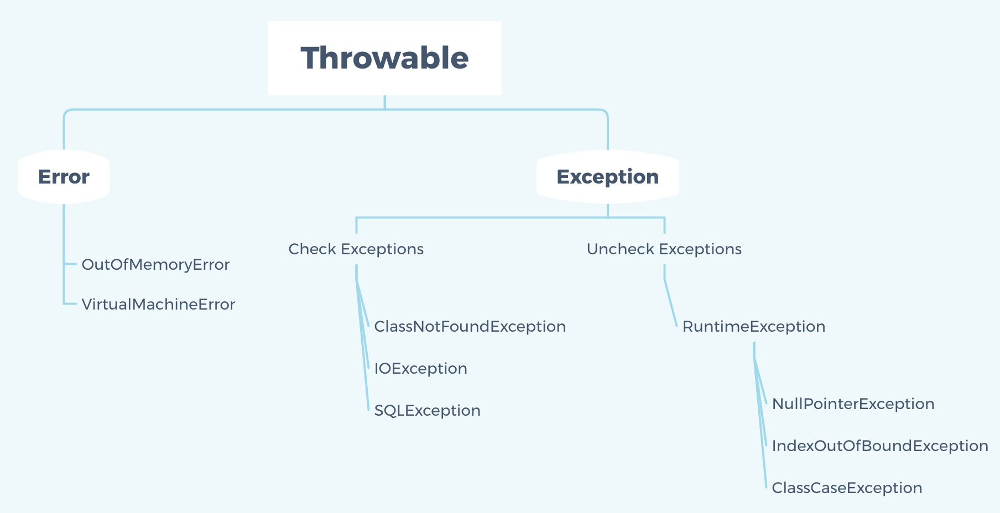
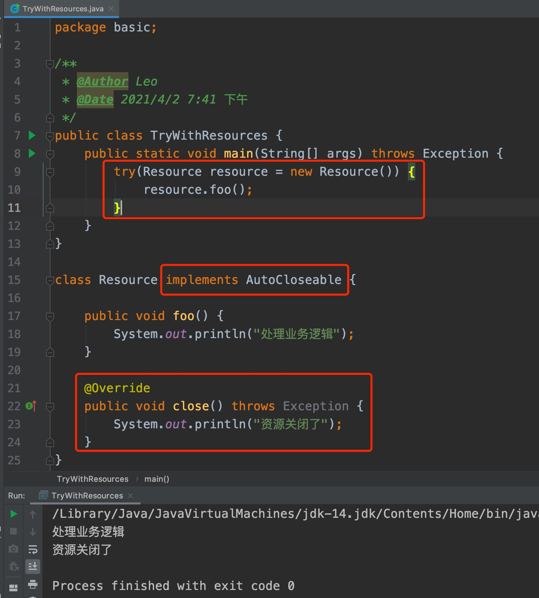

### **1、基础数据类型**

| 基本类型 | 包装类    | 字节 | 位数 | 范围                        | 默认值  |
| -------- | --------- | ---- | ---- | --------------------------- | ------- |
| byte     | Byte      | 1    | 8    | -128 ～ 127                 | 0       |
| short    | Short     | 2    | 16   | -2^15 ~ 2^15 -1             | 0       |
| int      | Integer   | 4    | 32   | -2^31 ~ 2^31 -1             | 0       |
| long     | Long      | 8    | 64   | -2^63 ~ 2^63 -1             | 0L      |
| float    | Float     | 4    | 32   | IEEE754                     | 'u0000' |
| double   | Double    | 8    | 64   | IEEE754                     | 0F      |
| char     | Character | 2    | 16   | Unicode 0 ~ Unicode 2^16 -1 | 0D      |
| boolean  | Boolean   |      | 1    |                             | false   |

### **2、自动装箱和拆箱的实现原理**

- 装箱过程通过调用包装类的valueOf方法实现；
- 拆箱过程通过调用包装类的xxxValue方法实现，如intValue()；
- Byte\Short\Integer\Long\Character会自动缓存-128 ～ 127的数字；

### **3、String为什么是不可变的？**

String类中使用final关键字修饰byte数组来保存字符串，所以String对象是不可变的。

```java
private final byte[] value;
```

### **4、String、StringBuffer、StringBuilder的区别**

**可变性：**String是不可变的，StringBuffer和StringBuilder都继承至AbstractStringBuilder，AbstractStringBuilder底层也是采用byte数组来存储字符串，但是没有使用final关键字修饰，所以是可变的；

```java
byte[] value;
```

**线程安全性：**String对象是不可变的，可以理解成常量，所以是线程安全的。StringBuffer对方法加了同步锁，所以也是线程安全的。StringBuilder没有对方法加锁，所以是线程非安全的。

```java
//StringBuffer
@Override
@HotSpotIntrinsicCandidate
public synchronized StringBuffer append(int i) {
    toStringCache = null;
    super.append(i);
    return this;
}
//StringBuilder
@Override
@HotSpotIntrinsicCandidate
public StringBuilder append(int i) {
    super.append(i);
    return this;
}
```

**性能：**每次对String类型进行修改时，都会生成一个新的对象，然后将指针指向新的对象，如果频繁修改性能较差。StringBuffer由于需要维护同步锁，所以性能次之。StringBuilder由于不需要维护锁，又不会频繁创建新对象，所以性能较好。

**总结：**

- 操作少量数据适合用String；
- 单线程操作字符串缓冲区下操作大量数据: 适用 StringBuilder；
- 多线程操作字符串缓冲区下操作大量数据: 适用 StringBuffer；

### **5、泛型**

Java 泛型（generics）是 JDK 5 中引入的一个新特性, 泛型提供了编译时类型安全检测机制，该机制允许程序员在编译时检测到非法的类型。泛型的本质是参数化类型，也就是说所操作的数据类型被指定为一个参数。

Java的泛型是伪泛型，这是因为Java在编译期间，所有的泛型信息都会被擦掉。Java的泛型基本上都是在编译器这个层次上实现的，在生成的字节码中是不包含泛型中的类型信息的，使用泛型的时候加上类型参数，在编译器编译的时候会去掉，这个过程成为类型擦除。

### **6、值传递与引用传递**

**值传递：**表示方法接收的是调用者提供的值，方法得到的是参数值的一个拷贝，方法中的修改不会影响传递过来变量的内容；

**引用传递：**表示方法接收的是调用者提供的变量地址，在方法中的修改会影响传递过来变量的内容；

在Java中只有值传递，如果传递的是基本数据类型，那么就是对应的值，如果是引用数据类型，由于引用类型变量的值是对象的地址，所以在方法传递时也是传递的对象的地址，虽然看起来像引用传递，但是实际还是值传递。

### **7、深拷贝&浅拷贝**

**深拷贝：**对基本数据类型进行值传递，对引用数据类型，创建一个新的对象，并复制其内容，此为深拷贝。

**浅拷贝：**对基本数据类型进行值传递，对引用数据类型进行引用传递般的拷贝，此为浅拷贝。


### **8、面向对象的三大特性**

**封装：**是指把一个对象的状态信息（也就是属性）隐藏在对象内部，不允许外部对象直接访问对象的内部信息。但是可以提供一些可以被外界访问的方法来操作属性。

**继承：**继承是使用已存在的类的定义作为基础建立新类的技术，新类的定义可以增加新的数据或新的功能，也可以用父类的功能，但不能选择性地继承父类。通过使用继承，可以快速地创建新的类，可以提高代码的重用，程序的可维护性，节省大量创建新类的时间 ，提高我们的开发效率。

**多态：**多态，顾名思义，表示一个对象具有多种的状态。具体表现为父类的引用指向子类的实例。

### **9、transent关键字的作用**

阻止实例中被该关键字修饰的变量进行序列化；当对象被反序列化时，被 transient 修饰的变量值不会被持久化和恢复。transient 只能修饰变量，不能修饰类和方法。

### **10、异常**



### **11、try-with-resources**

try-with-resources 是 JDK 7 中一个新的异常处理机制，它能够很容易地关闭在 try-catch 语句块中使用的资源。所谓的资源（resource）是指在程序完成后，必须关闭的对象。try-with-resources 语句确保了每个资源在语句结束时关闭。所有实现了 java.lang.AutoCloseable 接口（其中，它包括实现了 java.io.Closeable 的所有对象），可以使用作为资源。

作为资源类必须实现AutoCloseable接口，并且重写close方法，try-with-resources语法糖会在处理完业务逻辑后自动调用资源类的close方法，从而达到自动释放资源的目的。



### **12、反射**

```java
package com.tanzw;
class Student {
    private Integer id;
    private String name;
    public Student(Integer id, String name) {
        this.id = id;
        this.name = name;
    }
    
    public Integer getId() {
        return id;
    }
    
    public String getName() {
        return name;
    }
    
    public void setId(Integer id) {
        this.id = id;
    }
    
    public void setName(String name) {
        this.name = name;
    }
    
    /**
     * 定义一个私有的方法
     */
    private String print() {
        return "ID:" + this.id + " Name:" + this.name;
    }
}
package com.tangzw;
public class Demo {
    public static void main(String[] args) throws Exception {
        //根据全限定类名获取Class对象
        Class clazz = Class.forName("com.tangzw.Student");
        //获取构造器
        Constructor constructor = clazz.getConstructor(new Class[] {Integer.class, String.class});
        //实例化对象
        Student student = (Student) constructor.newInstance(1, "张三");
        //调用对象方法，输出：张三
        System.out.println(student.getName());
        //通过Method调用对象方法，getMethod只会返回public方法
        Method setNameFunc = clazz.getMethod("setName", String.class);
        setNameFunc.invoke(student, "李四");
        //调用对象方法，输出：李四
        System.out.println(student.getName());
        
        //访问私有方法，getDeclaredMethod可以获取类声明的所有方法
        Method printFunc = clazz.getDeclaredMethod("print");
        //将私有方法设置可见
        printFunc.setAccessible(true);
        //调用方法
        String str = (String) printFunc.invoke(student);
        //输出：ID:1 Name:李四
        System.out.println(str);
    }
}
```

### **13、强引用、软引用、弱引用和虚引用**

**强引用：**强引用是最普遍的引用，如果一个对象具有强引用，垃圾回收器不会回收该对象，当内存空间不足时，JVM 宁愿抛出 OutOfMemoryError异常；只有当这个对象没有被引用时，才有可能会被回收。

```java
Object object = new Object();
String str = "StrongReference";
```

**软引用：**软引用是用来描述一些有用但并不是必需的对象，适合用来实现缓存(比如浏览器的‘后退’按钮使用的缓存)，内存空间充足的时候将数据缓存在内存中，如果空间不足了就将其回收掉。软引用在Java中用java.lang.ref.SoftReference类来表示。

如果一个对象只具有软引用，则

- 当内存空间足够，垃圾回收器就不会回收它。
- 当内存空间不足了，就会回收该对象。JVM会优先回收长时间闲置不用的软引用的对象，对那些刚刚构建的或刚刚使用过的“新”软引用对象会尽可能保留。
- 如果回收完还没有足够的内存，才会抛出内存溢出异常。只要垃圾回收器没有回收它，该对象就可以被程序使用。

```java
Person person = new Person("张三");
SoftReference<Person> softReference = new SoftReference<>(person);
person = null;  //去掉强引用，new Person("张三")的这个对象就只有软引用了
```

**弱引用：**弱引用与软引用的区别在于：只具有弱引用的对象拥有更短暂的生命周期，它只能生存到下一次垃圾收集发生之前。当垃圾回收器扫描到只具有弱引用的对象时，无论当前内存空间是否足够，都会回收它。不过，由于垃圾回收器是一个优先级很低的线程，因此不一定会很快发现那些只具有弱引用的对象。

弱引用也可以和一个引用队列（ReferenceQueue）联合使用。

使用场景：一个对象只是偶尔使用，希望在使用时能随时获取，但也不想影响对该对象的垃圾收集，则可以考虑使用弱引用来指向该对象。

```java
public static void main(String[] args) throws InterruptedException {
    Person person = new Person("张三");
    ReferenceQueue<Person> queue = new ReferenceQueue<>();
    WeakReference<Person> weakReference = new WeakReference<Person>(person, queue);
    person = null;//去掉强引用，new Person("张三")的这个对象就只有弱引用了
    System.gc();
    Thread.sleep(1000);
    System.err.println("弱引用的对象 ------->" + weakReference.get());
    Reference weakPollRef = queue.poll();   //poll()方法是有延迟的
    if (weakPollRef != null) {
        System.err.println("WeakReference对象中保存的弱引用对象已经被GC，下一步需要清理该Reference对象");
        //清理softReference
    } else {
        System.err.println("WeakReference对象中保存的软引用对象还没有被GC，或者被GC了但是获得对列中的引用对象出现延迟");
    }
}
```

**虚引用：**与其他三种引用都不同，虚引用并不会决定对象的生命周期。如果一个对象仅持有虚引用，那么它就和没有任何引用一样，在任何时候都可能被垃圾回收。

虚引用主要用来跟踪对象被垃圾回收的活动。虚引用与软引用和弱引用的一个区别在于：虚引用必须和引用队列（ReferenceQueue）联合使用。当垃圾回收器准备回收一个对象时，如果发现它还有虚引用，就会在回收对象的内存之前，把这个虚引用加入到与之关联的引用队列中。

程序可以通过判断引用队列中是 否已经加入了虚引用，来了解被引用的对象是否将要被垃圾回收。程序如果发现某个虚引用已经被加入到引用队列，那么就可以在所引用的对象的内存被回收之前采取必要的行动。

```java
Object object = new Object();
ReferenceQueue queue = new ReferenceQueue ();
PhantomReference pr = new PhantomReference (object, queue);
```

在实际程序设计中一般很少使用弱引用与虚引用，使用软引用的情况较多，这是因为软引用可以加速JVM对垃圾内存的回收速度，可以维护系统的运行安全，防止内存溢出（OutOfMemory）等问题的产生。