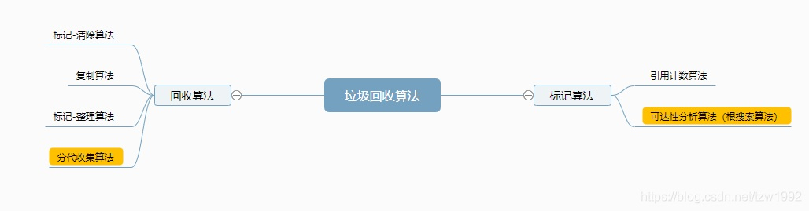
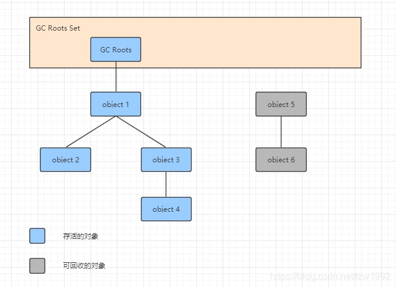
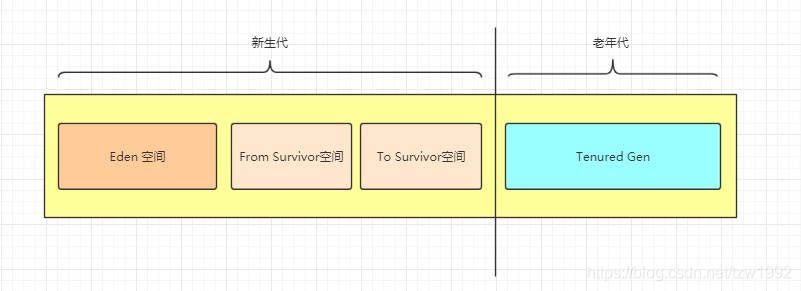
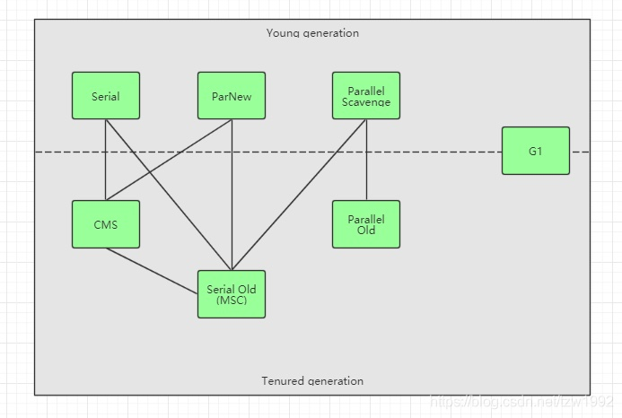
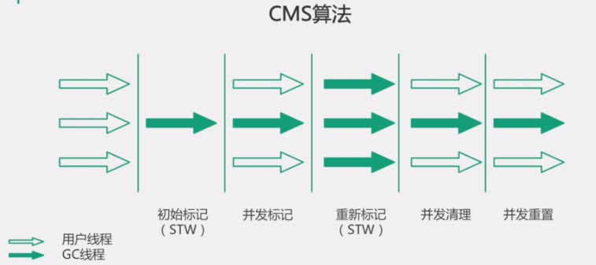
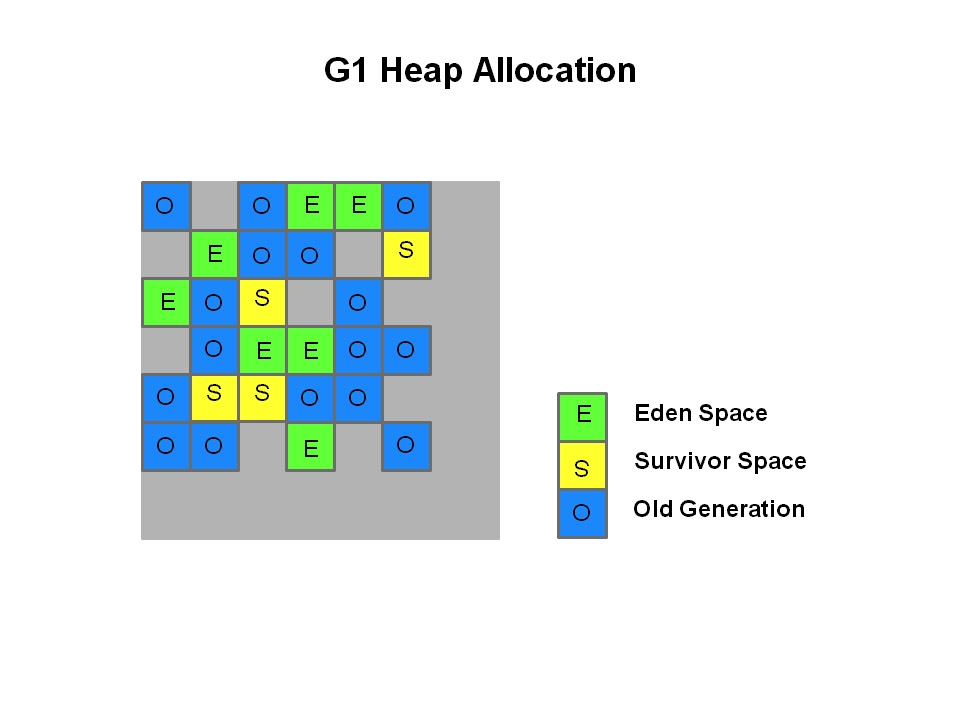

### 一、垃圾回收算法

#### **标记算法**

##### 1. 引用计数算法

该算法的实现是给对象添加一个引用计数器，每当有一个地方引用它时，计数器数值就加1；当引用失效时，计数器值就减1；当计数器数值为0时表示该对象不可再被使用，则可以对其进行回收。

优点： 实现简单，判定效率高。

缺点： 很难解决对象循环引用问题。

##### 2. 可达性分析算法（根搜索算法）

该算法是从离散数学中的图论引入的，程序将所有引用关系看成是一张图，通过一系列称为“GC Roots”的对象作为起始点，从这些节点开始向下搜索，搜索走过的路径称为引用链（Reference Chain），当一个对象到GC Roots没有任何引用链相连（用图论的话来讲，就是从GC Roots到这个对象不可达）时，则说明该对象是不可用的。

Java中可以作为GC Roots的对象

- 虚拟机栈（栈帧中的本地变量表）中引用的对象。
- 方法区中类静态属性引用的对象。
- 方法区中常量引用的对象。
- 本地方法栈中JNI（Native方法）引用的对象。

#### **回收算法**

##### 1. 标记-清除算法

标记-清除算法分为标记和清除两个阶段，首先从根集合进行扫描，对存活的对象进行标记，然后对堆内存从头到尾进行线性遍历，回收不可达对象的内存。

缺点：

- 效率问题，标记和清除两个过程的效率都不高。
- 空间问题，内存碎片化严重。

##### 2. 复制算法

复制算法的原理是将可用内存按容量划分为大小相等的两块（对象面和空闲面），每次只使用其中的一块，当这一块的内存用完了，就将还存活的对象复制到另一块上，然后再把已使用过的内存空间一次清理掉。

优点：

- 解决了内存碎片化问题。
- 按顺序分配内存，简单高效。
- 适用于对象存活率低的场景（如：新生代）。

缺点：

- 将内存缩小为原来的一半。
- 在对象存活率较高的场景下需要进行较多的复制操作，效率会变低。

##### 3. 标记-整理算法

标记-整理算法的标记过程与标记-清除算法一致，先从根集合进行扫描，对存活的对象进行标记，但是后续步骤不是直接对可回收的对象进行清理，而是移动所有存活的对象，且按照内存地址次序依次排列，然后将末端内存地址以后的内存全部回收。

优点： 解决了内存碎片化问题，不用设置两块内存互换。

缺点： 比标记-清除算法增加了对象移动的过程，所以实现成本更高。适用于对象存活率高的场景（如：老年代）。

##### 4. 分代收集算法

分代收集算法是根据对象的存活周期的不同，将内存划分为不同的区域，然后针对不同的区域采用不同的垃圾回收算法。一般是将Java堆分为新生代和老年代，新生代的对象存活率低，每次垃圾回收都会有大量对象需要被回收，所以该区域采用复制算法。而老年代的对象存活率高，该区域采用标记-清除算法或标记-整理算法。这样做的好处是可以提高JVM的回收效率，避免了只采用某一种算法的缺陷。当前商业虚拟机都是采用该种算法进行垃圾回收。

- Eden空间和Survivor空间的默认大小比例是8:1，可通过 -XX:SurvivorRatio 命令调整这个比例。

- 新生代和老年代默认内存大小的比例是1:2，可用过 -XX:NewRatio 命令调整这个比例。

- 对象如何晋升到老年代：

- - 经历一定Minor次数依然存活的对象，该次数可通过 -XX:MaxTenuringThreshold 命令调整，默认：15。
  - Survivor空间中存放不下的对象，会存储在老年代。
  - 新生成的大对象会存储在老年代中，可通过 -XX:+PretenuerSizeThreshold 命令调整。

- GC的分类：

- - Minor GC：从新生代回收内存。
  - Full GC：回收整个Java堆空间的内存，包括新生代和老年代。Full GC比Minor GC慢很多，大概有10倍的差距，但是Full GC执行的频率比较低。
  - Major GC：一般来说和Full GC是等价的，由于名词解读的混乱，当说Major GC时一定要问清楚是指Full GC还是仅指从老年代回收内存。

- 触发Full GC的条件：

- - 老年代空间不足
  - 永久代空间不足（JDK1.7之前）
  - CMS GC时出现promotion failed，concurrent mode failure时
  - Minor GC晋升到老年代的平均大小大于老年代的剩余空间
  - 调用System.gc()
  - 使用RMI来进行RPC或管理的JDK应用，没小时执行一次Full GC

### 二、垃圾回收中几个概念

#### **Stop The World**

- - JVM由于要执行GC而停止应用程序的执行。
  - 任何一种GC算法中都会发生。
  - 多数GC优化都是通过减少stop-the-world发生的时间来提高程序性能。

**安全点（Safepoint）**

- - 程序执行时并非在所有地方都能停下来开始GC，而是在到达安全点时才会暂停。
  - 在可达性分析过程中对象引用关系不会发生变化的点。
  - 产生安全点的地方：方法调用、循环跳转、异常跳转等。
  - 安全点数量得适中，太少会使GC等待时间太长，太多会增加运行时的负荷。

### 三、垃圾收集器

#### **1. Serial收集器**

- 单线程收集，进行垃圾收集时，必须暂停所有工作线程。
- 简单高效，Client模式下默认的新生代收集器。
- 采用复制算法。
- 使用 -XX:+UseSerialGC 命令可以切换使用该收集器。

#### **2. ParNew收集器**

- 多线程收集，其余的行为、特点和Seria收集器一样。
- 单核执行效率不如Serial，在多核下执行才有优势。
- 采用复制算法。
- 使用 -XX:+UseParNewGC 命令可以切换使用该收集器。

#### **3. Parallel Scavenge收集器**

- 比起关注用户线程停顿时间，该收集器更关注系统的吞吐量。
- 在多核下执行才有优势，Server模式下默认的新生代收集器。
- 采用复制算法。
- 使用-XX:+UseParallelGC 命令可以切换使用该收集器。
- 使用-XX:+UseAdaptiveSizePolicy 命令开启自适应调节策略，该命令会动态调整Java堆中各区域的大小及进入老年代的年龄。
- 吞吐量=运行用户代码时间/(运行用户代码时间+垃圾收集时间)

#### **4. Serial Old收集器**

- 单线程收集，进行垃圾收集时，必须暂停所有工作线程。
- 简单高效，Client模式下默认的老年代收集器。
- 使用标记-整理算法。
- 使用 -XX:+UseSerialOldGC 命令可切换该收集器。

#### **5. Parallel Old收集器**

- 多线程，吞吐量优先。
- 使用标记-整理算法。
- 使用 -XX:+UseParallelOldGC 命令可切换该收集器。

#### **6. CMS收集器**

- 垃圾回收的六个步骤：

- - 初始标记：stop-the-world
  - 并发标记：并发追溯标记，程序不会停顿。
  - 并发预清理：查找执行并发标记阶段从新生代晋升到老年代的对象。
  - 重新标记：暂停虚拟机，扫描CMS堆中的剩余对象。
  - 并发清理：清理垃圾对象，程序不会停顿。
  - 并发重置：重置CMS收集器的数据结构。

- 使用标记-清除算法，会有内存碎片化问题，默认每次进行FullGC时会进行碎片压缩。

- 使用 -XX:+UseConcMarkSweepGC 命令可切换该收集器。

#### **7. G1收集器**

- 并发和并行
- 分代收集
- 空间整合
- 可预测的停顿
- 将整个Java堆内存划分成多个大小相等的Region。
- 年轻代和老年代不再物理隔离。
- 使用复制+标记-整理算法
- 使用 -XX:+UseG1GC 命令可切换该收集器。

G1将整个堆分成相同大小的分区（Region）。

每个分区都可能是年轻代也可能是老年代，但是在同一时刻只能属于某个代。
年轻代、幸存区、老年代这些概念还存在，成为逻辑上的概念，这样方便复用之前分代框架的逻辑。在物理上不需要连续，则带来了额外的好处——有的分区内垃圾对象特别多，有的分区内垃圾对象很少，G1会优先回收垃圾对象特别多的分区，这样可以花费较少的时间来回收这些分区的垃圾，这也就是G1名字的由来，即首先收集垃圾最多的分区。

新生代其实并不是适用于这种算法的，依然是在新生代满了的时候，对整个新生代进行回收——整个新生代中的对象，要么被回收、要么晋升，至于新生代也采取分区机制的原因，则是因为这样跟老年代的策略统一，方便调整代的大小。

G1还是一种带压缩的收集器，在回收老年代的分区时，是将存活的对象从一个分区拷贝到另一个可用分区，这个拷贝的过程就实现了局部的压缩。每个分区的大小从1M到32M不等。

#### **8. Epsilon GC**

- JDK11中新引入的垃圾收集器。

- 一个处理内存分配但不实现任何实际内存回收机制的GC，一旦可用堆内存用完，JVM就会退出。

- 主要用途：

- - 性能测试，可以帮助过滤掉GC引起的性能假象。
  - 内存压力测试。
  - 非常短的JOB任务。
  - VM接口测试。
  - Last-drop 延迟&吞吐改进。

#### **9. ZGC**

- [OpenJDK ZGC](http://openjdk.java.net/projects/zgc/)