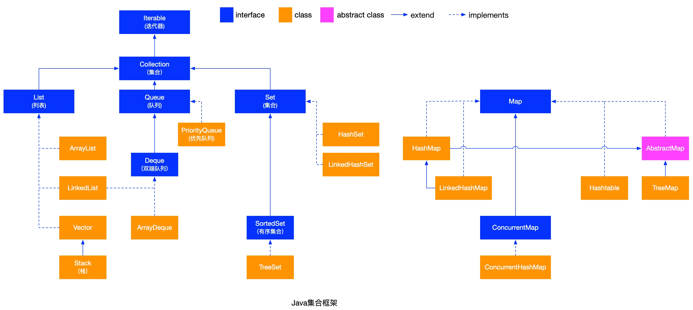
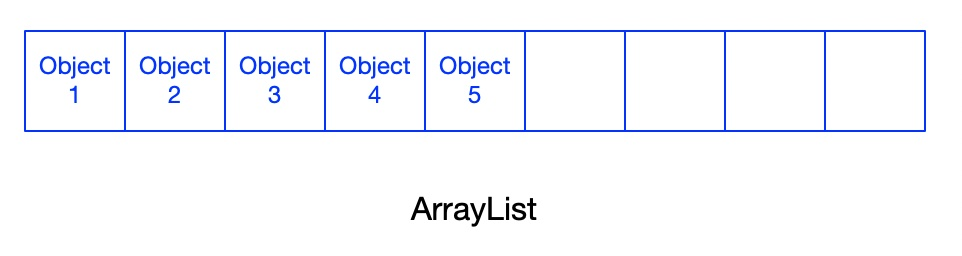
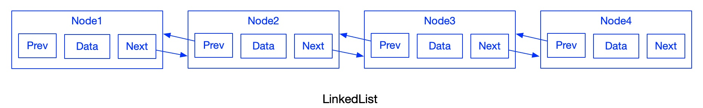
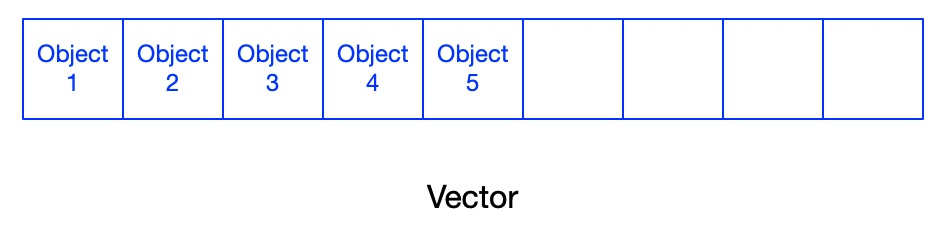
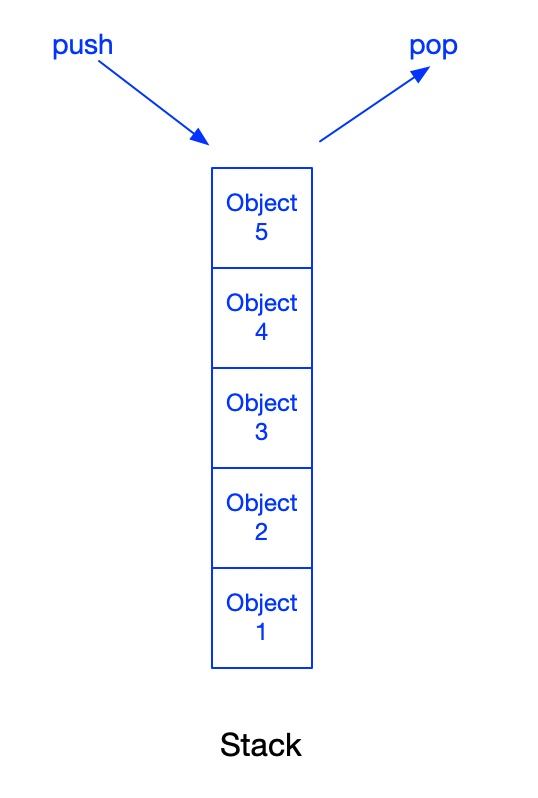
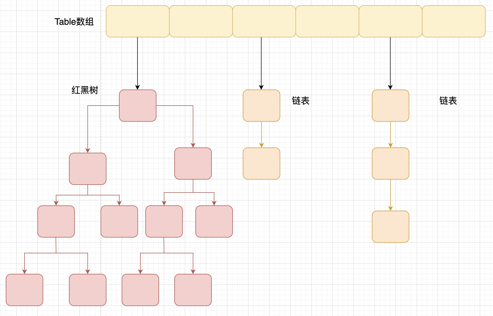
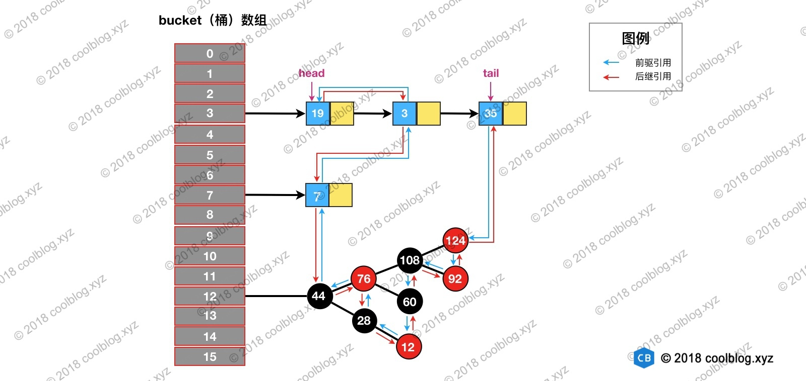
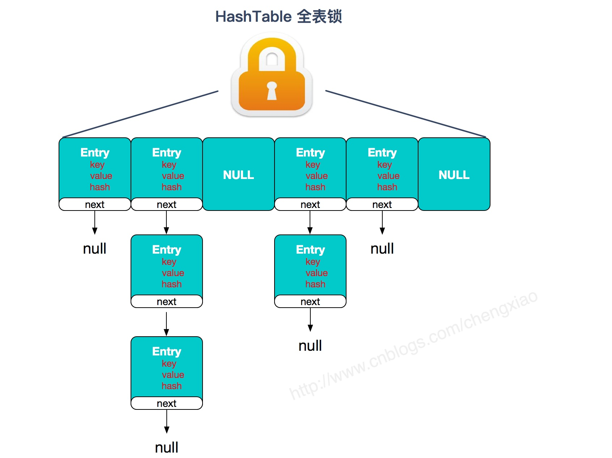
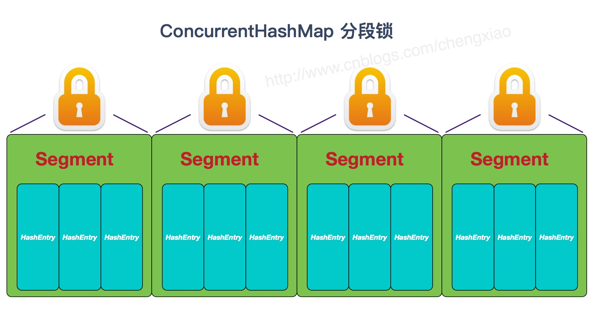
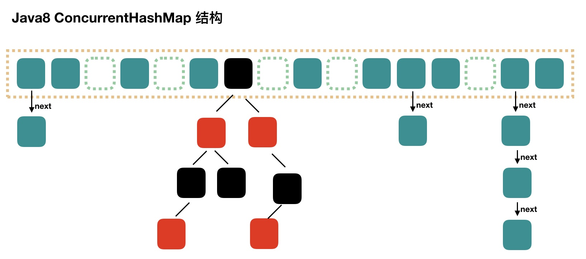

### **1、集合框架的分类**



### **2、List**

#### ArrayList：

采用Object[]存储数据，线程不安全。

默认大小为10，如果数组的剩余容量不够存放新插入的数据，那么会进行扩容，扩容后容量会变为原来的1.5倍。



#### LinkedList:

底层采用双向链表存储数据，线程不安全。



#### Vector：

采用Object[]存储数据，线程安全。



#### Stack：

继承至Vector，所以也是线程安全的。

在Vector基础上提供push(E item) (入栈)、pop() (出栈)、peek() (查看栈顶元素，但是不删除)、empty() (是否为空)、search(Object o) (元素在栈中的位置)。

栈是一种先进后出的数据结构。



### **3、Set**

#### HashSet：

底层采用HashMap存储数据，所以数据是无序的，并且数据不允许重复。线程不安全。HashSet可以存储null值，但是只允许存储一个null值。

HashSet如何检查数据重复：

先计算对象的hashcode值，来确定数据存储的位置，如果该位置有数据，判断新加进来的对象的hashcode和原来的对象的hashcode值是否相等；

如果hashcode值不相等，认为没有重复；

如果hashcode值相等，再调用equals()判断对象是否相等，如果相等则不允许插入，如果不相等，则可以插入数据。



#### LinkedHashSet：

LinkedHashSet是HashSet的子类。LinkedHashSet并没有扩展自己的方法，所以使用基本和HashSet一致，差异点在于构造方法，如下源码：

 

```
//LinkedHashSet
public LinkedHashSet(int initialCapacity, float loadFactor) {
    super(initialCapacity, loadFactor, true);
}
//HashSet
HashSet(int initialCapacity, float loadFactor, boolean dummy) {
    map = new LinkedHashMap<>(initialCapacity, loadFactor);
}
```

从源码可以看出LinkedHashSet底层采用LinkedHashMap存储数据。所以LinkedHashSet可以保证数据的顺序。

#### TreeSet：

底层采用TreeMap存储数据（红黑树），所以数据是有序的，并且是唯一的。

### **4、Map**

#### HashMap：

在JDK1.8之前HashMap由数组和链表组成，数组是HashMap的主体，链表是为了解决Hash冲突而存在的。

在JDK1.8之后HashMap则由数组+链表+红黑树组成。当链表长度大于阈值（默认是8）时，先判断数组的长度，如果数组长度（默认16）小于64，则先对数组进行扩容，每次扩容为原来的2倍，否则将链表转成红黑树。

非线程安全，允许存储null值的key和value，


#### LinkedHashMap：

LinkedHashMap继承至HashMap，底层也是采用数组+链表+红黑树的方式存储数据，但是LinkedHashMap在上面的基础上增加了一条双向链表，使得上面的结构可以保持键值对的插入顺序。



#### TreeMap：

TreeMap底层采用红黑树构造数据，有点类似数据库的索引，只不过数据库索引采用的是B+树。

TreeMap存储的数据是有序的，可以对元素进行搜索。

#### Hashtable：

底层采用数组+链表存储数据，数组长度默认为11，每次扩容为2n+1，不能存储null值，线程安全。

目前基本被废弃，如果要保证线程安全可以使用ConcurrentHashMap.



#### ConcurrentHashMap：

ConcurrentHashMap是线程安全的，和Hashtable相比效率更高，因为它不是对整个数组进行加锁。

在JDK1.7之前采用的是分段锁，也就是每次只锁定一个Segment分组。



在JDK1.8之后，不在使用Segment数组+HashEntry数组+链表方式，而是采用Node数组+链表+红黑树，采用CAS+synchronized来保证并发，并且synchronized只锁定当前链表或红黑树的首节点，当hash不冲突时就不会产生并发。

