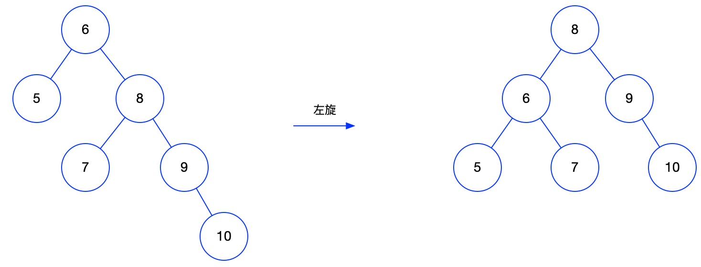
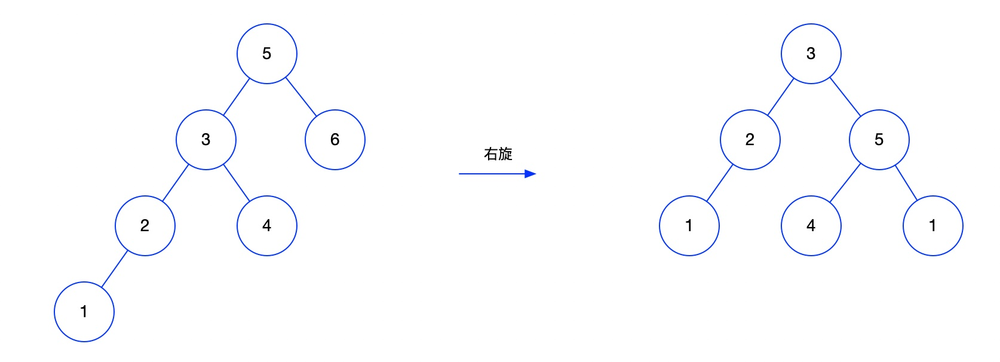

### 1、HashMap

#### HashMap底层实现

HashMap底层采用数组+链表+红黑树实现

##### 扩容机制

当元素个数超过数组大小*loadFactor（负载因子）时就会触发扩容机制，会将数组的大小设为原来的2倍，然后重新计算所有元素在数组中的位置。

数组大小默认是16；

负载因子默认是0.75；

##### 扩容分两步

扩容：创建一个长度为原来2倍的新数组

rehash：遍历原数组中所有的元素，重新hash计算在新数组中的位置，将数据插入到新数组中

#### 链表什么情况下转成红黑树

当链表的长度大于8，并且数组的长度大于64时才会将链表转成红黑树，否则会对数组进行扩容。执行删除操作后，当链表长度小于6时，由会将红黑树退化成链表。

#### 红黑树的特点

- 每个节点要么是黑色，要么是红色；
- 根节点是黑色；
- 每个叶子节点（NIL）是黑色；
- 每个红色节点的两个子节点一定都是黑色；
- 任意一个节点到每个叶子节点的路径都包含数量相同的黑节点；

#### 左旋和右旋的规则

- **左旋：** 

- - 定义：将目标节点变为右节点的左节点，右节点原来的左节点变为目标节点的右节点
  - 过程：父节点是红色，叔叔节点是黑色，且当前节点是右子树，以父节点作为目标节点进行左旋

- **右旋：** 

- - 定义：将目标节点变为左节点的右节点，左节点原来的右节点变为目标节点的左节点

  - 过程：父节点是红色，叔叔节点是黑色，且当前节点是左子树，进行右旋，右旋前需要先完成下面三个动作：

  - - 把父节点变为黑色
    - 把祖父节点变为红色
    - 以祖父节点作为目标节点进行右旋

- **变颜色：** 

- - 定义：节点的颜色由红变黑或者由黑变红，新插入的节点默认都是红色

  - 过程：当前节点的父节点是红色，且它的叔叔节点也是红色，此时需要变颜色

  - - 把父节点变成黑色
    - 把叔叔节点设为黑色
    - 把祖父节点设为红色
    - 把指针定义到祖父节点，将祖父节点作为目标节点重新上面的分析，看是否需要继续变颜色

#### 红黑树查询效率为什么比链表快

- 红黑树是一个二叉查找树，数据是排好序的，查询过程类似折半查找，时间复杂度为O(log n)
- 链表查询需要从头开始遍历，时间复杂度是O(n)

#### 在多线程环境下使用HashMap会有什么问题

待完善...

#### 用自定义对象作为HashMap的key时要注意什么

用自定义对象作为HashMap时要重写equals方法和hashCode方法，不然会出现内存泄漏问题