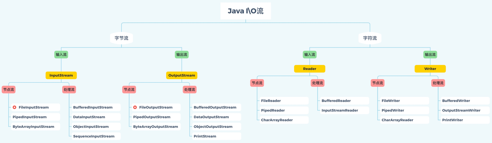
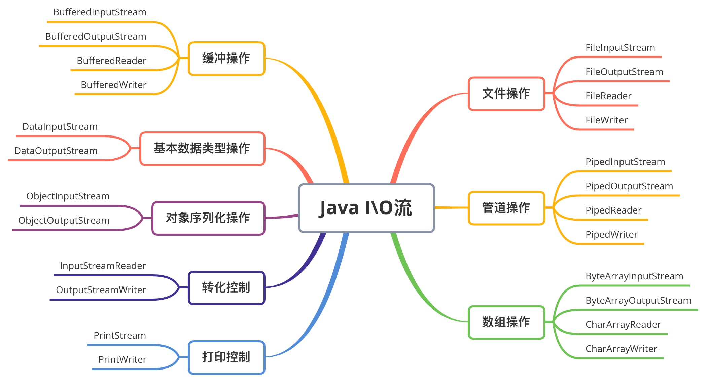
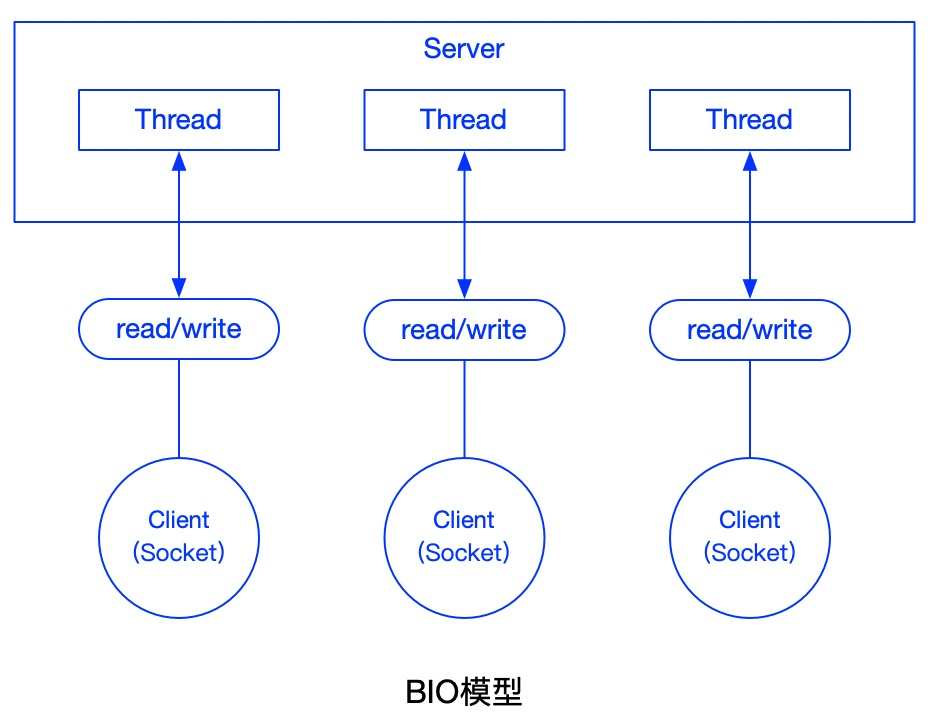
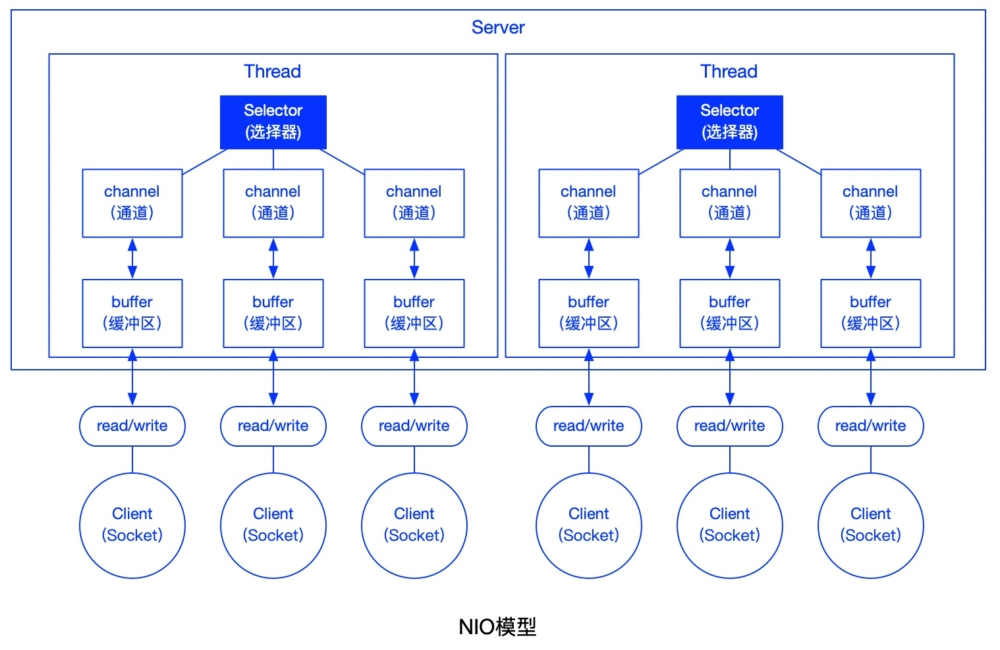
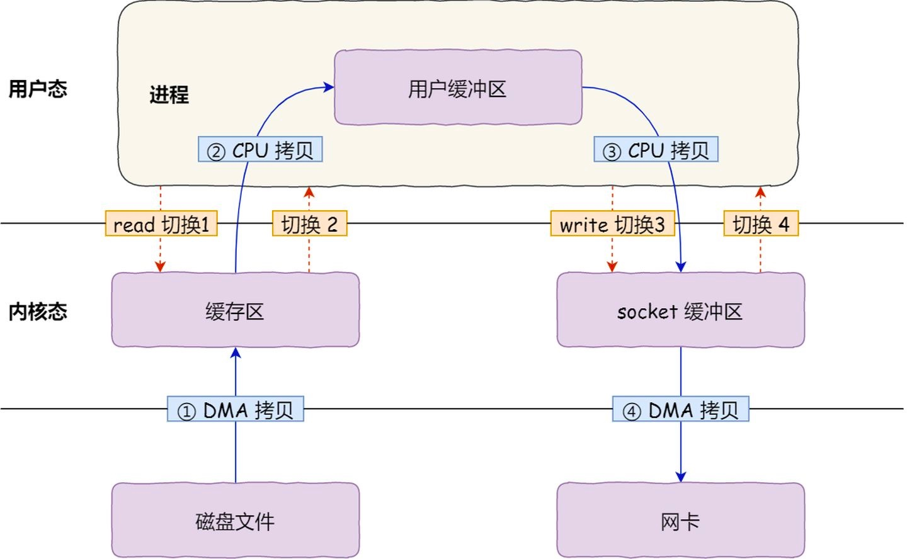
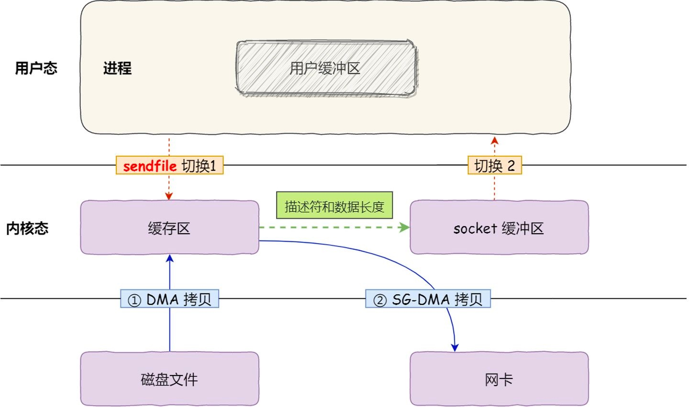
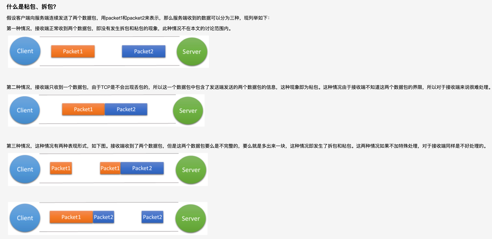
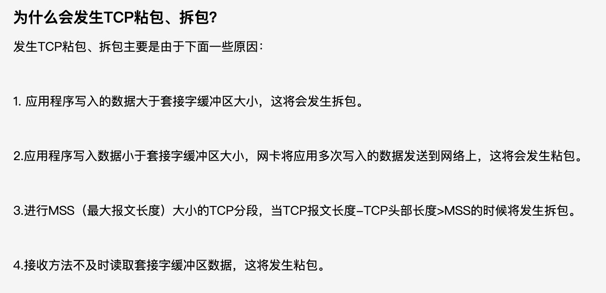
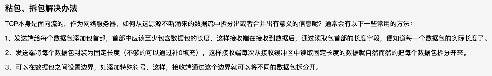

### **1、I/O流的分类**

- 按照流的流向分，可以分为输入流和输出流；
- 按照操作单元划分，可以划分为字节流和字符流；
- 按照流的角色划分为节点流和处理流。

Java IO 流共涉及 40 多个类，这些类看上去很杂乱，但实际上很有规则，而且彼此之间存在非常紧密的联系， Java I0 流的 40 多个类都是从如下 4 个抽象类基类中派生出来的。

- InputStream/Reader: 所有的输入流的基类，前者是字节输入流，后者是字符输入流。
- OutputStream/Writer: 所有输出流的基类，前者是字节输出流，后者是字符输出流。

#### 按操作方式分类：

#### 按操作对象分类：

### **2、既然有了字节流为什么还要有字符流？**

这个问题本质是想问：**不管是文件读写还是网络发送接收，信息的最小存储单元都是字节，那为什么 I/O 流操作要分为字节流操作和字符流操作呢？**

回答：字符流是由 Java 虚拟机将字节转换得到的，问题就出在这个过程还算是非常耗时，并且，如果我们不知道编码类型就很容易出现乱码问题。所以， I/O 流就干脆提供了一个直接操作字符的接口，方便我们平时对字符进行流操作。如果音频文件、图片等媒体文件用字节流比较好，如果涉及到字符的话使用字符流比较好。

### **3、BIO、NIO、AIO的区别：**

#### BIO（Blocking IO）：

同步阻塞IO。服务器实现模式为一个连接对应一个线程，即客户端有连接请求时服务端就需要启动一个线程进行处理，如果这个线程不做任何事情会造成线程开销，可以通过线程池机制改善。

BIO方式适用于连接数较小且固定的架构，这种方式对服务器资源要求比较高，并发局限于应用中，JDK1.4以前的唯一选择，但程序简单易理解。

编程流程：

- 服务器端启动一个ServerSocket；
- 客户端启动Socket与服务器进行通讯，默认情况下服务器端需要对每个客户端建立一个线程与之通信；
- 客户端发出请求后，先咨询服务器端是否有线程响应，如果没有则会等待或者被拒绝；
- 如果有响应，客户端线程会等待请求结束后再继续执行；

特点：

- 每个请求都需要独立的线程完成数据read、数据处理、数据write的完整操作

问题：

- 当并发数较大时，需要创建大量线程来处理连接，系统资源占用较大
- 连接建立后，如果当前线程暂时没有数据可读，则线程就阻塞在read操作上，造成线程资源的浪费  

#### NIO（Non-Blocking IO）：

同步非阻塞IO。服务器实现模式为一个线程处理多个请求，即客户端发送的连接请求都会注册到多路复用器上，多路复用器轮询到有I/O请求就进行处理。

NIO适用于连接数较多且较短（轻连接）的架构。比如聊天服务器，弹幕系统，服务器间通讯等。编程比较复杂，JDK1.4开始支持。

NIO有三大核心部分：Channel（通道）、Buffer（缓冲区）、Selector（选择器）

NIO是面向缓冲区或者面向块编程的，数据读取到一个它稍后处理的缓冲区，需要时可在缓冲区中前后移动，这就增加了处理过程的灵活性，使用它可以提供非阻塞式的高伸缩网络；

#### AIO（Asynchronous IO）：

异步非阻塞IO。AIO即NIO2.0，叫做异步非阻塞的IO。AIO引入异步通道概念，采用了Proactor模式，简化了程序编写，有效的请求才启动线程，它的特点是先由操作系统完成后才通知服务器端程序启动线程进行处理，一般适用与连接数较多且连接较长的应用。

目前AIO还没有广泛应用，Netty也是基于NIO而不是AIO。

### 4、零拷贝

**传统拷贝：**

 

**零拷贝：**

 

### 5、粘包/拆包

粘包：多个数据包合成了一个数据包

拆包：一个数据包拆成了多个

