### **1、JUC包总览**

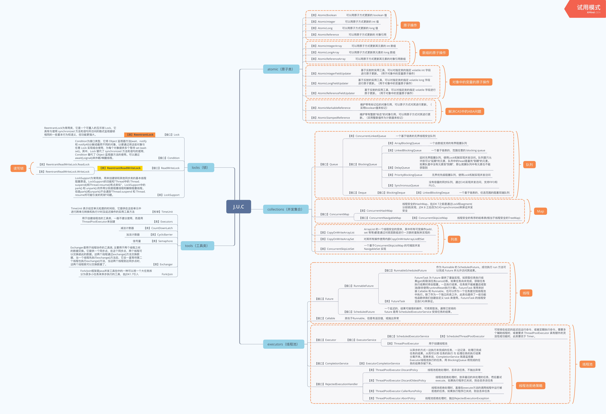

### **2、volatile关键字**

#### **volatile关键字的作用：**

- **保证内存可见性：** Java线程使用变量时并不是直接操作主内存，而是先把数据复制到线程自己的工作内存中，然后再操作，如下图，线程2对变量进行修改后写入到主内存中，此时线程1并没有感知到，就容易出问题，而volatile关键字解决了该问题，可以保证内存的可见性。

- - MESI缓存一致性协议：多个CPU从主内存读取同一数据到各自的高速缓存，当其中某个CPU修改了缓存里的数据，该数据会立马同步回主内存，其他CPU通过总线嗅探机制可以感知到数据的变化，从而将自己缓存里的数据失效。

- **不保证原子性** 

- **防止指令重排：** 代码编译成字节码后，JVM会对指令的执行顺序进行优化，那么代码实际执行的顺序和我们编写的顺序可能会不一致，volatile可以防止指令重排，底层是通过内存屏障来实现的，加来volatile关键字的指令前后都会加上一层内存屏障，从而防止调整顺序。

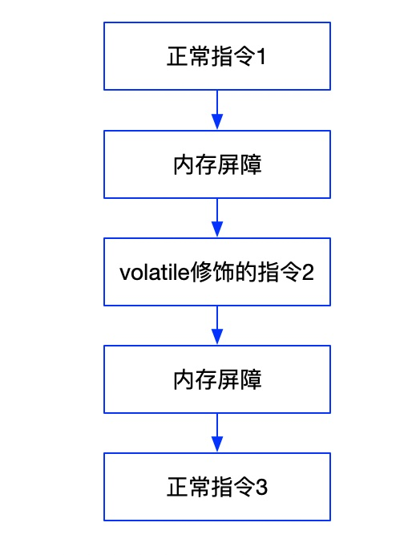

#### **volatile关键字的底层实现原理：**

底层实现主要是通过汇编lock前缀指令，它会锁定这块内存区域的缓存（缓存行锁定）并写回到主内存。

IA-32架构软件开发者手册对lock指令的解释：

- 会将当前处理器缓存行的数据立即写回到系统内存。
- 这个写回内存的操作会引起在其他CPU里缓存了该内存地址的数据无效（EMSI）。

加锁和解锁操作：在store时进行加锁，在write完成后解锁。加锁的目的是为了防止并发修改主内存时出现问题，加在store步骤的好处是提高效率。

### **3、synchronized底层实现原理**

**synchronized可以作用在三个场景下：**

- 修饰实例方法：对当前实例对象加锁
- 修饰静态方法：对当前类Class对象加锁
- 修饰代码块：对synchronized括号内对象加锁

**synchronized关键字在这三种情况下解析成字节码如下：**

当修饰在方法上时，不管是静态方法还是实例方法，解析成字节码后都是在方法定义上加上synchronized关键字

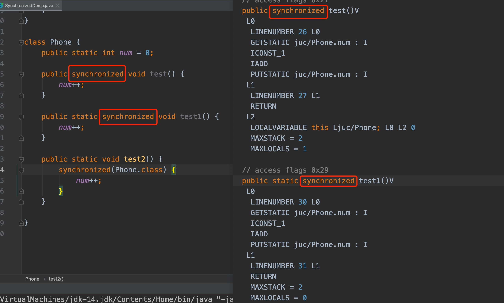

当修饰代码块时，则是通过MONITORENTER和MONITOREXIT指令标示

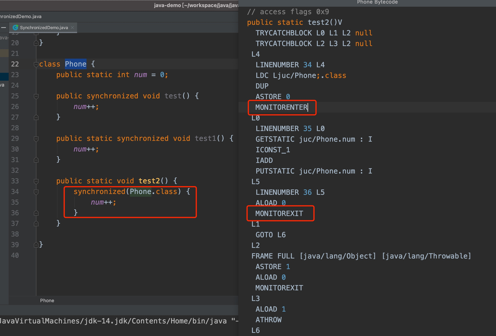

JVM是基于进入和退出Monitor对象来实现方法同步和代码块同步的。

方法级的同步是隐式的，即无需通过字节码指令来控制。JVM可以从方法常量池中的方法表结构(method_info Structure) 中的ACC_SYNCHRONIZED访问标志区分一个方法是否为同步方法。方法调用时调用指令将会检查方法的ACC_SYNCHRONIZED访问标志是否被设置，如果设置了，执行线程将先持有monitor，然后再执行方法，等方法执行完后再释放monitor。

代码块的同步是利用monitorenter和monitorexit这两个字节码指令。当JVM执行到monitorenter指令时，当前线程试图获取monitor对象的所有权，如果未加锁或者已经被当前线程所持有，就把锁的计数器+1，当执行到monitorexit指令时，锁的计数器-1，当锁的计数器为0时，该锁就被释放。如果获取monitor对象失败，该线程会进入阻塞状态，直到其他线程释放锁。

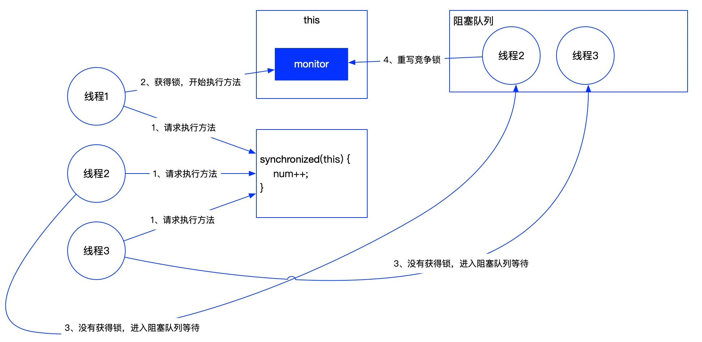

比如三个线程都去执行同步代码块，线程1首先获得了锁（即获得了monitor对象的控制权），则线程1执行同步方法，线程2和线程3没有获得锁，则在阻塞队列中进行等待，当线程1执行完代码后释放锁，则线程2和线程3再次去竞争锁，拿到锁的线程继续执行。这种方式开销比较大，在JDK1.6之后开始对锁机制进行了大量优化。

### **4、synchronized锁优化**

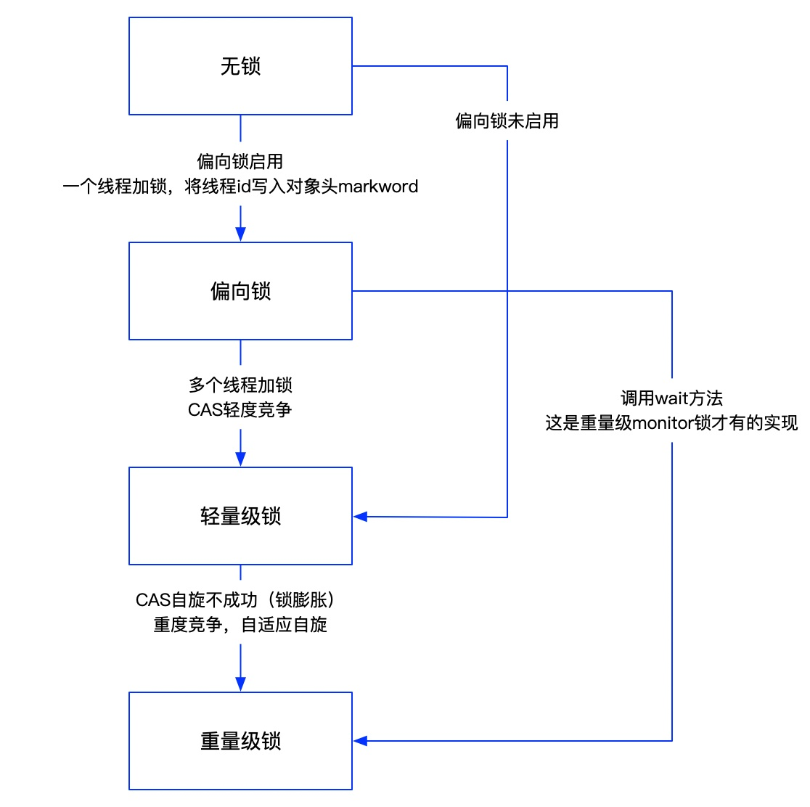

JDK1.6之前synchronized锁效率比较低，JDK1.6之后进行了大量优化，引入了锁的4种状态，默认情况下是无锁状态，当需要加锁时会先启用偏向锁，比如加了synchronized关键字，也就是将线程ID写入到对象头中，在获取锁时判断当前线程和对象头中的线程ID是否相等，如果相等直接获取锁，执行代码，这样做的好处是HotSpot的开发人员通过分析发现大多数应用都只有一个线程在竞争锁，通过这种方式可以减少很多调度的开销，从而提高效率。当有多个线程竞争锁时，会将偏向锁升级为轻量级锁，轻量级锁采用CAS自旋来获取锁，如果CAS自旋不成功（默认是自旋10次），则会进行锁膨胀，此时会升级为重量级锁，也就是放到阻塞队列中进行等待。

### **5、ReentrantLock底层实现原理**

ReentrantLock底层采用CAS+AQS实现的。

ReentrantLock先通过CAS尝试获取锁；

如果此时锁已经被占用，该线程加入AQS队列并wait()；

当前驱线程的锁被释放，挂在CLH队列头部的线程就会被notify()，然后继续CAS尝试获取锁；

如果是非公平锁，如果有其他线程尝试lock()，有可能被其他刚好申请锁的线程抢占；

如果是公平锁，只有在队列头部的线程才能获取锁，新来的线程只能插入队列尾部；

### **6、AQS详解**

AQS是一个用于构建锁和同步容器的框架。AQS维护一个volatile int state（代表共享资源）和一个FIFO线程等待队列（也叫CLH队列，是CLH锁的一种变形），表示排队等待锁的线程。队列头节点称作“哨兵节点”或者“哑节点”，它不与任何线程关联。其他的节点与等待线程关联，每个节点维护一个等待状态waitStatus。结构如下图：

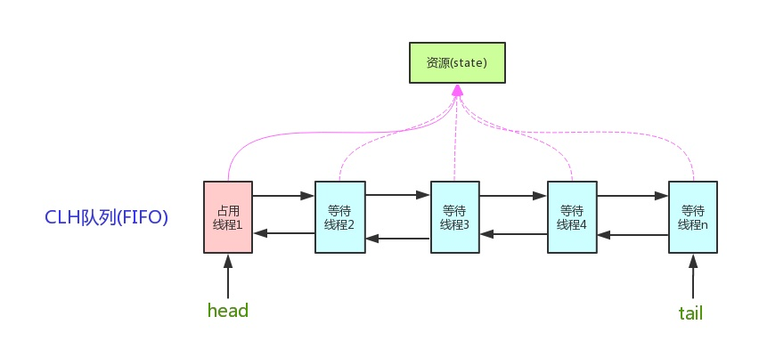

AQS定义了两种资源共享方式：Exclusive（独占，只有一个线程能执行，如ReentrantLock）和Share（共享，多个线程可同时执行，如Semaphore/CountDownLatch）。

不同的自定义同步器争用共享资源的方式也不同。自定义同步器在实现时只需要实现共享资源state的获取与释放方式即可，至于具体线程等待队列的维护（如获取资源失败入队/唤醒出队等），AQS已经在顶层实现好了。

以ReentrantLock为例，state初始化为0，表示未锁定状态。A线程lock()时，会调用tryAcquire()独占该锁并将state+1。此后，其他线程再tryAcquire()时就会失败，直到A线程unlock()到state=0（即释放锁）为止，其它线程才有机会获取该锁。当然，释放锁之前，A线程自己是可以重复获取此锁的（state会累加），这就是可重入的概念。但要注意，获取多少次就要释放多少次，这样才能保证state是能回到零态的。

再以CountDownLatch以例，任务分为N个子线程去执行，state也初始化为N（注意N要与线程个数一致）。这N个子线程是并行执行的，每个子线程执行完后countDown()一次，state会CAS减1。等到所有子线程都执行完后(即state=0)，会unpark()主调用线程，然后主调用线程就会从await()函数返回，继续后续动作。

一般来说，自定义同步器要么是独占方法，要么是共享方式，他们也只需实现tryAcquire-tryRelease、tryAcquireShared-tryReleaseShared中的一种即可。但AQS也支持自定义同步器同时实现独占和共享两种方式，如ReentrantReadWriteLock。

### **7、CAS详解**

CAS是compare and swap的缩写，意思是比较并交换。

CAS 操作包含三个操作数 —— 内存位置（V）、预期原值（A）和新值(B)。 如果内存位置的值与预期原值相匹配，那么处理器会自动将该位置值更新为新值 。否则，处理器不做任何操作。无论哪种情况，它都会在 CAS 指令之前返回该位置的值。（在 CAS 的一些特殊情况下将仅返回 CAS 是否成功，而不提取当前值）

### **8、ABA问题**

CAS算法实现的一个前提是需要取出内存中某时刻的数据并在当下时刻比较并替换，那么在这个时间差内会导致数据的变化。

比如：线程1从内存中取出数据A，这时候另一个线程2也从内存中取出数据A，并且线程2进行了一些操作将A的值改为B，然后线程2又将数据改回成A，这时候线程1进行CAS操作发现内存中仍然是A，然后线程1操作成功。

尽管线程1的CAS操作成功，但是不代表这个过程没有问题。

如何解决：JUC包中提供了AtomicStampedReference和AtomicMarkableReference两个原子类来解决该问题，AtomicStampedReference可以原子性的更新引用和版本号，通过版本号来标识对象是否被修改过，对应的思想为：乐观锁。

### **9、JMM**

JMM是指Java内存模型，Java线程内存模型跟CPU缓存模型类似，是基于CPU缓存模型来建立的，Java线程内存模型是标准化的，屏蔽掉了底层不同计算机的区别。

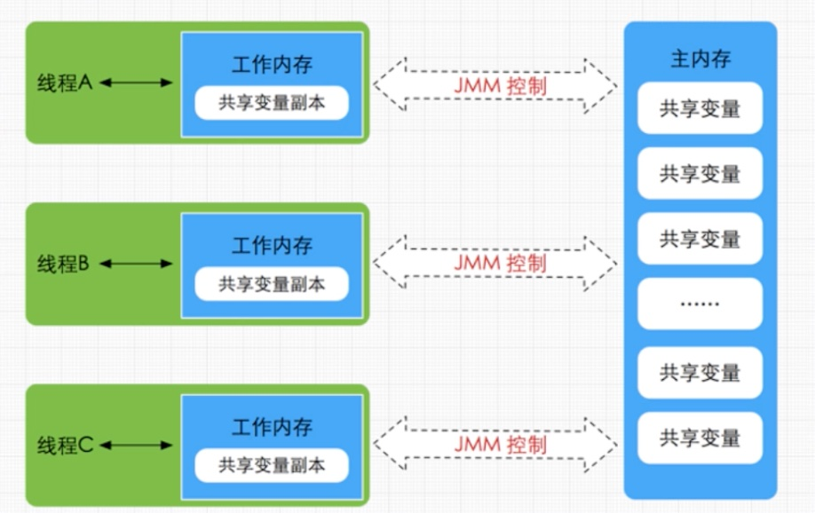

**JMM 8种数据原子操作：**

read（读取）：从主内存读取数据；

load（载入）：将主内存读取到的数据写入工作内存；

use（使用）：从工作内存读取数据来计算；

assign（赋值）：将计算好的值重新赋值到工作内存中；

store（存储）：将工作内存数据写入主内存；

write（写入）：将store过去的变量值赋值给主内存中的变量；

lock（锁定）：将主内存变量加锁，标识为线程独占状态；

unlock（解锁）：将主内存变量解锁，解锁后其他线程可以锁定该变量；

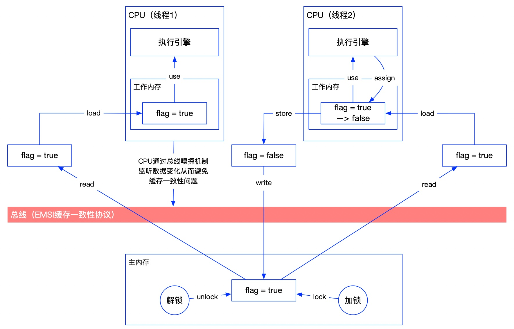

### **10、Java对象存储结构**

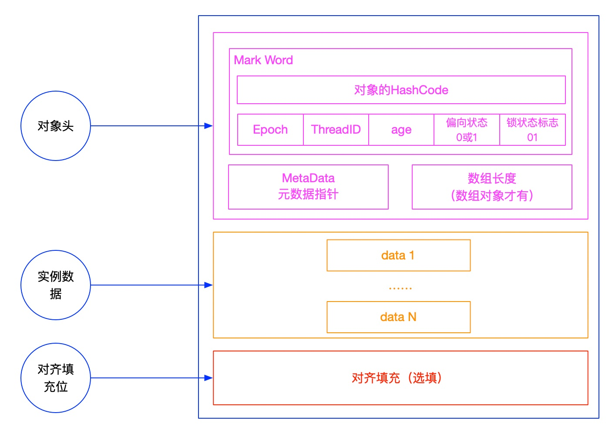

对齐填充位的作用：JVM要求对象的大小必须被8个字节整除，如果不能被整除则会在对齐填充位补一些空白。这样做的目的是为了寻址最优。

不同位数的虚拟机Mark Word存储的内容也是不一样的，以64位虚拟机为例，加不同锁时存储的内容：

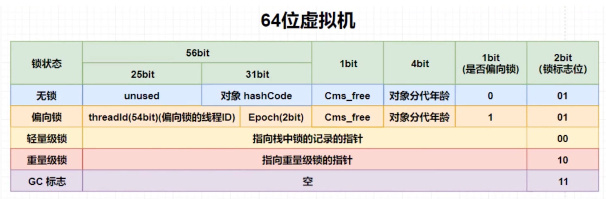