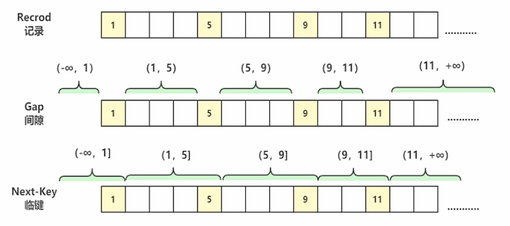

### 1、什么是事务

事务是逻辑上的一组操作，要么都执行，要么都不执行。

### 2、并发事务可能引发的问题

**脏读：**当一个事务正在访问数据并且对数据进行了修改，而这种修改还没有提交到数据库中，这是另外一个事务也访问了这个数据，然后使用了这个数据。因为这个数据是还没有提交的数，那么另一个事务读到的这个数据是“脏数据”，依据“脏数据”所做的操作可能是不正确的。（A事务在修改数据，但是还没有提交到数据库中，B事务就已经能访问到A事务修改后的值）

**丢失修改：**指在一个事务读取一个数据时，另外一个事务也访问了该数据，那么在第一个事务修改了该数据后，第二个事务也修改了该数据。这样第一个事务内修改的该数据就被丢失，因此称为丢失修改。（A事务在修改数据，B事务也修改该数据，造成A事务的修改被覆盖）

**不可重复读：**指在一个事务内多次读同一数据。在这个事务还没有结束时，另一个事务也访问该数据。那么，在第一个事务中的两次读数据之间，由于第二个事务的修改，导致第一个事务两次读取的数据可能不一致，这就发生了在一个事务内两次读到的数据是不一致的情况，因此称为不可重复读。（A、B两个事务读取同一个数据，B事务对数据进行了修改，造成A事务多次读取的结果不一致）

**幻读：**幻读与不可重复读类似，它发生在一个事务读取了几行数据，接着另外一个并发事务插入了一些数据，随后的查询中，第一个事务就会发现多了一些原本不存在的记录，就好像发生了幻觉一样，所以称为幻读。（A事务查询数据，B事务新增了数据，造成A事务后面查到的数据比之前多）

**不可重复读和幻读的区别：**不可重复读的重点是修改，幻读的重点在于新增或者删除。

### 3、事务的四大特性（ACID）

#### **原子性（Atomicity）**

**定义：**原子性是指一个事务是一个不可分割的工作单位，其中的操作要么都做，要么都不做；如果事务中一个sql语句执行失败，则已执行的语句也必须回滚，数据库退回到事务前的状态。

**实现原理：**

实现原子性的关键，是当事务回滚时能够撤销所有已经成功执行的sql语句。InnoDB实现回滚，靠的是undo log，当事务对数据库进行修改时，InnoDB会生成对应的undo log，如果事务执行失败或调用了rollback，导致事务需要回滚，便可以利用undo log中的信息将数据回滚到修改之前的样子。

undo log属于逻辑日志，它记录的是sql执行相关的信息。当发生回滚时，InnoDB会根据undo log的内容做与之前相反的工作，对于每个insert，回滚时会执行delete，对于每个delete，回滚时会执行insert，对于每个update，回滚时会执行一个相反的update，把数据改回去。

#### **隔离性（Isolation）**

**定义：**隔离性是指，事务内部的操作与其他事务是隔离的，并发执行的各个事务之间不能互相干扰。

**隔离级别：**

- **读未提交（Read Uncommitted）：**允许读取事务尚未提交的数据（会出现脏读、不可重复读、幻读）
- **读已提交（Read Committed）：**只允许读取事务已经提交的数据（可以解决脏读，但是不能解决不可重复读和幻读）
- **可重复读（Repeatable Read）：**同一事务对同一字段的多次读取结果是一样的（InnoDB默认隔离级别，可以解决脏读和不可重复读，但是无法解决幻读，InnoDB解决幻读问题是通过间隙锁来实现的）
- **可串行化（Serializable）：**事务串行执行，效率低一般不使用（可以解决脏读、不可重复读、幻读问题）

| 隔离级别 | 脏读 | 不可重复读 | 幻读 |
| -------- | ---- | ---------- | ---- |
| 读未提交 | 会   | 会         | 会   |
| 读已提交 | 不会 | 会         | 会   |
| 可重复读 | 不会 | 不会       | 会   |
| 可串行化 | 不会 | 不会       | 不会 |

**实现原理：**

对于隔离性的探讨，主要可以分为两个方面：

- （一个事务）写操作对（另一个事务）写操作的影响：LBCC（Lock-Based Concurrency Control 基于锁的并发控制）保证隔离性；
- （一个事务）写操作对（另一个事务）读操作的影响：MVCC（Multi-Version COncurrency Control 多版本并发控制）保证隔离性；

**a、LBCC（基于锁的并发控制）**

隔离性要求同一时刻只能有一个事务对数据进行写操作，InnoDB通过锁机制来保证这一点。

锁机制的基本原理可以概括为：事务在修改数据前，需要先获得相应的锁，获得锁之后，事务便可以修改数据，该事务操作期间，这部分数据是锁定的，其他事务如果需要修改数据，需要等待当前事务提交或者回滚后释放锁。

按照粒度，锁可以分为表锁、行锁以及其他位于二者之间的锁。表锁在操作数据时会锁定整张表，并发性能较差，行锁则只锁定需要操作的数据，并发性能好。但是由于加锁本身需要消耗资源（获得锁、检测锁、释放锁），因此在锁定数据较多情况下使用表锁可以节省大量资源。MySQL中不同的存储引擎支持的锁是不一样的，例如MyISAM只支持表锁，而InnoDB同时支持表锁和行锁，并且处于性能考虑，绝大多数情况下使用行锁。

**b、MVCC（多版本并发控制）**

MVCC全称为Multi-Version Concurrency Control，即多版本并发控制。主要是为了提高并发读写性能，不用加锁就能让多个事务并发读写。MVCC的特点是同一时刻，不同的事务读取到的数据可能是不同的（即多个版本）。

**当前读：**读取的是记录的最新版本，读取时还要保证其他并发事务不能修改当前数据，会对读取的记录进行加锁。

下面这几种情况都会使用当前读：

- select * from table where id=1 lock in share mode;（共享锁）
- select * from table where id=1 for update;
- update、insert、delete（排他锁）

**快照读：**快照读可以理解成读取的是数据的某个版本的快照，像不加锁的select操作就是快照读，快照读的前提是隔离级别不能是串行级别，串行级别会使快照读退化成当前读。

**实现原理：**MVCC是基于表中的隐藏列、回滚日志（undo log）和ReadView来实现的。

首先MySQL表中会有四个隐藏字段：

- 事务ID（DB_TRX_ID）：创建这条记录或最后一次修改该记录的事务ID
- 回滚指针（DB_ROLL_PTR）：指向这条记录上一个版本的地址（上一个版本的undo log）
- 隐藏主键（DB_ROW_ID）：没有指定主键时会自动生成一个默认的隐藏字段作为主键
- 删除标记（deleted_bit）：记录被删除时并不是真的被删除，而是把删除标记设为true，后台会有一个purge线程定时去清理被删除的记录。

这里主要用到事务ID和回滚指针，每次数据修改时都会更新事务ID，并且将回滚指针指向上一个版本的undo log，从而形成一个undo log版本链。

在事务第一次触发select查询时会生成一个ReadView，ReadView中会包含自身事务ID（creator_trx_id），当前活跃的事务ID列表（m_ids），最小活跃事务ID（min_trx_id）和最大活跃事务ID（max_trx_id），InnoDB会基于一定的规则来判断当前数据是否可见，来返回相应版本的数据，从而实现MVCC。具体的推导过程可见下图：

假如有一张用户表（user）：

| id   | age  | DB_TRX_ID | DB_ROLL_PTR |
| ---- | ---- | --------- | ----------- |
| 1    | 18   | 0         | null        |

#### **持久性（Durability）**

**定义：**持久性是指事务一旦提交，它对数据库的改变就应该是永久性的。接下来的其他操作或故障不应该对其有任何影响。

**实现原理：**

InnoDB作为MySQL的存储引擎，数据是存放在磁盘中的，但如果每次读写数据都需要磁盘IO，效率会很低。为此，InnoDB提供了缓存（Buffer Pool），Buffer Pool中包含了磁盘中部分数据页的映射，作为访问数据库的缓冲，当从数据库读取数据时，会首先从Buffer Pool中读取，如果Buffer Pool中没有，则从磁盘读取后放入Buffer Pool，当向数据库写入数据时，会首先写入Buffer Pool，Buffer Pool中修改的数据会定期刷新到磁盘中（这一过程称为刷脏）。

Buffer Pool的使用大大提高了读写数据的效率，但是也带来了新的问题，如果MySQL宕机，而此时Buffer Pool中修改的数据还没有刷新到磁盘，就会导致数据的丢失，事务的持久性无法保证。

于是redo log被引入进来解决这个问题：当数据修改时，除了修改Buffer Pool中的数据，还会在redo log记录这次操作，当事务提交时，会调用fsync接口对redo log进行刷盘。如果MySQL宕机，重启时可以读取redo log中的数据，对数据库进行恢复。redo log采用的时WAL（write-ahead logging，预写式日志），所有修改先写入日志，再更新到Buffer Pool，保证数据不会因为MySQL宕机而丢失，从而满足了持久性要求。

既然redo log也需要在事务提交时将日志写入磁盘，为什么它比直接将Buffer Pool中修改的数据写入磁盘（即刷脏）更快呢？主要有以下两方面的原因：

- 刷脏是随机IO，因为每次修改的数据位置随机，但写redo log是追加操作，属于顺序IO；
- 刷脏是以数据页（Page）为单位的，MySQL默认页大小是16kb，一个Page上一个小修改都要整页写入；而redo log中只包含真正需要写入的部分，无效IO大大减少。

#### **一致性（Consistency）**

**定义：**一致性是指事务执行结束后，数据库的完整性约束没有被破坏，事务执行的前后都是合法的数据状态。数据库的完整性约束包括但不限于：实体完整性（如行的主键存在且唯一）、列完整性（如字段的类型、大小、长度要符合要求）、外键约束、用户自定义完整性（如转账前后，两个账户余额的和应该不变）。

**实现原理：**

一致性是事务追求的最终目标：前面提到的原子性、持久性、隔离性都是为了保证数据库状态的一致性。此外，除了数据库层面的保障，一致性的实现也需要应用层面进行保障。

实现一致性的措施包括：

- 保证原子性、持久性和隔离性，如果这些特性无法保证，事务的一致性也无法保证；
- 数据库本身提供保障，例如不允许向整形列插入字符串值、字符串长度不能超过列的限制；
- 应用层面进行保障，例如如果转账操作只扣除转账者的余额，而没有增加接收者的余额，无论数据库实现多么完美，也无法保证状态的一致。

下面总结一下ACID特性及其实现原理：

- **原子性：**语句要么全执行，要么全不执行，是事务最核心的特性，事务本身就是以原子性来定义的；实现主要基于undo log
- **持久性：**保证事务提交后不会因为宕机等原因导致数据丢失；实现主要基于redo log
- **隔离性：**保证事务执行尽可能不受其他事务影响；InnoDB默认的隔离级别是RR，RR的实现主要基于锁机制（包含next-key lock）、MVCC（包括数据的隐藏列、基于undo log的版本链、ReadView）
- **一致性：**事务追求的最终目标，一致性的实现既需要数据库层面的保障，也需要应用层面的保障

（参考：https://www.cnblogs.com/kismetv/p/10331633.html）

### 4、锁的分类

#### 锁的模式：

**共享锁（Shared Locks，记为S）：** 又称为读锁，是一种行锁级别的锁，对某一资源加共享锁，自身可以读该资源，其他人也可以读该资源（也可以再继续加共享锁，即共享锁可以多个共存），但无法修改。要想修改就必须等所有共享锁都释放完之后才能进行。

- 加锁：select * from table lock in share mode;
- 释放锁：commit、rollback

**排他锁（Exclusive Locks，记为X）：** 又称为写锁，是一种行锁级别的锁，对某一资源加排他锁，自身可以进行增删改查，其他人无法进行任何操作（排他锁不能与其他锁共存）。

- 加锁：
  - 自动：DML语句默认会加排他锁
  - 手动：select * from table where id=1 for update;
- 释放锁：commit、rollback

**意向锁（Intention Locks）：** 均是表锁，无法手动创建，是由共享锁和排他锁所触发的，当我们加共享锁和排他锁的时候会自动给表上加一个意向（共享/排他）锁。

- 为什么要加入意向锁？：意向锁不是用来锁定数据的，而是用来判断表中有没有已经锁定的数据，可以提高加表锁的效率。
- 分类：
  - **意向共享锁（Intention Shared Locks，记为IS）：**表示事务准备给数据行加入共享锁之前，数据行加共享锁的前提是获取此表的IS锁
  - **意向排他锁（Intention Exclusive Locks，记为IX）：**表示事务准备给数据行加入排他锁之前，数据行加排他锁的前提是获取此表的IX锁

#### **锁的算法：** 

- **记录锁（Record Lock）：** 对索引项加锁，锁定符合条件的行。
- 例子：select * from table where id=1 for update;（会锁住id=1的这条记录，等值查询，精确匹配）
- **间隙锁（Gap Lock）：** 对索引项之间的间隙加锁，锁定记录的范围，不包含索引项本身。其他事务不能在锁范围内插入数据，这样可以防止别的事务新增幻影行。间隙锁只存在于RR隔离级别。
- 例子：select * from table where id>5 and id<9 for update;（会锁住(5,9)的开区间）
- **临键锁（Next-key Lock）：** 锁定索引项本身和索引范围，即记录锁和间隙锁的并集。查锁的范围包含索引项和索引间隙时就会自动触发临键锁。InnoDB使用临键锁来解决幻读问题。
  - 例子：select * from table where id>5 and id<11 for update;（会锁住(5,9]、(9,11]的数据）