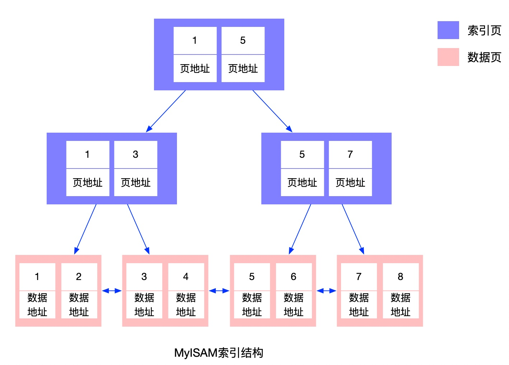
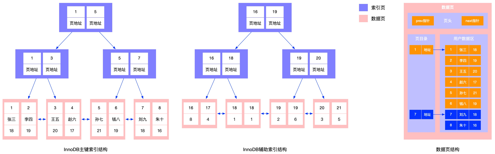
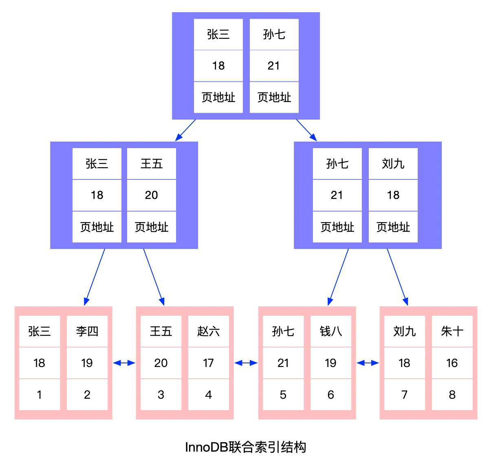

### 1、MySQL的索引结构

MySQL的索引底层采用的是B+树进行存储，B+树的每个节点代表一个索引页（如果是叶子节点称为数据页），一个索引页默认可以存储16KB的数据，在进行磁盘IO的时候也是以页为单位的，每次会加载1页数据到内存中，索引页的结构有三个比较重要的部分，一个是页头，它里面会有一个指向前一页的指针和一个指向后一页的指针，这样做的好处是，比如进行全表扫描或者进行范围查询的时候可以像链表一样操作；另外两个部分是页目录和用户数据区，用户数据区会存储具体的索引项以及子节点的指针，页目录相当于对用户数据区的数据再做了一层索引来提高数据的查询效率，有点跳表的意思。

B+树的数据都存储在叶子节点上，非叶子节点只存储索引，这样做的好处是可以节省空间，一个索引页里面就可以存储更多的索引，一般一个高度为3的B+树可以构造一个千万级别的表。

MyISAM采用的是非聚簇索引，也就是索引和数据是分开来存储的，叶子节点里面存储的是数据的地址，需要拿到这个地址去真实的数据文件里面查找。

InnoDB采用的是聚簇索引，它必须有一个主键索引，所有的数据会存储在主键索引的叶子结点上，如果建表的时候没有指定主键，InnoDB会选择一个能唯一标识数据的列作为主键，或者自动生成一个隐藏列作为主键，所以一般在建表的规范里面都会要求必须包含一个自增的主键ID。

如果是普通索引，它的叶子节点存储的是主键ID，通过普通索引进行查找的时候如果没有覆盖索引还需要回表到主键索引里面查询需要的字段。

### **2、InnoDB和MyISAM索引实现的区别**

#### a、MyISAM

MyIASM底层采用B+树作为索引结构，叶子结点的数据域存放的是数据记录的地址，这种索引称为非聚簇索引，MyISAM的主键索引和辅助索引结构上没太多区别，只不过主键索引的key要求唯一，辅助索引key可以不唯一。

MyISAM的数据文件包括三个，分别是：

.frm文件：存放的是表结构定义；

.MYD文件：存放真实数据；

.MYI文件：存放索引数据；

#### b、InnoDB

InnoDB底层同样采用B+树作为索引结构，和MyISAM不同的是，叶子结点存放的是不是数据的地址，而是真实的数据，InnoDB的数据文件本身就是索引文件，这种索引称为聚簇索引。

InnoDB要求表必须有主键索引（MyISAM可以没有），如果没有显示指定MySQL会自动选择一个可以唯一标识数据记录的列作为主键，如果没有满足这种要求的列，MySQL会自动为InnoDB表生成一个隐藏的字段作为主键，类型为长整型。所以在建表时尽量指定一个自动递增的列作为主键。如果主键是非连续的在插入数据时会造成B+树频繁分裂，从而影响插入性能。

InnoDB辅助索引的叶子节点的数据域记录的是主键的值，这点也是和MyISAM不同的，查询时通过辅助索引找到对应的主键值，然后再回表到主键索引中查询真实的数据。

MySQL进行磁盘IO加载数据是以页为单位的，每次会从磁盘中读取一页数据加载到内存中，每页的默认大小是16KB，MySQL将所有数据项存放到叶子结点是为了存储更多的索引键，一颗高度为3的B+树可以构造一个千万级别的表。

为了提高页中数据的查询效率，MySQL引入页目录的概念，页目录将数据按照一定的大小分成不同的组，默认每组6条记录，在页目录中记录每组数据中最小的那个索引值，以及对应数据的地址，这样在查询时先查询页目录，然后再查询用户数据区，对性能进一步提高。

InnoDB的数据文件包括两个：

- .frm文件：存储表结构定义

- .ibd文件：存储索引和表数据

### **3、最左前缀原则**

在介绍最左前缀原则前，先介绍一下联合索引，索引是一种排序好的数据结构，联合索引会按照字段的先后顺序依次进行排序，比如下图，建立一个名称和年龄的联合索引，那么索引在存储时，先按照名字进行排序，名字相同再按照年龄排序，这就会出现一个问题，假如我们的查询条件中没有名字，只有年龄，单纯的年龄字段在索引中并不是有序的，那么则无法利用索引进行查询。

最左前缀原则表示进行查询时，如果想要使用联合索引，查询条件中必须含有最左边的字段，比如a、b、c三个字段的联合索引，只有a/ab/abc才能命中索引，b/c/bc都无法命中索引，ac可以命中索引，这种情况是利用了a字段的索引，c字段并未起作用。

### **4、索引分类：**

逻辑角度：

- 主键索引：特殊的唯一索引，不允许有空值
- 唯一索引：索引列值必须唯一，允许有空值
- 单列索引
- 联合索引（多列索引）

物理存储角度：

- 聚簇索引：索引和数据存储在一起
- 非聚簇索引：索引和数据分开存储

数据结构角度：

- B+树索引：
- hash索引：采用哈希算法，查询效率高，但是不支持范围查询
- full text索引：

### 5、什么情况下不会走索引

- 查询条件中有or关键字，如果查询条件中有字段没有加索引，那么会进行全表扫描
- 组合索引在不符合最左前缀原则的时候不会使用索引
- like查询以%开头
- 索引列的数据类型存在隐式转换
- 索引列上有数学运算
- 对索引列使用MySQL内置的函数
- 查询优化器发现全表扫描比使用索引更快时

### 6、为什么用B+树做索引，而不用普通的B树做索引

B+树在B树的基础上做了一些改进，比如数据只存储在叶子节点，叶子节点之间会通过双向指针链接等

- 数据只存储在叶子节点可以节省存储空间，提高磁盘I/O效率，MySQL磁盘I/O是以数据页为单位的，每个数据页大小固定，这样可以存储更多的数据行；
- 节点之间通过双向指针链接可以支持高效的范围查询和全表扫描，这两个场景是MySQL中频次非常高的操作；

### 7、什么是覆盖索引

利用辅助索引可以直接返回数据，不需要再回表去主键索引上查询数据。

### 8、什么是索引下推

索引下推（Index Condition Pushdown 简称：ICP）是MySQL5.6版本推出的一个查询优化。只能用于辅助索引上。

- 不使用ICP：在使用非主键索引进行查询时，存储引擎通过索引检索到数据，然后返回给MySQL服务器，服务器然后判断数据是否符合条件；
- 使用ICP：如果存在某些被索引的列的条件判断时，MySQL服务器将这部分判断条件传递给存储引擎，然后由存储引擎判断索引是否符合条件，只有当索引符合条件才会将数据返回给MySQL服务器；
- 索引条件下推可以减少存储引擎回表查询的次数，也可以减少MySQL服务器从存储引擎接收数据的次数；

举个例子：有一张用户表（user），id是主键，name和age是联合索引

| id   | last_name | first_name | age  |
| ---- | --------- | ---------- | ---- |
| 1    | 张        | 一         | 18   |
| 2    | 张        | 二         | 17   |
| 3    | 李        | 三         | 19   |
| 4    | 李        | 四         | 16   |

假如现在有一条查询语句：select * from user where last_name="张" and first_name like "%一%";

- 不使用ICP：按照最左前缀原则，可以命中索引，先通过last_name查到张的ID，fisrt_name是一个条件查询，且不符合最左前缀原则，所以不会进行判断，这个时候会对ID为1和2的记录进行回表，将查到的结果返回给MySQL服务器端，服务器端对数据进行条件判断，将正确的结果返回，在这个过程中，回表了两次，服务器端取到的数据也是两条；
- 使用ICP：同样进行上面的查询，由于把查询条件下推给了存储引擎，这个时候会first_name进行条件判断，只会拿到ID为1的记录进行回表，服务器端也只拿到1条数据，减少了一次回表，也减少了一条数据的获取，效率会更高；