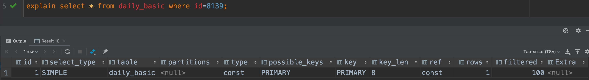
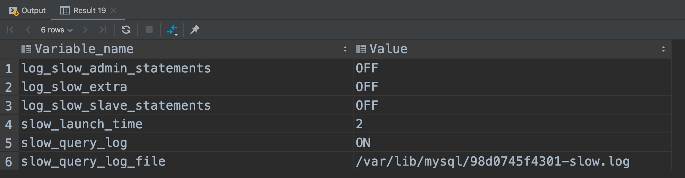
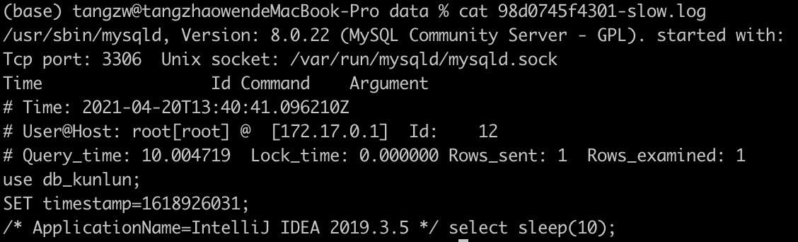

### 1、SQL的优化方案

- 没有索引的时候加索引

  - 出现在select、update、delete语句的where从句中的列
  - 包含在order by、group by、distinct中的字段
  - join的关联列
  - 对于频繁的查询优先考虑使用覆盖索引

- 有索引时避免索引失效

  - 使用like语句时，如果用双%（a like "%123%"），会让索引失效（如果无前置%，只有后置%，是可以走到索引的）
  - 避免数据类型隐示转换造成索引失效（如：select name,phone from customer where id = '111';）
  - 避免在where子句中使用or来连接条件，有可能会造成索引失效

- 避免返回无用数据

  - 不使用select *，而是需要什么字段就查什么字段
  - 加上where条件，不要把不需要的数据也返回

- 避免无效的CPU运算

  - 如果明确知道结果的数量可以加上limit关键字，这样可以避免全表扫描，提高效率
  - 优化limit分页，MySQL并不是跳过偏移量直接取后面的数据，而是把偏移量加上要取的条数全部查出来，然后再抛弃掉偏移量前面的数据

    - 将上一页的最大值加到where条件中进行过滤
    - order by + 索引
    - 业务层面优化设计

  - 如果检索结果中不会有重复的记录，推荐union all 替换 union。如果使用union，不管检索结果有没有重复，都会尝试进行合并，然后在输出最终结果前进行排序。如果已知检索结果没有重复记录，使用union all 代替union，这样会提高效率。

### **2、Explain关键字分析：**



**使用explain关键字重点会关注哪些信息？**

- 第一个是会关注type字段，用来判断是不是进行了全表扫描
- 然后会关注possible_keys和key字段，用来判断能使用哪些索引以及实际使用的索引
- 然后会关注rows字段，用来判断读取了多少数据
- 最后会去看extra字段来获取一些额外的信息，比如是不是有索引覆盖，索引条件下推等等一些情况

| 字段              | 说明                                                         | 可能值                                                       |
| ----------------- | ------------------------------------------------------------ | ------------------------------------------------------------ |
| **id**            | 查询的序号，表示查询中执行select子句或操作表的顺序。id相同，执行顺序从上往下；id不同，id值越大，优先级越高，越先执行； |                                                              |
| **select_type**   | 查询类型，用于区分普通查询、联合查询、子查询等复杂查询。     | **SIMPLE:** 简单的select查询，查询中不包含子查询或者union；<br>**PRIMARY:** 查询中若包含任何复杂的子部分，最外层查询被标记为primary；<br>**UNION:** UNION中的第二个或后面的SELECT语句；<br>**DEPENDENT UNION:** UNION中的第二个或后面的SELECT语句，取决于外面的查询；<br>**UNION RESULT:** UNION的结果，union语句中第二个select开始后面所有select；<br>**SUBQUERY:** 子查询中的第一个SELECT，结果不依赖于外部查询；<br>**DEPENDENT SUBQUERY:** 子查询中的第一个SELECT，依赖于外部查询；<br>**UNCACHEABLE SUBQUERY:** 一个子查询的结果不能被缓存，必须重新评估外链接的第一行；<br>**DERIVED:** 派生表的SELECT, FROM子句的子查询； |
| **table**         | 输出的行所引用的表名                                         |                                                              |
| **partitions**    | 如果查询是基于分区表的话，会显示查询将访问的分区             |                                                              |
| **type**          | 对表访问方式，表示MySQL在表中找到所需行的方式，又称“访问类型”。常用的类型有： ALL、index、range、 ref、eq_ref、const、system、NULL（从左到右，性能从差到好） | **ALL:** Full Table Scan， MySQL将遍历全表以找到匹配的行。<br>**index:** Full Index Scan，index与ALL区别为index类型只遍历索引树。<br>**range:** 只检索给定范围的行，使用一个索引来选择行。<br>**ref:** 表示上述表的连接匹配条件，即哪些列或常量被用于查找索引列上的值。<br>**eq_ref:** 类似ref，区别就在使用的索引是唯一索引，对于每个索引键值，表中只有一条记录匹配，简单来说，就是多表连接中使用primary key或者 unique key作为关联条件。<br>**const、system:** 当MySQL对查询某部分进行优化，并转换为一个常量时，使用这些类型访问。如将主键置于where列表中，MySQL就能将该查询转换为一个常量，system是const类型的特例，当查询的表只有一行的情况下，使用system。<br>**NULL:** MySQL在优化过程中分解语句，执行时甚至不用访问表或索引，例如从一个索引列里选取最小值可以通过单独索引查找完成。 |
| **possible_keys** | 指出MySQL能使用哪个索引在该表中能找到行                      |                                                              |
| **key**           | key列显示MySQL实际决定使用的键（索引），必然包含在possible_keys中。如果没有选择索引，键是NULL。要想强制MySQL使用或忽视possible_keys列中的索引，在查询中使用FORCE INDEX、USE INDEX或者IGNORE INDEX。 |                                                              |
| **key_len**       | 表示索引中使用的字节数，可通过该列计算查询中使用的索引的长度（key_len显示的值为索引字段的最大可能长度，并非实际使用长度，即key_len是根据表定义计算而得，不是通过表内检索出的）。不损失精确性的情况下，长度越短越好 。 |                                                              |
| **ref**           | 列与索引的比较，表示上述表的连接匹配条件，即哪些列或常量被用于查找索引列上的值 |                                                              |
| **rows**          | 估算出结果集行数，表示MySQL根据表统计信息及索引选用情况，估算的找到所需的记录所需要读取的行数 |                                                              |
| **filtered**      | 是一个半分比的值，rows * filtered/100 可以估算出将要和 explain 中前一个表进行连接的行数（前一个表指 explain 中的id值比当前表id值小的表）。 |                                                              |
| **Extra**         | 包含不适合在其他列中显示，但是十分重要的额外信息             | **Using where:** 不用读取表中所有信息，仅通过索引就可以获取所需数据，这发生在对表的全部的请求列都是同一个索引的部分的时候，表示mysql服务器将在存储引擎检索行后再进行过滤。<br>**Using temporary:** 表示MySQL需要使用临时表来存储结果集，常见于排序和分组查询，常见 group by ; order by。<br>**Using filesort:** 当Query中包含 order by 操作，而且无法利用索引完成的排序操作称为“文件排序”。<br>**Using join buffer:** 该值强调了在获取连接条件时没有使用索引，并且需要连接缓冲区来存储中间结果。如果出现了这个值，那应该注意，根据查询的具体情况可能需要添加索引来改进能。<br>**Impossible where:** 这个值强调了where语句会导致没有符合条件的行（通过收集统计信息不可能存在结果）。<br>**Select tables optimized away:** 这个值意味着仅通过使用索引，优化器可能仅从聚合函数结果中返回一行。<br>**No tables used:** Query语句中使用from dual 或不含任何from子句。<br>**Using index:** 使用索引覆盖的情况，查询的字段都包含在使用的索引中，where子句使用的字段也都包含在使用的索引中。<br>**Using index condition:** 发生索引条件下推的情况。 |

**explain 有两个变种（在MySQL 5.7后这两个字段默认就包含）：**

1） explain extended：会在 explain 的基础上额外提供一些查询优化的信息。紧随其后通过 showwarnings 命令可以 得到优化后的查询语句，从而看出优化器优化了什么。额外还有 filtered 列，是一个半分比的值，rows * filtered/100 可以估算出将要和 explain 中前一个表进行连接的行数（前一个表指 explain 中的id值比当前表id值小的表）。

2）explain partitions：相比 explain 多了个 partitions 字段，如果查询是基于分区表的话，会显示查询将访问的分区。

### **3、慢查询日志：**

#### a、查看是否开启慢查询日志：

```
show variables like '%slow%';
```



#### b、临时开启慢查询日志：

```
-- 临时开启慢查询日志
set global slow_query_log = on;
-- 设置慢查询时间临界点（秒）
set long_query_time = 1;
-- 设置慢查询存储方式
set global log_output = file;
```

#### c、永久设置开启慢查询日志：

修改MySQL配置文件即可，默认在/etc/my.cnf

#### d、分析慢查询日志：

- 通过cat命令查看慢查询日志
- 使用mysqldumpslow分析慢查询日志
- 使用pt-query-digest工具分析慢查询日志



- Query_time：语句执行时间（秒）
- Lock_time：在几秒内获得锁
- Rows_sent：发送到客户端的行数
- Rows_examined：优化程序检查的行数
- SET timestamp表示什么时候记录的慢查询

