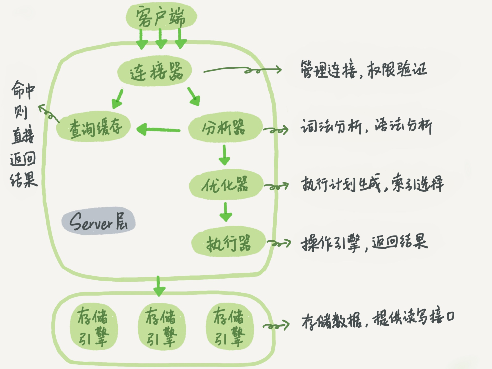
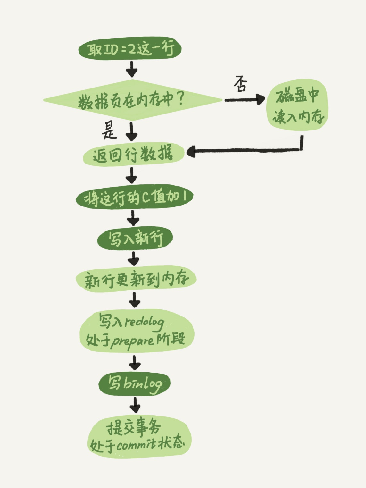

### 1、一条SQL语句在MySQL中是如何执行的？

- 第一步：先连接到数据库，负责处理的是连接器；

- - 连接器：负责跟客户端建立连接、获取权限、维持和管理连接

- 第二步：MySQL拿到一个查询请求后，会先到查询缓存里面查找，如果找到则直接将结果返回给客户端。

- - 查询缓存：之前执行过的语句和结果会以键值对的形式缓存在内存中。key是查询的语句，value是查询的结果。查询缓存一般不建议使用，因为失效比较频繁，表有更新的时候整个表上所有的查询缓存都会被清空。

  - - 可以通过参数query_cache_type设置成DEMAND，这样默认的SQL语句不会使用查询缓存，如果要使用的时候可以通过SQL_CACHE显示指定，如：select SQL_CACHE * from T where ID=10;
    - MySQL 8.0已经把查询缓存整块删掉了；

- 第三步：如果没有命中查询缓存，SQL语句会传递到分析器中进行词法和语法分析，来分析SQL语句是不是合法的；

- - 分析器：负责解析SQL语句；

  - - 词法分析：识别出SQL语句中的关键字、表名、列名等等；
    - 语法分析：判断SQL是不是符合MySQL的语法规则；

- 第四步：SQL语句被解析后就知道要做什么事情，这个时候会经过优化器进行处理，制定最优的执行计划；

- - 优化器：优化器会帮助我们选择合适的索引，或者多表关联（join）的时候决定各个表的连接顺序，使执行的效率较优；

- 第五步：通过分析器可以知道你要做什么，通过优化器可以知道具体应该怎么做，那么下一步就是通过执行器具体去执行SQL语句；

- - 执行器：负责具体的执行逻辑

  - - 首先会进行权限校验，在分析器之后会做一次权限验证，叫做precheck，但是这一步无法对运行时涉及到的表进行权限验证，比如使用了触发器的情况，所以在执行器这里也要做一次执行时的权限验证；
    - 做完权限校验后，执行器会根据表的引擎定义，去使用这个引擎提供的接口来进行数据操作，最后会将符合条件的结果集返回给客户端；

### 2、更新语句是如何执行的，比如：update T set c=c+1 where ID=2;

- 执行器先找引擎取ID=2这一行，如果ID=2这一行所在的数据页本来就在内存中，就直接返回给执行器；否则需要先从磁盘读入内存再返回；
- 执行器拿到引擎给的行数据，把这个值加上1，再调用引擎接口写入这行新数据；
- 引擎将这行新数据更新到内存中，同时将这个更新操作记录到redo log里面，此时，redo log处于prepare状态，然后告知执行器执行完成了，随时可以提交事务；
- 执行器生成这个操作的binlog，并把binlog写入磁盘；
- 执行器调用引擎的提交事务接口，引擎把刚刚写入的redo log改成提交（commit）状态，更新完成；