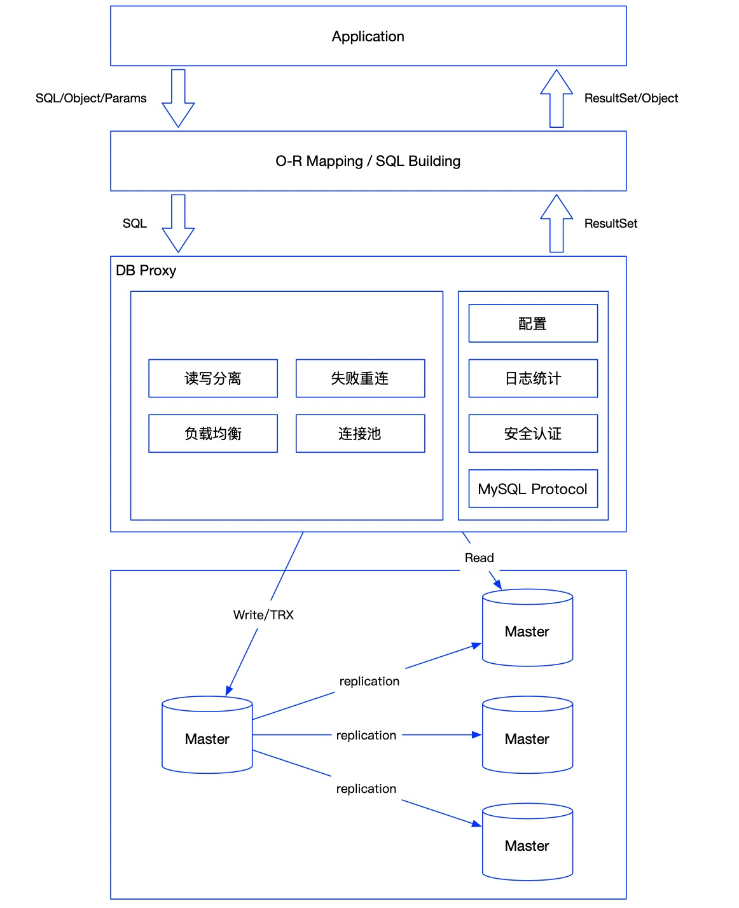
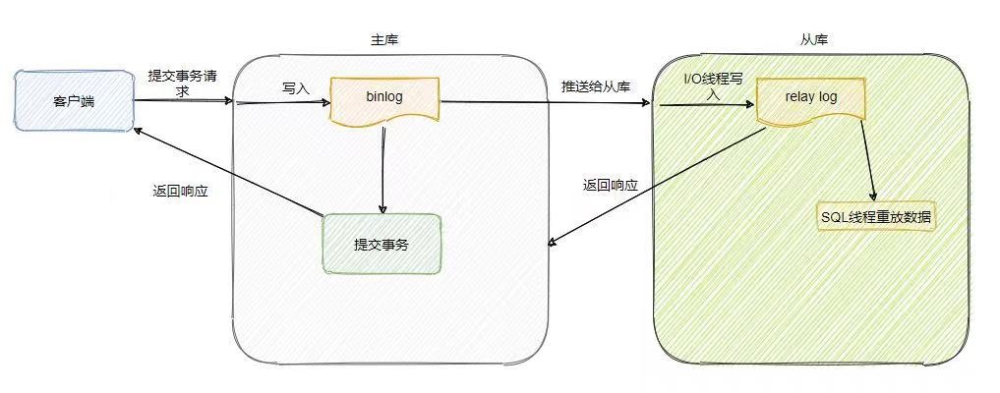
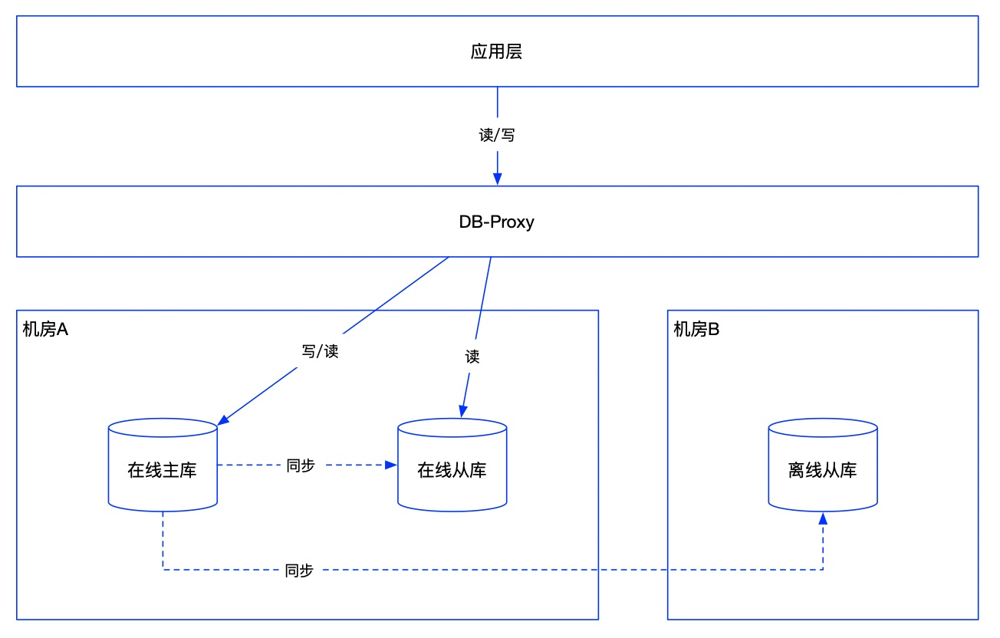
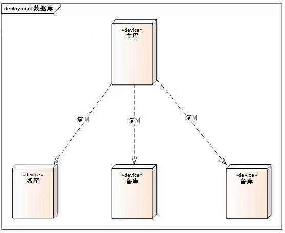
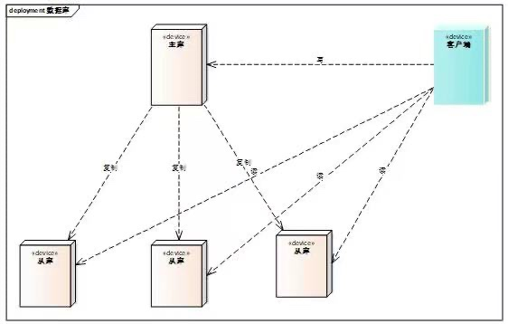

### 1、数据库中间件的使用（DB-Proxy）

**背景：**

实际项目中，读写分离，失败重连，负载均衡，连接池等功能往往写在应用中，不仅干扰实际应用的代码，还使应用出错的机会大大增加，而SQL日志分析，连接池等功能在PHP上更是很难做或者根本做不了。运维上，应用方直连数据库是一种灾难，同时故障恢复往往需要前端配合，为了尽量减少DBA运维成本，以及应用方故障恢复成本，也需要中间层来解耦。

**功能：**

- 读写分离

  - 基本原则是读请求走从库，写请求走主库
  - 为了避免主从延迟带来的读不到刚刚更新的数据问题，同一会话中，写请求结束后指定时间内的读请求会发到主库。
  - 事务内的sql不进行读写分离，全部发到主库

- 负载均衡

- 安全认证

- 失败重连：失败重连主要是为应用到DB服务器建立重连机制，此处的失败是指TCP层的连接失败，而非应用层的连接失败，连接失败后会重试2次

- 连接池

- 表路由功能：为方便DBA做数据库实例的透明拆分，加入表路由功能，该功能允许dbproxy配置表路由规则，根据表名做sql路由到不同的数据库集群，此过程对业务透明。

- 支持sqlhint来实现一些扩展功能，比如强制主库、指定分片、全链路压测影子表等

### 2、如何进行主从同步

主从同步依赖的是binlog，MySQL默认是异步复制，具体流程如下：

**主库：** 

- 接收到提交事务请求
- 更新数据
- 将数据写入binlog中
- 给客户端响应
- 推送binlog到从库

**从库：** 

- 由I/O线程将同步过来的binlog写入到relay log中
- 由SQL线程从relay log重放事件，更新数据
- 给主库返回响应

用一句话概括下：主库提交事务会写binlog，会由一个dump线程推送给从库，从库接受之后会有一个I/O线程将其写到relay log中，慢慢消化，由SQL线程来重放数据。

异步复制：有数据丢失的风险，例如数据还未同步到从库，主库就给客户端响应，然后主库挂了，此时从库晋升为主库的话数据是缺失的；

同步复制：主库需要将binlog复制到所有从库，等所有从库响应了之后才给客户端响应，这样的话性能很差，一般不会选择同步复制；

半同步复制：MySQL5.7出来的，有个参数可以设置成功同步几个从库后就返回响应，兼顾了性能和可靠性；

**主从同步延时怎么处理：**

- 二次查询：如果从库查不到数据，到主库再查一遍
- 强制将写后立马读的操作转移到主库，DB-Proxy就是这种方案，可以设置一个时间，写完后在这个时间内走主库
- 关键业务读写都走主库，非关键业务读写分离

### 3、数据库如何实现高可用

数据存储高可用的方案本质就是通过将数据复制到多个存储设备，通过数据冗余的方式来实现高可用。

- **实际项目中使用的方案：**采用一主两备的方案，在线主库主要负责写操作，也可以提供读能力，在线从库提供读操作，在线主库和从库一般在同一个机房，数据同步延迟低，离线从库一般跨机房，不提供读写服务，只用来做数据备份。如果有数据库挂了，中间件自动做主从切换。

- **主备架构：**主库完成业务的读写操作，备库只做数据备份，不参与实际业务

  - 优点：简单
  - 缺点：故障后需要人工干预，无法自动恢复，备库职责太少容易造成成本浪费

- **主从架构：**主库完成写操作，从库完成读操作

  - 优点：主库故障时，从库可以继续提供读服务，从库可以缓解主库压力
  - 缺点：容易出现数据一致性问题，故障后需要人工干预，无法自动恢复

### 4、数据库如何实现高性能、高并发

总体原则就是采用分布式进行分流，或者利用中间件降低直接对数据库的并发

- 查询优化
- 分库分表
- 读写分离
- 利用缓存

### 5、使用MySQL时一般会看哪些指标

- 慢查询监控：最普遍，直接和程序员相关，一般需要优化SQL
- QPS、TPS：用来判断数据库压力是不是很大，考虑要不要加缓存或者做读写分离
- SQL异常：用来判断代码中是否有SQL执行报错，可以发现一些比较隐秘的问题，比如临界值处理，唯一key判断等
- 单表数据量监控：发现一些大表，判断是不是要做分表
- 还有一些db-proxy的监控，比如延时、请求数、服务器的各种监控指标，这个一般DBA和运维关注比较多