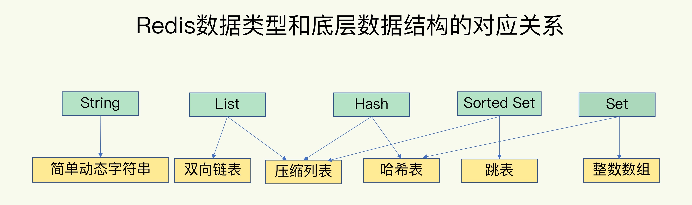
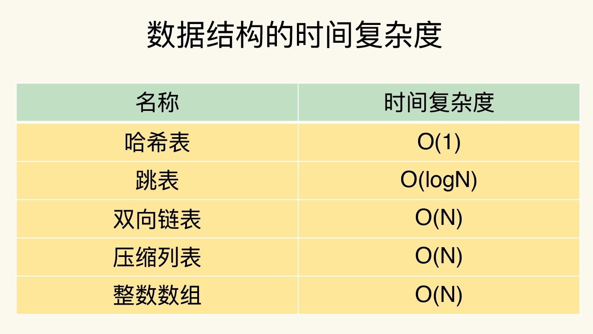
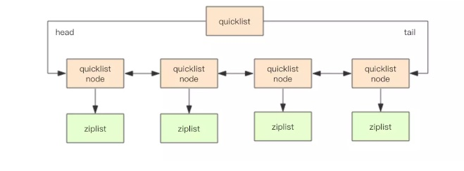
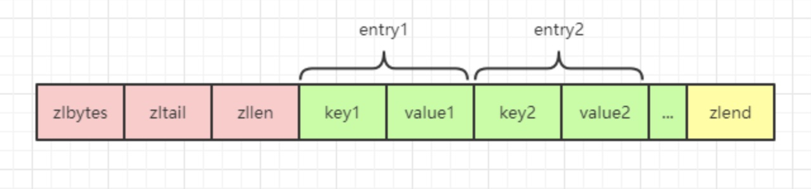
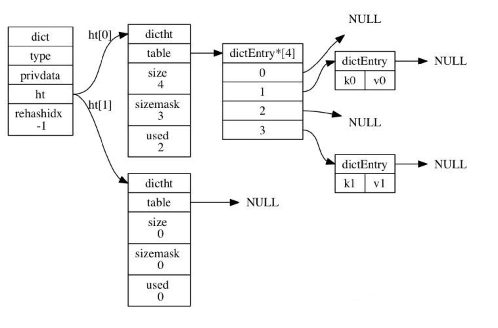
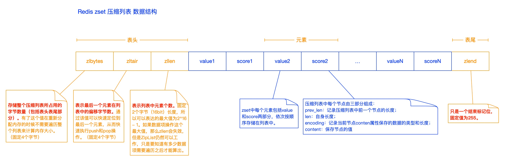
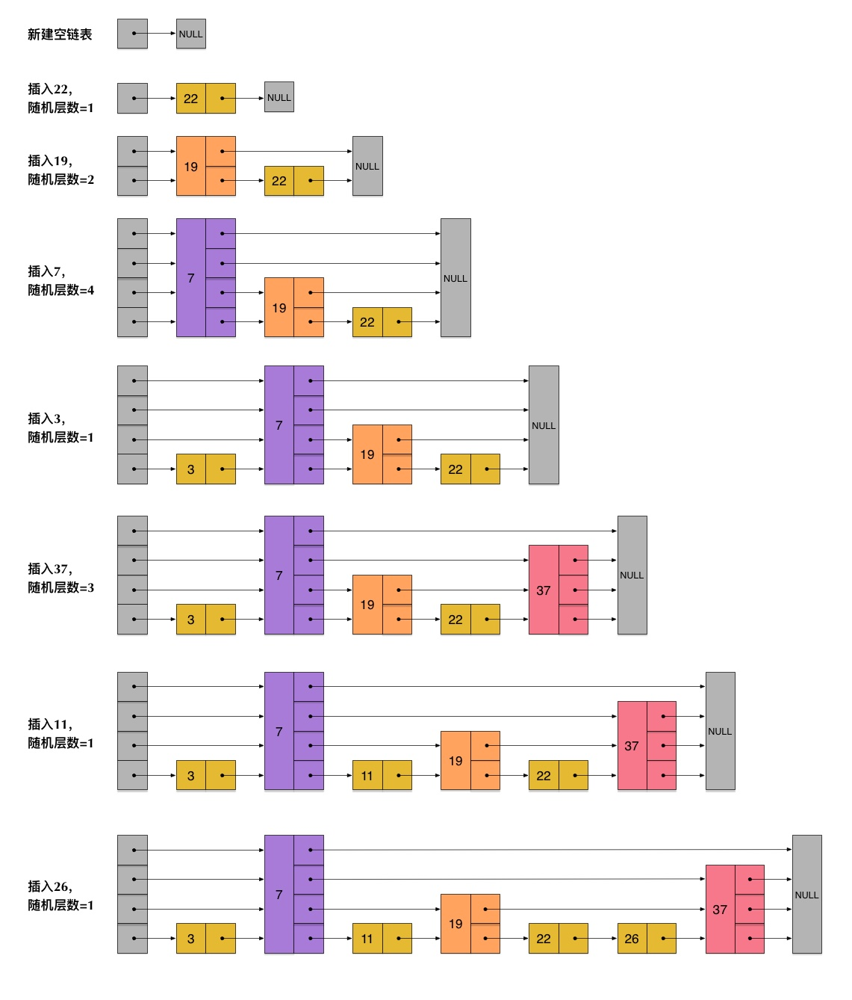
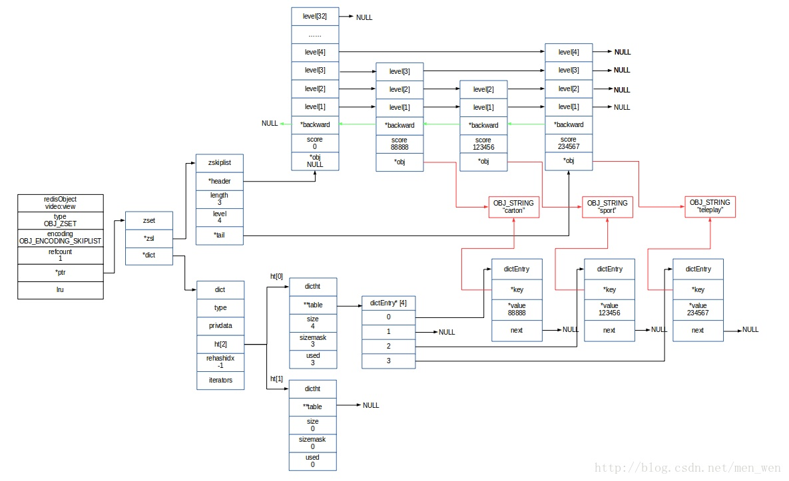

### **一、Redis支持的数据类型**





#### 1、String（字符串）

**底层数据结构：**简单动态字符串（SDS）

**SDS实现原理：**

- 空间预分配策略

- - 第一次创建字符串对象时, SDS不会分配冗余空间, 即 len = 0

  - 对字符串进行修改时，先判断空间是否充足，如果充足则直接使用，如果不充足则会自动扩充SDS的内存空间

  - 当SDS的API修改SDS时, 则会为其分配冗余空间.

  - - 当修改后的SDS的 len 属性小于1MB时, 则为其分配和 len 同样大小的冗余空间, 即 free = len, 此时 buf [ ] 的实际长度 = len(实际长度) + free(冗余空间) + 1(空字符)
    - 当修改后的SDS的 len 属性大于等于1MB时, 则为其分配1MB的冗余空间. buf [ ] 的实际长度 = len(实际长度) + free(1MB) + 1(空字符)

 

```
struct sdshdr {
    // 记录 buf 数组中已使用字节的数量, 不包括 '\0' 的长度
    // 等于 SDS 所保存字符串的长度
    int len;
    // 记录 buf 数组中未使用字节的数量
    int free;
    // 字节数组，用于保存字符串
    char buf[];
};
```

#### 2、List（列表）

**底层数据结构：**Redis3.2之前使用压缩列表、双向链表；Redis3.2之后使用quicklist

**底层实现原理（Redis3.2之前）：**底层采用压缩列表（ziplist）和双向链表（LinkedList）实现，由于LinkedList占用内存比ziplist要多，当创建新的List时会优先使用ziplist，当满足以下条件时，会将ziplist转换成LinkedList（任意一个条件）：

- 新添加的值长度大于64（可通过redis.conf配置：list-max-ziplist-value 64）
- ZipList包含的节点数大于512（可通过redis.conf配置：list-max-ziplist-entries512）

压缩列表的实现可参考zset中的介绍，双向链表的实现如下： 

```
// 链表的封装
typedef struct list {
     // 头节点
     listNode *head; 
     // 尾节点
     listNode *tail; 
     // 链表中的节点数
     unsigned int len; 
     // 节点值复制函数
     void *(*dup) (void *ptr); 
     // 节点值释放函数
     void (*free) (void *ptr); 
     // 节点值对比函数
     int (*match) (void *ptr, void *key);
} list;
// 链表节点的定义
typedef struct listNode { 
     // 前置节点
     struct listNode *prev;
     // 后置节点
     struct listNode *next;
     // 节点的值
     void *value;
} listNode;
```

**底层实现原理（Redis3.2之后）：**底层采用quicklist实现，quicklist可以理解成是zipList和LinkedList的结合，是一个将ZipList作为节点的双向链表。quicklist内部单个ziplist长度为8KB（可以通过配置文件：list-max-ziplist-size配置），超过这个大小就会创建一个新的ziplist。

quicklist结合了ziplist内存利用优势和LinkedList更新性能优势于一体。为了进一步节省空间，Redis还会对ziplist进行压缩存储，使用LZF算法进行压缩，可以选择压缩深度。



quicklist的定义如下：

```
// quicklist定义
struct quicklist{
    quicklistNode* head;    //指向头结点
    quicklistNode* tail;    //指向尾节点
    long count;             //元素总数
    int nodes;              //quicklistNode节点的个数
    int compressDepth;      //压缩算法深度
}
// quicklist节点定义
struct quicklistNode{
    quicklistNode* prev;    //前一个节点
    quicklistNode* next;    //后一个节点
    ziplist* zl;            //压缩列表
    int32 size;             //ziplist大小
    int16 count;            //ziplist 中元素数量
    int2 encoding;          //编码形式 存储 ziplist 还是进行 LZF 压缩储存
}
// ziplist压缩后的结构
struct quicklistLZF {
    unsigned int sz;    //元素个数
    char compressed[];  //元素内容
} quicklistLZF;
```

#### **3、Hash（哈希）**

**底层数据结构：**压缩列表（ziplist）、哈希表（hashtable）

**底层实现原理：**底层采用压缩列表和哈希表实现，当满足以下条件时使用ziplist（任意一个条件）：

- 哈希对象中所有键值对总长度（包括键和值）小于64字节（可通过redis.conf配置：list-max-ziplist-value 64）
- 哈希对象中的键值对数量小于512个（可通过redis.conf配置：hash-max-ziplist-entries 512）

**压缩列表实现：**使用压缩列表存储键值对是将键和值分表作为一个元素，相邻添加到列表中。



**哈希表实现：**字典的定义中有两个哈希表，主要用来进行扩容时进行rehash操作



```
// 字典的定义
typedef struct dict {
    dictType *type;          //字典类型的一些特定函数
    void *privdata;          //私有数据，type中的特定函数可能需要用到
    dictht ht[2];            //哈希表(注意这里有2个哈希表)
    long rehashidx;          //rehash索引，不在rehash时，值为-1
    unsigned long iterators; //正在使用的迭代器数量
} dict;
// 哈希表的定义
typedef struct dictht {
    dictEntry **table;      //哈希表数组，每个元素都是一个dictEntry对象。
    unsigned long size;     //哈希表大小
    unsigned long sizemask; //掩码大小，用于计算索引值，总是等于size-1
    unsigned long used;     //哈希表中的已有节点数
} dictht;
// 哈希表元素的定义 包含Key,Value数据对
typedef struct dictEntry {
    void *key;              //键
    union {
        void *val;          //值
        uint64_t u64;
        int64_t s64;
        double d;
    } v;
    struct dictEntry *next; //指向下一个节点, 链接表的方式解决Hash冲突
} dictEntry;
```

**Hash扩容流程：**

- 当 hash 表中元素的个数等于第一维数组的长度时，就会开始扩容，
- 扩容的新数组是原数组大小的 2 倍，
- 然后将旧字典所有链表中的元素重新挂接到新的数组下面，这是一个 O(n)级别的操作，
- Redis 使用渐进式 rehash 扩容，
- 渐进式rehash可以避免了集中式rehash带来的庞大计算量，
- 在渐进式rehash过程中，因为还可能会有新的键值对存进来，此时Redis的做法是新添加的键值对统一放入ht[1]中，
- 这样就确保了ht[0]键值对的数量只会减少，
- 当执行rehash操作时需要执行查询操作，此时会先查询ht[0]，查找不到结果再到ht[1]中查询。

#### 4、Set（集合）

**底层数据结构：**整数数组（intset）、哈希表（hashtable）

**底层实现原理：**底层使用整数数组和哈希表实现，当满足以下两个条件时使用intset，否则使用hashtable：

- 集合对象中保存的所有元素都是整数值
- 集合中元素不操作512个

**整数数组（intset）实现方式：**

```
// intset的定义
typedef struct intset {
    // 编码方式
    uint32_t encoding;
    // 集合包含的元素数量
    uint32_t length;
    // 保存元素的数组
    int8_t contents[];
} intset;
```

**哈希表实现方式：**类似Hash中的哈希表

**set存储数据的过程：**

- 检查set是否存在，如果不存在，则创建一个set集合

- 根据传入的set集合一个个进行添加，添加的时候需要进行内存压缩

- setTypeAdd执行set添加过程中会判断是否进行编码转换

- 首先如果已经是hashtable的编码，那么我们就走正常的hashtable的元素添加，如果原来是intset的情况，那么我们就需要进行如下判断：

- - 如果能够转成int的对象（isObjectRepresentableAsLongLong），那么就用intset保存
  - 如果用intset保存的时候，如果长度超过512（REDIS_SET_MAX_INTSET_ENTRIES）就转为hashtable编码
  - 其他情况统一用hashtable进行存储

#### 5、Sorted Set（有序集合）

**底层数据结构：**压缩列表、跳表

**底层实现原理：**zset底层采用压缩列表（ziplist）和跳表（skiplist）实现的，当满足以下条件时采用压缩列表，其他情况下均采用跳表实现：

- 集合中元素数量小于128个；
- 每个元素的长度小于64字节；



```
// 压缩列表的定义
struct ziplist<T>{
    int32 zlbytes;            //压缩列表占用字节数
    int32 zltail_offset;      //最后一个元素距离起始位置的偏移量,用于快速定位到最后一个节点
    int16 zllength;           //元素个数
    T[] entries;              //元素内容
    int8 zlend;               //结束位 0xFF
}
// 压缩列表元素的定义
struct entry{
    int<var> prevlen;            //前一个 entry 的长度
    int<var> encoding;            //元素类型编码
    optional byte[] content;    //元素内容
}
```

**跳表的结构：**





**从源码分析跳表的数据结构：**

```
/* Redis 对象 */
typedef struct redisObject {
    // 类型
    unsigned type:4;
    // 对齐位
    unsigned notused:2;
    // 编码方式
    unsigned encoding:4;
    // LRU 时间（相对于 server.lruclock）
    unsigned lru:22;
    // 引用计数
    int refcount;
    // 指向对象的值
    void *ptr;
} robj;
/* type(对象类型) */
#define REDIS_STRING 0  // 字符串
#define REDIS_LIST   1  // 列表
#define REDIS_SET    2  // 集合
#define REDIS_ZSET   3  // 有序集
#define REDIS_HASH   4  // 哈希表
/* encoding(对象编码) */
#define REDIS_ENCODING_RAW        0     // 编码为字符串
#define REDIS_ENCODING_INT        1     // 编码为整数
#define REDIS_ENCODING_HT         2     // 编码为哈希表
#define REDIS_ENCODING_ZIPMAP     3     // 编码为 zipmap
#define REDIS_ENCODING_LINKEDLIST 4     // 编码为双端链表
#define REDIS_ENCODING_ZIPLIST    5     // 编码为压缩列表
#define REDIS_ENCODING_INTSET     6     // 编码为整数集合
#define REDIS_ENCODING_SKIPLIST   7     // 编码为跳跃表
```

```
/* 有序集合 */
typedef struct zset {
    // 字典，键为成员，值为分值
    // 用于支持 O(1) 复杂度的按成员取分值操作
    dict *dict;
    // 跳跃表，按分值排序成员
    // 用于支持平均复杂度为 O(log N) 的按分值定位成员操作
    // 以及范围操作
    zskiplist *zsl;
} zset;
```

```
/* 跳跃表 */
typedef struct zskiplist {
    // 表头节点和表尾节点
    struct zskiplistNode *header, *tail;
    // 表中节点的数量
    unsigned long length;
    // 表中层数最大的节点的层数
    int level;
} zskiplist;
```

```
/* 跳跃表节点 */
typedef struct zskiplistNode {
    // 成员对象
    robj *obj;
    // 分值
    double score;
    // 后退指针
    struct zskiplistNode *backward;
    // 层
    struct zskiplistLevel {
        // 前进指针
        struct zskiplistNode *forward;
        // 跨度
        unsigned int span;
    } level[];
} zskiplistNode;
```

**跳表的索引是如何生成的？**

每一个节点的层数（level）是随机出来的，而且新插入一个节点不会影响其它节点的层数。

计算随机数的过程，是一个很关键的过程，它对skiplist的统计特性有着很重要的影响。这并不是一个普通的服从均匀分布的随机数，它的计算过程如下：

- 首先，每个节点肯定都有第1层指针（每个节点都在第1层链表里）。
- 如果一个节点有第i层(i>=1)指针（即节点已经在第1层到第i层链表中），那么它有第(i+1)层指针的概率为p。
- 节点最大的层数不允许超过一个最大值，记为MaxLevel。

```
// 这个计算随机层数的伪码如下所示
randomLevel()
    level := 1
    // random()返回一个[0...1)的随机数
    while random() < p and level < MaxLevel do
        level := level + 1
    return level
// randomLevel()的伪码中包含两个参数，一个是p，一个是MaxLevel。在Redis的skiplist实现中，这两个参数的取值为：
p = 1/4
MaxLevel = 32
```

**zset为什么需要同时使用dict和skiplist？**

- dict和skiplist会通过指针来共享相同元素的成员和分值，所以同时用字典和跳表来保存元素不会产生重复的成员或分数，所以不会造成空间浪费。
- 为了让集合的查找和范围操作都尽可能的快，所以同时采用两种数据结构。

