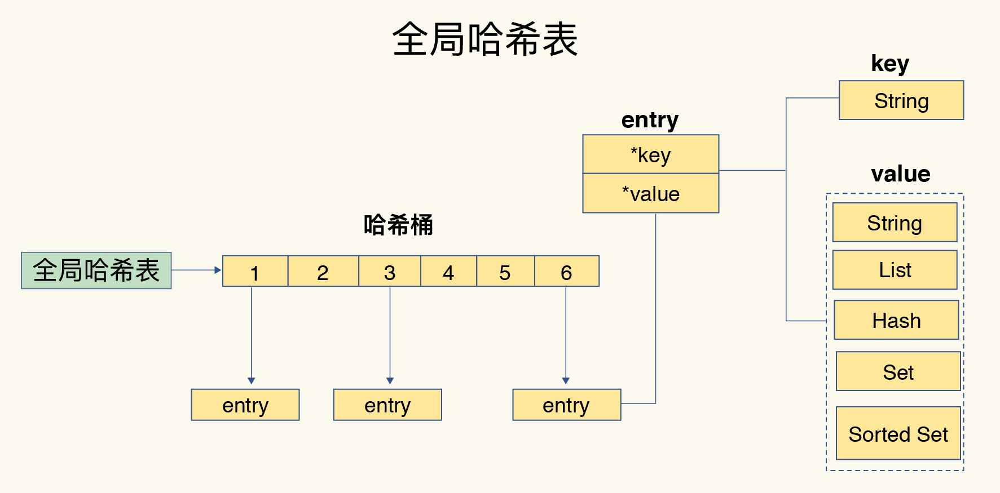

### **1、数据存储方式** 

Redis使用一个全局哈希表来保存所有键值对，一个哈希表就是一个数组，数组的每个元素称为一个哈希桶，每个哈希桶中并不是直接保存键和值的原始数据，而是保存键和值的指针，然后通过指针查找真实的数据。如下图所示：



采用哈希表的好处是我们可以用O(1)的时间复杂度快速查找到键值对，只需要计算键的哈希值就可以定位到数据在哈希表中的位置，速度非常快。当数据量非常大时我们需要考虑一个潜在的风险点，那就是哈希表冲突问题和rehash可能带来的操作阻塞。

由于哈希表是一个长度固定的数组，通常来说哈希表的长度会小于key的数量，这样就会造成多个key的哈希值会落到同一个哈希桶内，造成哈希冲突问题。Redis解决哈希冲突的方式是采用链式哈希，也就是同一个哈希桶中的多个元素用一个链表来保存，它们之间依次用指针连接。


这里还存在一个问题，哈希冲突链上的元素只能通过指针逐一查找再操作，如果哈希表里写入的数据越来越多，哈希冲突可能也会越来越多，这就导致某些哈希冲突链过长，进而导致这个链上的元素查找耗时变长，效率降低，这个时候Redis会对哈希表进行rehash操作，也就是增加现有哈希桶的数量，减少单个桶中哈希链的长度，从而提高查询的效率。

### 2、rehash操作（扩容/缩容）

当Redis中数据变多后，哈希冲突会变多，有的哈希冲突链会变得非常长，这样在查询时效率会变低，为了提升查询效率，Redis会进行rehash操作，也就是将原哈希表中的数据复制到另外一个容量更大的哈希表中，从而降低哈希冲突的概率。Redis会维护两个哈希表，默认情况下第二个哈希表没有分配空间，当要进行rehash时会分配一个空间为原来**2倍**的哈希表用于存储数据。

**触发时机：**

- 触发扩容的条件：

- - 服务器当前没有执行BGSAVE命令或BGREWRITEAOF命令，且哈希表的负载因子大于等于1（负载因子=ht[0].used / ht[0].size <哈希表已使用数 / 哈希表大小>）
  - 服务器当前正在执行BGSAVE命令或BGREWRITEAOF命令，且哈希表的负载因子大于等于5

- 触发缩容的条件：

- - 哈希表的负载因子小于0.1时

**rehash的过程：**

- redis采用的是渐进式rehash，也就是一次只迁移一个哈希桶的数据，因为rehash是在主线程中完成的，如果一次性迁移全部数据，会造成服务的阻塞

- **详细过程：**

- - 为ht[1]分配大小为ht[0]两倍的空间，此时dict字典同时持有ht[0]和ht[1]
  - 在字典中维持一个索引计数器rehashidx，并将它的值设为0，表示rehash工作正式开始
  - 在rehash进行期间，每次对字典执行增、删、改、查时，除了执行指定操作外，还会顺带将ht[0]哈希表在rehashidx索引上的所有键值对rehash到ht[1]上，然后将rehashidx的值加1
  - 当ht[0]中所有键值对都rehash到ht[1]后，释放ht[0]的空间，交换ht[0]和ht[1]的指针，将ht[1]留作下次使用，并将rehashidx的值设为-1，表示rehash操作已经完成

- **两种rehash的方式：**

- - 操作辅助rehash：也就是redis会在每次增删改查命令中都判断当前是否处于rehash过程中，如果是则会对一个哈希桶执行rehash操作，然后将rehashidx加1，下次则继续完成下一个索引位置的rehash操作；
  - 定时辅助rehash：操作辅助rehash依赖用户操作，假如长时间没有请求则无法进行rehash操作，所以redis还有一种定时辅助rehash，它会按一定周期定时执行rehash操作，默认每100ms执行一次，这样能保证即使没有请求进来也可以完成rehash操作；

- **rehash时的增、删、改、查**

- - 增：如果正在进行rehash，会将数据插入到ht[1]，否则将数据插入到ht[0]
  - 删：如果正在进行rehash，需要从ht[0]和ht[1]中查找删除，否则只从ht[0]删除
  - 改：同删除
  - 查：先在ht[0]上查找，然后判断当前是否在进行rehash，如果没有，那么ht[0]上的查找结果就是最终结果，否则在ht[1]上进行查询。


### **3、Redis的多路复用机制**

a、基于Linux的select/epoll机制；

b、该机制允许内核中，同时存在多个监听套接字和已连接套接字；

c、内核会一直监听这些套接字上的连接请求或数据请求，一旦有请求到达，就会交给Redis线程处理，这就实现了一个Redis线程处理多个IO流的效果；

d、为了在请求到达时能通知到Redis线程，select/epoll提供了基于事件的回调机制，即针对不同事件的发生，调用相应的处理函数。

e、这些事件会被放进一个事件队列，Redis单线程对该事件队列不断进行处理，调用相应的处理函数，这就实现了基于事件的回调。


### **4、Redis持久化机制**

Redis持久化主要有两大机制：AOF（Append Only File）日志和RDB快照。

#### AOF：

和传统数据库的写前日志不同，AOF属于写后日志，也就是先执行命令，把数据写入内存，然后才记录日志。这样做的原因是AOF中记录的是Redis的执行命令，而且为了避免额外的检查开销，Redis在向AOF记录日志的时候不会对这些命令进行语法检查，如果是先记录日志再执行命令的话就容易记录错误的命令，在使用日志恢复数据时，就可能会出错，还有一个好处是由于是在命令执行后才记录日志，所以不会阻塞当前的写操作。

AOF有两个潜在的风险：一个是命令执行完，但是还没来得及记录日志就宕机了，这个时候可能有数据丢失风险；第二个是AOF是在主线程执行的，如果日志写入磁盘时，磁盘写入压力太大，会给后面的操作带来阻塞风险。

**AOF的三种写回策略：**

Always：同步写回，每个命令执行完，立马同步地将日志写回磁盘；

Everysec：每秒写回：每个写命令执行完，只是先把日志写到AOF文件的内存缓冲区，每隔一秒把缓冲区中的内容写入磁盘；

No：操作系统控制的写回，每个写命令执行完，只是先把日志写到AOF文件的内存缓冲区，由操作系统决定何时将缓冲区内容写回磁盘；


**AOF文件过大的性能问题：**

a、文件系统本身对文件大小有限制，无法保存过大的文件；

b、如果文件过大，之后再往里面追加命令记录的话，效率会变低；

c、如果发生宕机，AOF中记录的命令要一个个被重新执行，用于故障恢复，如果日志文件太大，整个恢复过程会非常缓慢，这就会影响到Redis的正常使用。

**AOF重写机制：**

为了解决AOF文件过大的性能问题，Redis提供AOF重写机制，AOF重写是由后台子进程bgrewriteaof来完成的，在进行AOF重写时不会阻塞主进程。

AOF重写机制就是在重写时，Redis根据数据库的现状创建一个新的AOF文件，然后读取数据库中的所有键值对，对每个键值对用一条命令记录它的写入，旧文件中的多条命令在重写后的新文件中会变成一条记录，这样就会使新的AOF日志文件变小。

每次AOF重写时，Redis会先执行一个内存拷贝，用于重写；然后，使用两个日志保证在重写过程中，新写入的数据不会丢失。而且，因为Redis采用额外的线程进行数据重写，所以这个过程并不会阻塞主线程。


#### RDB：

RDB是Redis DataBase的缩写，Redis会把某一时刻的状态以文件的形式写到磁盘上，也就是快照，即使宕机，快照文件也不会丢失，在做数据恢复时可以直接把RDB文件读到内存中就可以完成数据恢复。Redis采用的是全量快照的方式，也就是把内存中所有的数据都记录到磁盘中。这样做的好处是能保证数据的完整性，但是当数据量很大时写入到磁盘时需要花费大量的时间，开销较大。

Redis提供了两个命令来生成RDB文件：

- save：在主线程中执行，会导致阻塞；
- bgsave：创建一个子进程，专门用于写入RDB文件，避免了主线程的阻塞，这也是Redis文件生成的默认配置；

### **5、Redis中缓存淘汰机制**


Redis缓存淘汰策略主要包含8种，其中volatile-lfu和allkeys-lfu是Redis4.0之后新增的。默认情况下，Redis在使用的内存空间超过maxmemory值时，并不会淘汰数据，也就是设定的noevction策略。

两条常用命令： 

```
#设置最大缓存容量
CONFIG SET maxmemory 4gb
#设置缓存淘汰策略
CONFIG SET maxmemory-policy allkeys-lru
```

- noeviction：不淘汰数据。一旦缓存被写满了，再有写请求来时，Redis不再提供服务，而是直接返回错误。
- volatile-ttl：针对设置了过期时间的键值对，按照过期时间的先后进行删除，越早过期的越先被删除；
- volatile-random：针对设置了过期时间的键值对，随机进行删除；
- volatile-lru：针对设置了过期时间的键值对，采用LRU算法进行删除；
- volatile-lfu：针对设置了过期时间的键值对，采用LFU算法进行删除；
- allkeys-random：在所有键值对中，随机进行删除；
- allkeys-lru：在所有键值对中，采用LRU算法进行删除；
- allkeys-lfu：在所有键值对中，采用LFU算法进行删除；

### **6、LRU算法详解：**

LRU算法全称是：Least Recently Used，是指按照最近最少使用的原则来筛选数据，最不常用的数据会被筛选出来，而最近频繁使用的数据会被留在缓存中。

LRU 会把所有的数据组织成一个链表，链表的头和尾分别表示 MRU 端和 LRU 端，分别代表最近最常使用的数据和最近最不常用的数据。如下图所示：


### **7、LFU算法详解：**

LFU（Least Frequently Used）算法是在LRU算法的基础上，为每个数据增加一个计数器，来统计这个数据的访问次数。当使用LFU策略来淘汰数据时，首先会根据数据的访问次数进行筛选，把访问次数最低的数据淘汰出缓存，如果两个数据的访问次数相同，LFU再比较这两个数据访问的时效性，把距离上一次访问时间更久的数据淘汰出缓存。所以LFU比LRU算法更精准的表示了一个key被访问的热度。

### **8、Redis为什么这么快？**

首先，Redis是一个内存数据库，所有的操作都在内存上完成，内存的访问速度比较快；

其次，Redis使用一个哈希表来保存所有的键值对，在查找键值对时只需要计算键的哈希值就可以定位到数据的位置，时间复杂度为O(1)，速度较快；

然后，Redis底层采用了一些高效的数据结构，比如哈希表和跳表，能够加快数据的操作；

还有就是Redis虽然是单线程的，但是它采用了多路复用机制，所以在网络IO操作时能并发的处理大量的客户端请求，实现高吞吐率。

 Redis底层包含6中数据结构，分别是：简单动态字符串、双向链表、压缩列表、哈希表、跳表、整数数组。


### **9、Redis真的是单线程的吗？**

Redis的单线程主要是指Redis的网络IO和键值对读写是由一个线程完成的，其他功能，比如持久化、异步删除、集群数据同步等都是由额外的线程执行的。

