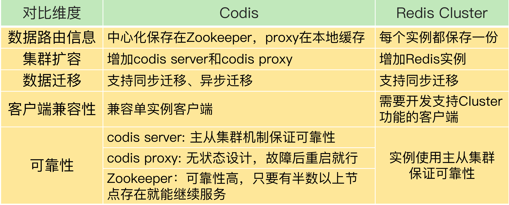
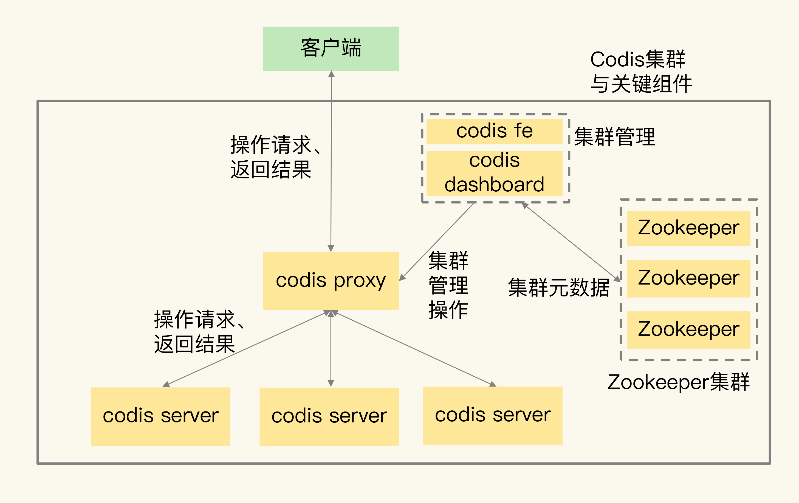

### **1、主从模式**

为了保证系统的高可靠性，Redis除了提供AOF和RDB机制保证数据尽量少丢失外，还提供主从库模式来保证服务尽量少中断，具体的做法是通过增加副本冗余量，将一份数据同时保存在多个实例上，即使有一个实例出现故障，其他实例也能对外提供服务。

**如何建立主从库模式？**

在从实例上执行replicaof（redis5.0之前采用slaveof命令）命令即可建立主从库关系，如：

```
replicaof 172.16.19.3 6379
```

**主从库如何保证数据一致性？**

主从库之间采用读写分离方式，对于写操作，首先会在主库上执行，然后主库将写操作同步给从库，对于读操作，主库和从库都可以接收。这样做的好处是所有的修改操作只会在主库上进行，主库有了最新的数据后会同步给从库，这样主从库的数据就一致了。


**主从库数据同步：**

第一阶段：主从库建立连接、协商同步的过程，主要是为全量复制做准备。

第二阶段：主库将所有数据同步给从库。从库收到数据后，在本地完成数据加载。

第三阶段：主库会把第二阶段执行过程中新收到的写命令，再发送给从库。具体的操作是，当主库完成RDB文件发送后，就会把此时replication buffer中的修改操作发给从库，从库再重新执行这些操作。


**Redis主从库同步的基本原理主要包括三方面：**

全量复制：一般是在第一次同步时，或者从库复制进度赶不上主库时也可能触发全量复制

基于长连接的命令传播：主从库正常运行后的常规同步阶段

增量复制：主从库网络断链后

### **2、哨兵机制**

在Redis主从集群中，哨兵机制是实现主从自动切换的关键机制，它有效的解决了主从复制模式下故障转移的这三个问题。哨兵其实就是一个运行在特殊模式下的Redis进程，主从库实例运行的同时，它也在运行。哨兵主要负责三个任务：监控、选主和通知。

**监控：**是指哨兵进程在运行时，周期性的给所有的主从库发送ping命令，检测它们是否仍然在线运行。

**选主：**主库挂了之后，哨兵就需要从很多个从库里，按照一定的规则选择一个从库实例，把它作为新的主库。

**通知：**哨兵把新的主库的连接信息发给其他从库，让它们执行replacaof命令，和新主库建立连接，并进行数据复制。同时哨兵会把新主库的连接信息通知给客户端，让它们把请求操作发到新主库上。


**哨兵如何判定主库是否下线？**

哨兵进程会使用PING命令检测它自己和主、从库的网络连接情况，来判断实例的状态。如果哨兵发现主库或从库对PING命令响应超时，那么哨兵就会把该实例标记为主观下线。如果哨兵检测的是从库，那么直接标记为主观下线即可，因为从库的下线对集群影响不大。如果哨兵检测的是主库，那么不能直接简单的标记为下线，因为主库的下线影响比较大，而且哨兵也可能因为自身网络的原因出现误判。为了解决这个问题一般会引入多个实例组成哨兵集群，多个哨兵同时进行判断，当大多数的哨兵都标记该实例为主观下线时，该实例才会被标记为客观下线，然后再进行后续的重新选主等操作，这样能提高哨兵监控的准确性。

**哨兵如何选定新主库？**

哨兵会在多个从库中按照一定的筛选条件，把不符合条件的从库去掉。然后再按照一定的规则，给剩下的从库逐个打分，将得分最高的从库选为新主库。


**筛选条件一般包含两方面：**

a、当前是否在线；

b、之前的网络连接状态，判断之前是否和主库经常断连；

**打分规则：**

第一轮：优先级最高的从库得分高。可以通过slave-priority配置项给不同的从库设置不同的优先级；

第二轮：和旧主库同步程度最接近的从库得分高。

第三轮：ID号小的从库得分高。每个实例都会有一个ID，这个ID就类似于这里的从库编号；

### **3、哨兵集群**

**哨兵集群配置方法：**

```
sentinel monitor <master-name> <ip> <redis-port> <quorum>
```

哨兵实例之间通过发布/订阅机制实现互相发现，哨兵只要和主库建立起了连接，就可以在主库上发布消息了，比如发布它自己的连接信息（IP和端口）。同时，它也可以从主库上订阅消息，获取其他哨兵发布的连接信息。


**由哪个哨兵执行主从切换？**

哨兵集群也会有Leader选举的过程，任何一个哨兵实例只要自身判断主库“主观下线”后就会给其他哨兵实例发送is-master-down-by-addr命令，然后其他哨兵实例会根据自身和主库的连接情况回复Y或者N来表示赞成或者反对，当一个哨兵获得了quorum配置项配置的数量后，就可以将主库标记为“客观下线”，然后给其他哨兵发送命令，表明让自己来执行主从切换，让其他哨兵进行投票，这个过程就称为Leader选举，选举为Leader的哨兵就可以执行主从切换。

**任何一个想成为Leader的哨兵要满足两个条件：**

第一，拿到半数以上的赞成票；

第二，拿到的票数同时还需要大于等于哨兵配置文件中quorum值；


### **4、切片集群**

**应对数据量增加的两种方案：**

**纵向扩展：**升级单个Redis实例的资源配置，包括增加内存容量，增加磁盘容量、使用更高配置的CPU。

**横向扩展：**横向增加当前Redis实例的个数。

**切片集群的两种实现：**



**Redis Cluster：**Redis3.0之后官方提供的方案。

**Codis：**Codis是业界广泛使用的Redis集群方案，Codis集群主要包括4类组件：

- **codis server：**这是进行二次开发的Redis实例，其中增加额外的数据结构，支持数据迁移操作，**主要负责具体的数据读写请求**；
- **codis proxy：接收客户端请求，并把请求转发给codis server**；
- **Zookeeper集群：保存集群元信息**，例如数据位置信息和codis proxy信息；
- **codis dashbord和codis fe：**集群管理工具，codis dashbord负责**执行集群管理工作**，比如：增删codis server、codis proxy和进行数据迁移。codis fe负责提供dashbord的web界面。



### **5、Codis集群数据是怎么分布在多个实例上的？**

**第一步：**Codis集群中一个数据保存在哪个codis server上，是通过逻辑槽（Slot）实现的，codis集群一共有1024个逻辑槽，可以通过手动或自动的方式将这些逻辑槽分配给codis server。

**第二步：**当客户端要读写数据时，会使用CRC32算法计算数据key的哈希值，并把这个哈希值对1024进行取模，取模后的值就是对应的逻辑槽编号，然后就可以找到对应的codis server实例。