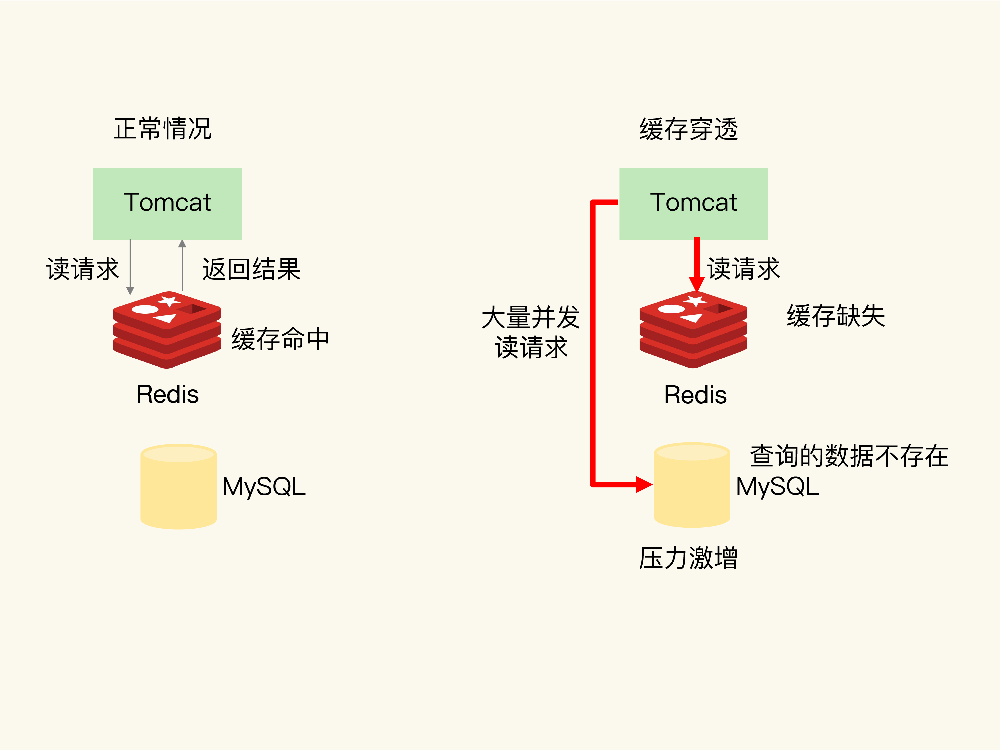

### **1、缓存异常**

#### **a、缓存和数据库数据不一致**

首先分析缓存和数据库的数据什么情况下会出现不一致？

在日常使用缓存的过程中，我们一般先从缓存中获取数据，如果缓存中有数据，那么直接返回，如果缓存中没有数据，那么从后端数据库中获取，查到数据后再写回到缓存中，如下图所示：

然后再看增、删、改操作，新增操作一般不会操作缓存，直接将数据插入数据库即可，所以不会出现缓存不一致问题，只有在修改和删除数据时需要同时操作缓存和数据库，此时无法保证原子性，在高并发的场景下这个问题没有非常完美的解决方案，下面整理两种比较常用的方案：

- 先删除缓存，然后更新数据，然后再删除一次缓存，删两次的目的是为了防止删除缓存后，有其他线程读取到旧的数据，然后更新到缓存中，造成缓存中还是旧的数据，所以在数据库更新完成后再删一遍缓存。这种方案还是会有问题，假如第二个线程读到旧数据后，没有立即更新到缓存中，而第一个线程已经完成了第二次删除操作，等到第二个线程回写缓存时还是旧数据。
- 先更新数据库，然后再删除缓存，如果缓存删除失败，将删除操作放到消息队列中进行重试，这种方式也没办法完全保证一致性，但是在日常开发中基本够用了。
- 总结：如果业务要求缓存和数据库的数据必须一致，不允许出现任何非一致性问题建议这样的数据不要放到缓存中，因为这个问题没办法避免，还有就是一致性要求高的数据设置好过期时间，这样假如出现了不一致，造成的影响也只是一小段时间。

#### **b、缓存雪崩**

**定义：**缓存雪崩是指大量应用请求无法在Redis缓存中处理，然后将大量请求发送到数据库上，造成数据库层压力激增；

**原因：**

- 缓存中有大量数据同时过期，导致大量请求无法得到处理；
- redis缓存实例发生故障宕机，无法处理请求，这就会造成大量请求发送到数据库上；

**解决方案：**

- 针对第一个原因：避免将大量数据设置相同的过期时间，可以增加一点随机时间。还可以采用服务降级，如果访问的是非核心数据，直接返回默认值出去；
- 针对第二个原因：在业务系统中实现服务熔断或请求限流，还可以采用主从节点的方式构建高可用集群，这样就算有一台机器出故障，其他的机器还可以继续提供服务；

#### **c、缓存击穿**

**定义：**缓存击穿是指，针对某个访问非常频繁的热点数据的请求，无法在缓存中进行处理，紧接着，访问该数据的大量请求，一下子都发送到了后端数据库，导致了数据库压力激增，会影响数据库处理其他请求。

**原因：**一般发生在热点数据过期失效时，和缓存雪崩有点类似，虽然缓存中没有处理请求，但是数据库中还能请求到数据，只是影响面没有缓存雪崩那么大

**解决方案：**针对热点数据，如果更新也不频繁，那么就不设置过期时间。

#### **d、缓存穿透**

**定义：**缓存穿透是指要访问的数据既不在 Redis 缓存中，也不在数据库中，导致请求在访问缓存时，发生缓存缺失，再去访问数据库时，发现数据库中也没有要访问的数据。此时，应用也无法从数据库中读取数据再写入缓存，来服务后续请求，这样一来，缓存也就成了“摆设”，如果应用持续有大量请求访问数据，就会同时给缓存和数据库带来巨大压力，如下图：

**原因：**

- 业务层误操作：缓存中的数据和数据库中的数据被误删除了，所以缓存和数据库中都没有数据；
- 恶意攻击：专门访问数据库中没有的数据。

**解决方案：**

- 缓存空值或默认值，比如查询时，从缓存中没有获取到数据，然后去数据库中也没有获取到数据，这个时候可以在缓存中设置一个空值，而不是不设置缓存，这样在下次请求时就客户获取到缓存中的空值了，请求就不会发生到数据库上；
- 使用布隆过滤器快速判断数据是否存在，避免从数据库中查询数据是否存在，减轻数据库压力。需要将数据库中的数据维护到布隆过滤器中，维护成本较高；
- 在入口处检测请求的合法性，避免恶意请求；

### 2、大Key问题

现象：key存储的value过大

危害：

- 如果是String类型，由于redis是单线程运行，读写大key会导致redis性能下降，甚至阻塞服务
- 如果是hash、list、set、zset，删除这些key会严重阻塞redis进程，因为删除的时间复杂度是O(n)。单个耗时过大命令容易引起应用程序雪崩或redis集群发生故障切换
- 大key会导致集群故障倾斜

定位：

- redis-cli --bigkeys命令
- redis-rdb-tools工具，redis实例上执行bgsave，然后对dump出来的rdb文件进行分析，找到其中的大KEY
- 自定义扫描脚本

解决：

- 单个简单的key存储的value很大：

- - 拆分成多个key，然后用mget获取值，这多个key还可以分散到不同的节点，可以分摊流量
  - 把大value拆到一个hash中，用hget获取值
  - 最佳实践：String控制在10KB以内

- hash、list、set、zset中存储过多元素：

- - 拆分成多个
  - 最佳实践：集合元素不要超过5000个

- 删除大key：

- - 大key不能直接删除，会阻塞redis服务
  - 用scan命令迭代大key中的元素，分批删除
  - redis4.0引入了unlink指令，它能对删除操作进行懒处理，丢给后台线程来异步回收线程

### 3、热key问题

现象：突然有大量请求访问redis上某个key。

危害：会造成流量过于集中，达到物理网卡上限，造成这台redis服务器宕机。这是大量请求会请求到后端的数据库上，造成服务不可用

定位：

- 凭借业务经验，进行预估，比如秒杀场景，商品的key就是一个热key。

- - 缺点：一般的业务都不太好预估

- 客户端进行收集，在操作redis之前，加入一行代码进行数据统计。那么这个数据统计的方式有很多种，也可以是给外部的通讯系统发送一个通知信息。

- - 缺点：对客户端代码造成入侵。

- 在Proxy层做收集，proxy层做收集上报，

- - 缺点：不是所有的redis集群都有proxy

- 用redis自带命令

- - monitor命令：该命令可以实时抓取出redis服务器接收到的命令，然后写代码统计出热key是啥。当然，也有现成的分析工具可以给你使用，比如redis-faina。

  - - 缺点：该命令在高并发的条件下，有内存增暴增的隐患，还会降低redis的性能。

  - hotkeys参数：redis 4.0.3提供了redis-cli的热点key发现功能，执行redis-cli时加上–hotkeys选项即可。

  - - 缺点：如果key比较多，执行起来比较慢。

- 自己抓包评估：Redis客户端使用TCP协议与服务端进行交互，通信协议采用的是RESP。自己写程序监听端口，按照RESP协议规则解析数据，进行分析。

- - 缺点：开发成本高，维护困难，有丢包可能性。

解决：

- **利用二级缓存：**比如利用ehcache，或者一个HashMap都可以。在你发现热key以后，把热key加载到系统的JVM中。针对这种热key请求，会直接从jvm中取，而不会走到redis层。假设此时有十万个针对同一个key的请求过来,如果没有本地缓存，这十万个请求就直接怼到同一台redis上了。现在假设，你的应用层有50台机器，OK，你也有jvm缓存了。这十万个请求平均分散开来，每个机器有2000个请求，会从JVM中取到value值，然后返回数据。避免了十万个请求怼到同一台redis上的情形。

- 备份热key：

  这个方案也很简单。不要让key走到同一台redis上不就行了。我们把这个key，在多个redis上都存一份不就好了。接下来，有热key请求进来的时候，我们就在有备份的redis上随机选取一台，进行访问取值，返回数据。假设redis的集群数量为N，步骤如下图所

  

- 业界方案：

- - 有赞TMC本地缓存：https://cloud.tencent.com/developer/article/1398207