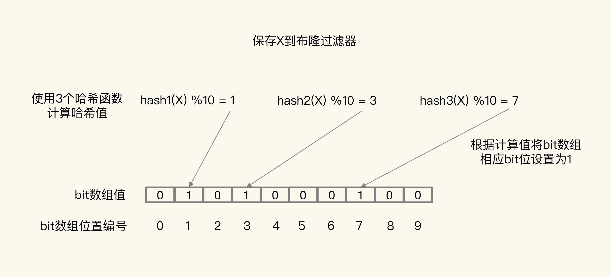
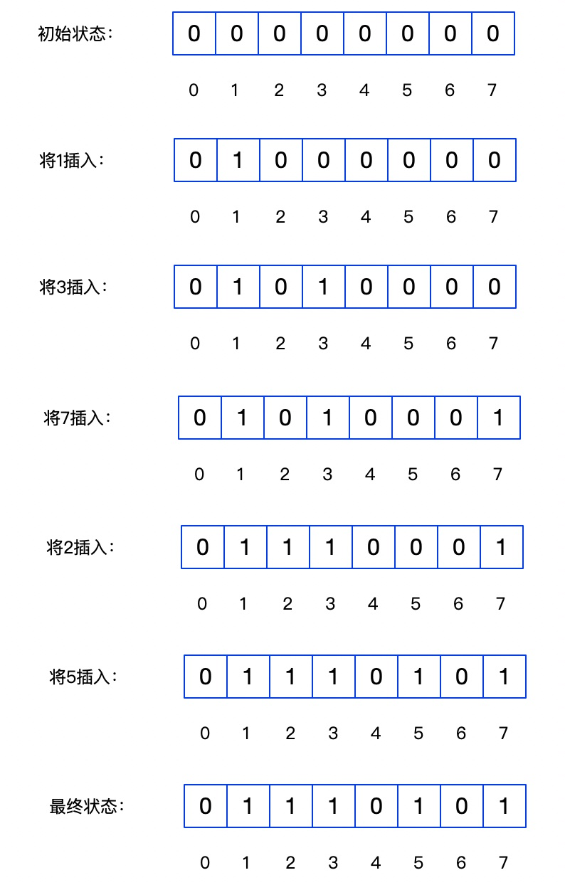

### 1、布隆过滤器作用

判断一个大集合中是否含有某个元素。

- 优点：节省空间
- 缺点：无法删除、会出现误判、查询效率不高
- 特点：布隆过滤器判断不存在的，一定不存在，布隆过滤器判断存在的，不一定存在

### 2、使用场景

- 网页黑名单系统
- 垃圾邮件过滤系统
- 爬虫的网址判重系统
- 解决缓存穿透问题

### 3、使用布隆过滤器解决缓存穿透问题

缓存穿透：数据既不在Redis缓存，也不在数据库中，查询数据时从缓存中查不到数据，从数据库也查不到数据，所以也无法将数据写入缓存，这就造成缓存成为摆设，所有请求都会请求到数据库，造成数据库压力过大。

解决办法：

- 缓存空值或缺省值：从数据库没查到数据后，给缓存设置一个空值，这样下次查询时可以从缓存中查询到空值，请求就不会打到数据库上；
- 使用布隆过滤器判断数据是否存在：在Redis前面加一层布隆过滤器来判断数据是否存在，如果数据不存在，则不进行后续的redis和数据库查询，如果数据存在再进行查询；

### 4、布隆过滤器原理

布隆过滤器由一个初始值为0的bit数组和N个哈希函数组成，可以用来快速判断某个数据是否存在。当我们想标记某个数据存在时，可以通过三个操作来标记：

- 使用N个哈希函数，分别计算这个数据的哈希值，得到N个哈希值；
- 把这N个哈希值对bit数组的长度取模，得到每个哈希值在数组中的对应位置；
- 把对应位置的bit位设置为1，这就完成了在布隆过滤器中标记数据的操作；

当需要查询某个数据时，按照上面的方式计算N个哈希值，找到在bit数组中的位置，判断这些位置是不是都为1，如果都为1代表该数据可能存在，如果有一个不为1，则代表该数据一定不存在。

### 5、布隆过滤器的实现

- 使用Redis实现：

- - Redis4.0提供了布隆过滤器模块，4.0以下需要引入第三方库；
  - Redis布隆过滤器是使用String实现的，所以会有big key问题，实际使用时最好单独部署，否则会对业务系统的Redis造成阻塞；
  - 历史数据可以先预处理存储在布隆过滤器中，新数据可以在插入数据库后将数据存储到布隆过滤器中；

- 使用Guava的布隆过滤器（BloomFilter、BloomFilterStrategies）实现：

- - 缺点：只能在单机环境使用

### 6、计数式布隆过滤器（Counting Bloom Filter）

**布隆过滤器的缺点**：无法删除，因为没法判断bit位都存在时目标值就一定存在，所以目标值删除时不能直接把对应bit位删除；

为了这解决这个问题，通过引入计数式布隆过滤器，计数式布隆过滤器在原有基础上引入一个计数器来进行计数，当插入数据时给对应的位置加1，删除数据时给对应的位置减1。

**优点：**支持删除

**缺点：**空间消耗变大

**实现步骤：**

- 初始化：创建一个足够大的int数组，初始值都是0
- 插入一个元素：通过k个哈希函数，计算出元素的k个哈希值，对int数组的长度取模后，将对应的k个位置上的值都加1
- 删除一个元素：通过k个哈希函数，计算出元素的k个哈希值，对int数组的长度取模后，将对应的k个位置上的值都减1
- 查找一个元素出现的次数：通过同样的k个哈希函数，在int数组中取出对应的k个位置上的值，并取出其中最小的值作为元素出现的次数

### 7、布谷鸟过滤器（Cuckoo Filter）

- 布谷鸟Hash：布谷鸟Hash包含两个Hash表（T1、T2）和两个Hash函数（h1、h2）

- - 第一步：插入数据时，先根据h1计算出其在T1表的位置，如果该位置为空则可以放进去
  - 第二步：如果该位置不为空，则根据h2计算出其在T2表的位置，如果该位置为空则可以放进去
  - 第三步：如果该位置还是不为空，则把该位置上的元素踢出，然后把当前元素放到该位置上
  - 第四步：被踢出的元素放到它的另外一个位置上，因为每个元素都会在另外一个Hash表中有个备用位置
  - 问题：通过上面的步骤有可能一直会出现另一个备用位置都有值的情况，这时候会有一个MaxLoop的变量记录移动了多少次（默认是16），如果达到了这个次数，说明hash表容量已经快满了，需要进行扩容，并对数据进行rehash。

- 布谷鸟过滤器：

- - 布谷鸟过滤器就是基于布谷鸟Hash实现的，区别在于布谷鸟Hash在Hash表中存储的是原始数据，而布谷鸟过滤器存储的是数据的指纹信息

  - 优点：

  - - 允许删除：因为一个位置只会被一个元素映射，所以允许删除，但是会存在误删的情况，因为存储的是指纹
    - 比传统布隆过滤器查询性能更高，访问内存的次数低
    - 比传统布隆过滤器占用空间更小

  - 缺点：

  - - 内存空间不连续，CPU消耗大
    - 容易出现装填循环问题：Hash冲突踢出原数据，原数据还是存在冲突
    - 删除数据时，Hash冲突会引起误删，查询有误判，删除也会有误删

### 8、BitMap（位图）

原理：BitMap的基本思想是用一个bit位来表示某个元素的值，而对应的位置就是指该元素。因为用Bit为单位来存储数据，所以可以大大节省存储空间。举个例子：

假设要将1，3，7，2，5五个数字要存放，正常情况，一个int值占用4个字节（byte），那么五个数字需要5*4=20字节，但是使用BitMap存储，只需要1字节，过程如下：

首先定义一个1byte的BitMap，所有位置都设为0，1byte=8bit。

这样就可以同一个1byte的空间存储5个数字，假如要对这5个数字排序，只需依次遍历即可得出：1，2，3，5，7。在这个BitMap中最大可以存储的数字是7。

在Java中一个int类型的数字占用的空间是4byte，也就是32bit，那么一个int类型的数可以用来映射0-31之间的数字，如果要存储大于31的数，那么可以用一个int数组来表示，一个数字不够后就加一个数字，如：

数组第1个元素 00 - 31

数组第2个元素 32 - 63

数组第3个元素 64 - 95

数组第4个元素 96 - 127

这里其实有一个问题，假如存储的数据比较少，比如就存储一个100，那么也需要开辟一个大小为4的数组来存储，这就造成了空间浪费，为了解决这个问题，谷歌实现的EWAHCompressedBitMap就对这个问题进行了优化，具体实现可以查阅相关资料。

使用场景：

- 快速排序

- - 比如：有10亿个不重复的无序的数字，只有2G内存空间，如果快速排序？

  - 优点：

  - - 运算效率高，不需要进行比较和移位
    - 占用内存少

  - 缺点：

  - - 数据不能重复
    - 数据比较密集时才有优势

- 快速去重

- - 比如：20亿个整数中找出不重复的整数的个数，内存不足以容纳这20亿个整数。

- 快速查找

- - 比如：int数组中的一个元素是4字节占32位，那么除以32就知道元素的下标，对32求余数（%32）就知道它在哪一位，如果该位是1，则表示存在