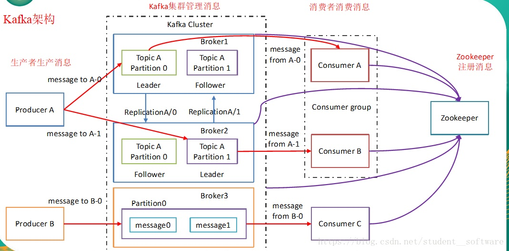
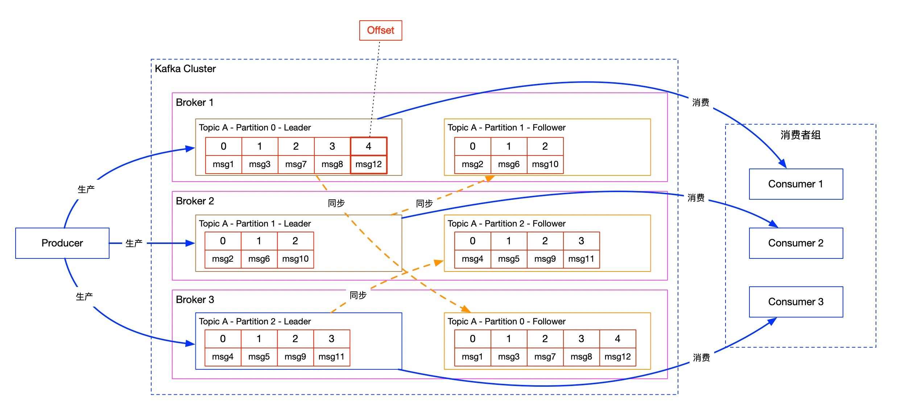

### 1、Kafka架构

- Producer：生产者，向kafka发送消息的客户端；

- Consumer：消费者，向kafka获取消息的客户端；

- Consumer Group：消费者组，一个消费者组可以消费多个Topic的消息，一个Partition的消息只能发送给消费者组中的一个Consumer；

- - 高性能：可以灵活的横向扩展消费者，提高消费能力，消费者数量不要超过分区数
  - 消费模式灵活
  - 故障容灾
  - 防止重复消费

- Cluster：集群，包含多个Broker；

- Broker：实例，也就是kafka集群中的一台具体服务器，一个Broker可以包含多个Topic；

- Topic：主题，是用来承载消息的逻辑容器，实际使用中用来区分具体的业务（逻辑上的概念）；

- Partition：分区，一个有序不变的消息序列，每个Topic可以包含多个Partition，每个Partition会对应一个log文件（物理上的概念）；

- Record：消息，具体某一条数据；

- Offset：消息位移，表示消息中每条消息的位置信息，是一个单调递增且不变的值；

- Consumer Offset：消费者位移，表示消费者消费进度，每个消费者都会有自己的消费者位移；

- Replica：副本，kafka中同一条消息能够被拷贝到多个地方以提供数据冗余，每个分区可以配置多个副本从而实现高可用；

- - Leader Replica：领导者副本，对外提供服务，与客户端进行交互；
  - Follower Replica：跟随者副本，不能对外提供服务，只负责同步领导者副本的数据；

- Rebalance：重平衡，消费者组内某个消费者实例挂掉后，其他消费者实例自动重新分配订阅主题分区的过程。Rebalance是kafka消费者端实现高可用的重要手段；

### 2、Kafka工作流程

