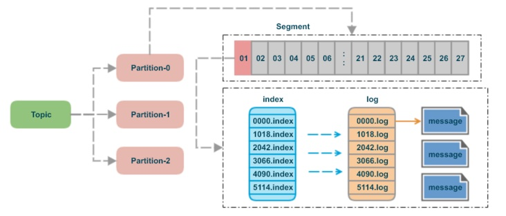
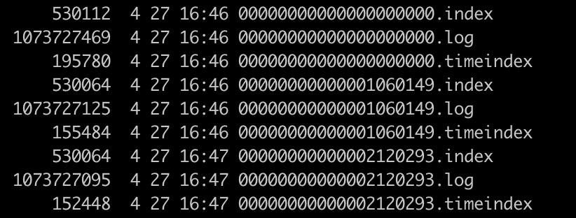
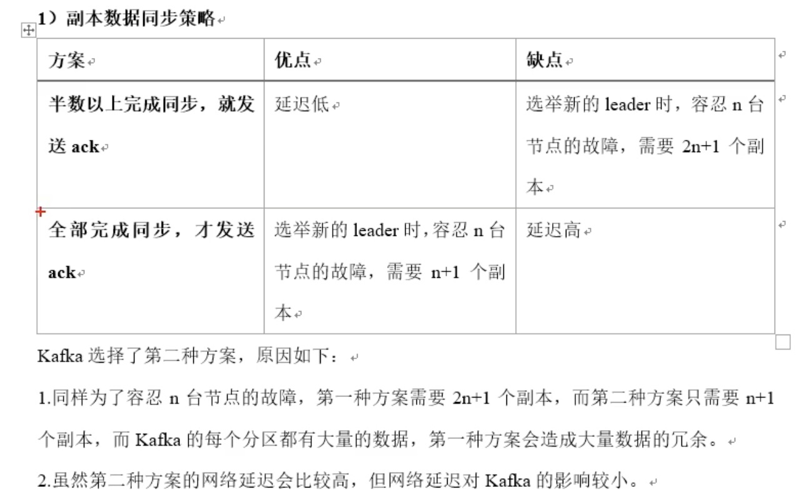

### 1、Kafka文件存储机制



一个Topic会包含多个Partition，一个Partition由多个Segment构成，一个Segment包含：.index文件（索引文件）、.log文件（数据文件）、.timeindex文件（时间索引文件）。



**.index文件：** 存储的是索引数据，包含offset和position两个值，也就是某条消息在.log文件中的位置。索引文件的目的是为了高效定位数据。 

```
# 通过命令可以查看.index文件的内容
./bin/kafka-run-class.sh kafka.tools.DumpLogSegments --files /kafka-logs/test-0/00000000000009541301.index --print-data-log
# 结果
offset: 10601349 position: 1073629880
offset: 10601365 position: 1073646085
offset: 10601381 position: 1073662290
offset: 10601397 position: 1073678495
offset: 10601413 position: 1073694700
offset: 10601429 position: 1073710905
```

从上面的结果可以看出，索引文件中的offset并不是连续的，而是间隔了16个，kafka并不是对每条消息都会建立索引，而是采用稀疏存储的方式，每隔一定字节的数据建立一条索引。这样可以减少索引文件的大小，从而可以将索引文件放到内存中。缺点是没有建立索引的消息不能被一次定位到，而是需要进行一次小批量的遍历才能获取到。

**.log文件：** 存储的是具体的消息数据；log数据文件中并不是直接存储数据，而是通过许多的message组成，message包含了实际的消息数据。

```
# 通过命令可以查看.log文件的内容
./bin/kafka-run-class.sh kafka.tools.DumpLogSegments --files /kafka-logs/test-0/00000000000009541301.log --print-data-log
# 结果
baseOffset: 10601365 lastOffset: 10601380 baseSequence: -1 lastSequence: -1 producerId: -1 producerEpoch: -1 partitionLeaderEpoch: 0 isTransactional: false position: 1073646085 CreateTime: 1619513343695 isvalid: true size: 16205 magic: 2 compresscodec: NONE crc: 723990854
baseOffset: 10601381 lastOffset: 10601396 baseSequence: -1 lastSequence: -1 producerId: -1 producerEpoch: -1 partitionLeaderEpoch: 0 isTransactional: false position: 1073662290 CreateTime: 1619513343695 isvalid: true size: 16205 magic: 2 compresscodec: NONE crc: 723990854
```

**.timeindex文件：** 时间戳索引，也就是某个时间点生产的消息。

```
# 通过命令可以查看.timeindex文件的内容
./bin/kafka-run-class.sh kafka.tools.DumpLogSegments --files /kafka-logs/test-0/00000000000009541301.timeindex --print-data-log
# 结果
timestamp: 1619513361664 offset: 12000998
timestamp: 1619513361665 offset: 12001078
timestamp: 1619513361666 offset: 12001174
```

| 关键字              | 解释说明                                                     |
| ------------------- | ------------------------------------------------------------ |
| 8 byte offset       | 在parition(分区)内的每条消息都有一个有序的id号，这个id号被称为偏移(offset),它可以唯一确定每条消息在parition(分区)内的位置。即offset表示partiion的第多少message |
| 4 byte message size | message大小                                                  |
| 4 byte CRC32        | 用crc32校验message                                           |
| 1 byte “magic”      | 表示本次发布Kafka服务程序协议版本号                          |
| 1 byte “attributes” | 表示为独立版本、或标识压缩类型、或编码类型                   |
| 4 byte key length   | 表示key的长度,当key为-1时，K byte key字段不填                |
| K byte key          | 可选                                                         |
| value bytes payload | 表示实际消息数据                                             |

**为什么需要分区？** 

为了性能考虑，如果不分区每个topic的消息只存在一个broker上，那么所有的消费者都是从这个broker上消费消息，那么单节点的broker成为性能的瓶颈，如果有分区的话生产者发过来的消息分别存储在各个broker不同的partition上，这样消费者可以并行的从不同的broker不同的partition上读消息，实现了水平扩展。 

**为什么需要Segment？** 

通过上面目录显示存在多个segment的情况，既然有分区了还要存多个segment干嘛？如果不引入segment，那么一个partition只对应一个文件（log），随着消息的不断发送这个文件不断增大，由于kafka的消息不会做更新操作都是顺序写入的，如果做消息清理的时候只能删除文件的前面部分删除，不符合kafka顺序写入的设计，如果多个segment的话那就比较方便了，直接删除整个文件即可保证了每个segment的顺序写入 。

**如何通过offset找到对应的message？** 

- 通过offset找到对应的segment文件，可以对文件列表进行二分查找即可；
- 通过.index文件找到对应的offset的position，如果索引能够命中则可以直接定位到，如果索引没命中，则拿到前一个索引的位置去.log文件中遍历查找即可；

### 2、分区策略

- 发送消息时指定分区，则直接发送到指定分区上；
- 发送消息时没有指定分区，但是指定了消息的key，将key进行hash，与topic的partition数进行取余得到partition的值；
- 发送消息时既没有指定分区，又没有指定消息的key，第一次调用时随机生成一个整数，后面每次调用在这个整数基础上自增，将这个值与partition数取余得到partition的值，也就是常说的round-robin算法；

### 3、数据可靠性保证

为保证producer发送的数据，能可靠的发送到指定的topic，topic的每个partition收到producer的数据后，都需要向producer发送ack消息（acknowledgement确认收到），如果producer收到ack，则进行下一轮发送，否则重新发送数据。

**何时发送ack？** 

会在所有副本都完成同步后才会发送ack。



**ISR：** 

ISR（in-sync replica set）是指和leader保持同步的follower集合。当ISR中的follower完成数据同步后，leader会给follower发送ack。如果follower长时间未向leader同步数据，则该follower将被踢出ISR，该时间阈值由replica.lag.time.max.ms参数设定。Leader发送故障后会从ISR中选举新的Leader。

**acks参数配置的三种级别：** 

- 0：producer不等待broker的ack，broker一收到消息还没写入磁盘就返回ack，延迟最低，但是broker故障时会丢失消息；
- 1：producer等待broker的ack，partition的leader落盘成功后返回ack，如果follower同步成功之前leader出现故障，那么会丢失数据；
- -1（all）：producer等待broker的ack，partition的leader和follower都落盘成功后才返回ack。但是如果在follower同步完成后，broker发送ack前，leader发送故障，那么会造成数据重复；

**kafka启用幂等性：** 

只需将producer的参数中设置enable.idompotence=true即可。Kafka的幂等性实现其实就是将原来下游需要做的去重放在了数据上游。开启幂等性的producer在初始化的时候会分配一个PID，发往同一partition的消息会附带sequence number。而broker端会对<PID、Partition、SeqNumber>做缓存，当具有相同主键的消息提交时，broker只会持久化一条。如果producer重启了，PID重新生成了，那么幂等性就无法保证，所以幂等性无法保证跨分区、跨会话的Exactly Once。