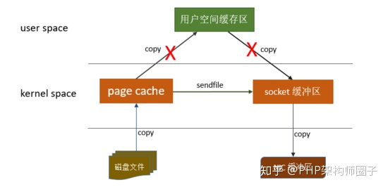

### **1、消息积压如何处理？** 

首先先确认消息积压的原因，一般就两个方面：要么生产方生产变快了，要么消费方消费变慢了。可以通过观察生产QPS、消费QPS、消费耗时等监控指标来确定具体原因。

如果是生产方生产过快，先判断是否可以对生产进行限流，如果生产方没办法进行限流那就只能提高消费方的消费能力，比如对消费集群进行扩容。

如果是消费方消费变慢，那么要先确定变慢的具体原因，比如优化消费方的代码提高性能，排查是否有大量消息消费失败造成重复消费，对非核心功能进行降级从而保证服务器有足够的资源来处理消息消费，如果这些都没办法解决也可以对消费集群进行扩容。

### **2、如何保证顺序消费？**

先确定出现顺序不一致的场景，总结起来就两点：一是同一个topic的消息发送到多个分片上，消费者进行消费时无法进行顺序消费；二是有多个消费者消费同一个topic的消息，每个消费者消费的耗时不一样，可能需要后消费的消息提前执行完成，造成无序消费。

解决的办法就是将需要保序的消息发到同一个分片上，消费方也只采用一个消费者进行消费。在实际开发中可以通过业务层面来解决，比如执行完第一个业务逻辑后再发送第二个业务逻辑的消息，执行完第二个业务逻辑后再发送第三个业务逻辑的消息，从而保证业务的顺序性。

kafka如何处理：

- 在发送消息时指定partition

- 通过一个业务标识（比如订单ID）当作partitionKey，这样同一个订单的消息就会发送到同一个partition中

- 多线程消费：单 KafkaConsumer 实例 + 多 worker 线程 + 一条线程对应一个阻塞队列消费线程模型

- - RocketMQ：使用 MessageListenerOrderly 监听消费可保证消息消费顺序

### **3、如何防止消息丢失？**

一般来讲，会产生消息丢失的地方主要有三个，一个是生产阶段，一个是存储阶段，还有一个是消费阶段，不同的阶段可以采用不同的方式来避免消息丢失。

**生产阶段：** 一般发送消息都会有返回值，可以通过返回值来判断消息是否发送成功，如果发送失败可以进行重试。

- 常见原因：网络抖动、通信异常

**存储阶段：** 在存储阶段正常情况下，只要 Broker 在正常运行，就不会出现丢失消息的问题，但是如果 Broker 出现了故障，比如进程死掉了或者服务器宕机了，还是可能会丢失消息的。**如果对消息的可靠性要求非常高，可以通过配置 Broker 参数来避免因为宕机丢消息。**

对于**单个节点**的 Broker，需要配置 Broker 参数，在收到消息后，将消息写入磁盘后再给 Producer 返回确认响应，这样即使发生宕机，由于消息已经被写入磁盘，就不会丢失消息，恢复后还可以继续消费。例如，在 RocketMQ 中，需要将刷盘方式 flushDiskType 配置为 SYNC_FLUSH 同步刷盘。

如果是 Broker 是由**多个节点**组成的集群，需要将 Broker 集群配置成：至少将消息发送到 2 个以上的节点，再给客户端回复发送确认响应。这样当某个 Broker 宕机时，其他的 Broker 可以替代宕机的 Broker，也不会发生消息丢失。

- 常见原因：

- - 数据写入到OS Cache中，但是还没来的及写入到磁盘中，此时机器宕机，就会丢失数据
  - 数据写入到Leader节点，但是还没同步到Follower节点，此时Leader节点宕机，就有可能数据丢失（kafka）

**消费阶段：** 消费阶段采用和生产阶段同样的方式，消费方从Broker拉到消息后先处理自己的业务逻辑，当业务逻辑处理完成后给Broker返回消费成功，如果没有返回成功则会进行重试。

- 常见原因：消息还未消费完，就通知RocketMQ的服务端成功的ACK，结果消费者宕机或出现其他问题造成消息消费失败

**kafka配置项：**

| **配置参数**                                       | **说明**                                                     |
| -------------------------------------------------- | ------------------------------------------------------------ |
| 消费者端：enable.auto.commit=false                 | 禁止手动提交位移（offset），避免多线程消费的时候出现消息丢失 |
| 生产者端：acks=all                                 | 即配置所有的partition副本都收到消息了才返回提交消息成功      |
| 生产者端：retries=N                                | 即出现问题比如网络抖动的重试次数                             |
| broker端：replication.factor >= 3                  | 消息分区的副本个数                                           |
| broker端：min.insync.replicas > 1                  | 消息写入多少个副本才算已提交                                 |
| broker端：replication.factor > min.insync.replicas | 保证可用性，如果相等，则任何一个副本挂了，则整个分区无法工作 |
| broker端：unclean.leader.election.enable=false     | 数据丢失太多的broker不能成为leader，防止数据丢失             |

**RocketMQ配置项：**

| **配置参数**                                                 | **说明**                                                     |
| ------------------------------------------------------------ | ------------------------------------------------------------ |
| 生产者API：producer.setRetryTimesWhenSendFailed(10);         | 配置重试次数                                                 |
| 生产者API： public SendResult send(Message msg); public void send(Message msg,SendCallback sendCallback); public void sendOneway(Message msg); | 有三种send方法，同步发送、异步发送、单向发送。 我们可以采取**同步发送**的方式进行发送消息，发消息的时候会同步阻塞等待broker返回的结果，如果没成功，则不会收到SendResult，这种是最可靠的。 其次是**异步发送**，再回调方法里可以得知是否发送成功。 **单向发送**（OneWay）是最不靠谱的一种发送方式，我们无法保证消息真正可达。 |
| broker端：flushDiskType = SYNC_FLUSH                         | 修改刷盘策略为同步刷盘。默认情况下是异步刷盘的               |
| broker端：采用集群方式（如：一主多从、多主多从）部署，并且设置为同步复制。**master 节点配置：**flushDiskType = SYNC_FLUSHbrokerRole=SYNC_MASTER**slave 节点配置：**brokerRole=slaveflushDiskType = SYNC_FLUSH | 设置为同步复制后，master会等slave节点复制完成后才会返回确认响应 |

### **4、如何防止重复消费？**

一般采用接口幂等来解决重复消费问题，在进行数据操作时通过一些能唯一确定数据的字段来判断当前操作是否已经执行过，如果已经执行过则直接返回成功即可。

- RocketMQ处理方式：

- - 通过业务逻辑表示来判断
  - 将业务唯一标识通过消息的message key来设置，在消费方可以建立一个日志表来记录消息是否被消费

### 5、Kafka和RocketMQ的区别

**存储形式：**

- Kafka：采用partition，每个topic的每个partition对应一个文件。顺序写入，定时刷盘。但一旦单个broker的partition过多，则顺序写将退化为随机写，Page Cache脏页过多，频繁触发缺页中断，性能大幅下降。
- RocketMQ：采用CommitLog+ConsumeQueue，单个broker所有topic在CommitLog中顺序写，Page Cache只需保持最新的页面即可。同时每个topic下的每个queue都有一个对应的ConsumeQueue文件作为索引。ConsumeQueue占用Page Cache极少，刷盘影响较小。

**存储可靠性：**

- Kafka：使用异步刷盘，异步Replication
- RocketMQ：支持异步刷盘、同步刷盘、异步Replication、同步Replication

**高可用：**

- Kafka：Kafka控制高可用的粒度是放在分区上。每个topic的leader分区和replica分区都可以在所有broker上负载均衡的存储。
- RocketMQ：RocketMQ在高可用设计上粒度只控制在Broker。其保证高可用是通过master-slave主从复制来解决的。

**顺序消息：**

- Kafka和RocketMQ都只支持单分区有序

**延时消息：**

- Kafka：不支持延时消息
- RocketMQ：支持固定延时等级的延时消息

### 6、Kafka为什么吞吐量这么高？

- 顺序读写
- 利用操作系统的Page Cache
- 零拷贝

- 分区分段+索引：提高了数据操作的并行度
- 批量读写：消息生产会将多条消息打包一次发送到broker上，消费也是一次读取多条
- 批量压缩：对多条消息进行批量压缩，减少数据大小，减少网络IO损耗