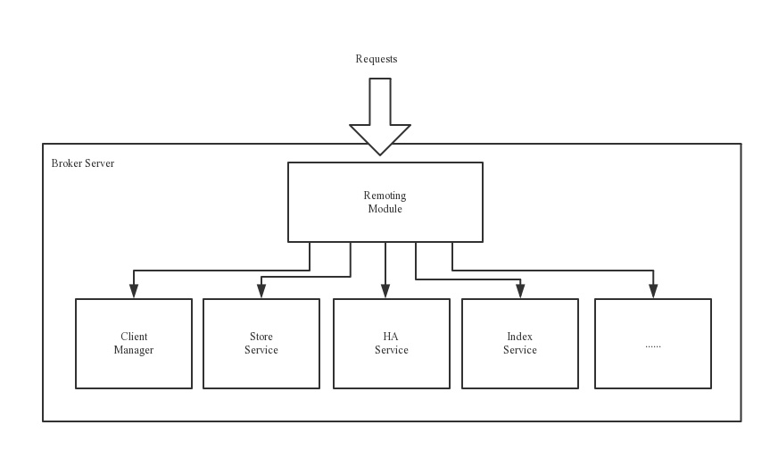

### 1、RocketMQ架构

- **Producer：**消息发布的角色，支持分布式集群方式部署，Producer通过MQ的负载均衡模块选择相应的Broker集群队列进行消息投递，投递的过程支持快速失败并且低延迟。

- - 生产者组：和Kafka不同的地方，RocketMQ有生产者组的概念，主要用于事务消息Broker回查事务状态时可以往生产者组中其他机器查询，提高系统的高可用；
  - Producer与NameServer集群中的一个节点（随机选择）建立长连接，定期从NameServer取Topic路由信息，并向提供Topic服务的Master建立长连接，且定时向Master发送心跳。

- **Consumer：**消息消费的角色，支持分布式集群方式部署。支持以push推，pull拉两种模式对消息进行消费。同时也支持集群方式和广播方式的消费，它提供实时消息订阅机制，可以满足大多数用户的需求。

- - Consumer与NameServer集群中的其中一个节点（随机选择）建立长连接，定期从NameServer取Topic路由信息，并向提供Topic服务的Master、Slave建立长连接，且定时向Master、Slave发送心跳。Consumer既可以从Master订阅消息，也可以从Slave订阅消息，订阅规则由Broker配置决定。

- **Topic：**主题，是一个逻辑上的概念，表示一类消息的集合，每个主题包含若干条消息，每条消息只能属于一个topic，是RocketMQ进行消息订阅的基本单位；

- - 同一个Topic下的数据会分片保存在不同的Broker上，每一个分片单位叫做MessageQueue。MessageQueue是生产者发送消息与消费者消费消息的最小单位；

- **MessageQueue：**消息队列，表示Broker上一个数据分片，类似Kafka中的Partition；

- **Message：**消息，生产和消费数据的最小单位，每条消息必须属于一个Topic，每个消息拥有唯一的Message ID，且可以携带具有业务标识的key。系统提供了通过Message ID和key查询消息的功能。

- - Tag标签：用于同一主题下区分不同类型的消息

- **NameServer：**NameServer是一个非常简单的Topic路由注册中心，其角色类似Dubbo中的zookeeper，支持Broker的动态注册于发现，是一个几乎无状态的节点，可集群部署，节点之间无任何信息同步

- - 主要包括两个功能：

  - - Broker管理，Broker Server会在启动时向所有的Name Server注册自己的服务信息，并且后续通过心跳的方式来检查这个服务是否正常；
    - 路由信息管理，生产者或消费者能够通过Name Server查找各主题的对应的Broker IP列表

  - 多个Name Server一般也是采用集群的方式部署，但是相互之间是独立的，不会进行数据交换，Name Server中任意节点宕机了，只要集群中还有一台服务器正常，那么整个路由服务可以正常使用；

- **BrokerServer：**Broker主要负责消息的存储、投递和查询以及服务高可用保证，为了实现这些功能，Broker包含了以下几个重要子模块：

- - **Remoting Module：**整个Broker的实体，负责处理来自clients端的请求；
  - **Client Manager：**负责管理客户端（Producer/Consumer）和维护Consumer的Topic订阅信息
  - **Store Service：**提供方便简单的API接口处理消息存储到物理硬盘和查询功能。
  - **HA Service：**高可用服务，提供Master Broker和Slave Broker之间的数据同步功能。
  - **Index Service：**根据特定的Message key对投递到Broker的消息进行索引服务，以提供消息的快速查询。
  - **集群：**Broker分为Master和Slave，一个Master对应多个Slave，但是一个Slave只能对应一个Master，Master和Slave的对应关系通过指定相同的BrokerName和不同的BrokerId来定义，BrokerId为0表示Master，非0表示Slave。Master也可以部署多个，每个Broker与NameServer集群中所有节点建立长连接，定期注册Topic信息到所有NameServer。

### 2、生产者发送消息的三种方式：

- 同步发送：等待消息返回后再继续进行下面的操作。
- 异步发送：消息异步发送，可在回调中获取消息发送的结果。
- 单向发送：没有返回值，也没有回调，只管发送消息，不管消息是否发送成功，使用producer.sendOneWay。

### 3、消费者消费消息的模式：

- **Push（推）模式：**Broker主动推送消息给消费者

- - **优点：**

  - - 实时性好

  - **缺点：**

  - - 增加服务端负载，真正的push模式需要和客户端保持长连接
    - 消费端处理能力不一样，如果push太快，消费端可能出现问题，不够灵活

  - **说明：**

  - - 在RocketMQ中，Push模式本质是对Pull模式的封装，客户端把轮询的过程封装了，并注册MessageListener监听器，取到消息后，唤醒MessageListener的consumeMessage()来消费，对用户来说，感觉消息是被推送过来的。

    - 由于采用客户端主动去服务器拉取消息，必然会产生延时，RocketMQ通过长轮询来解决这个问题；

    - - 长轮询：在请求过程中，如果服务器端数据没有更新，那么服务器会把这个请求挂起，直到有新数据，或者超时，才会给客户端响应，客户端拿到响应后再进行下一次请求。

- **Pull（拉）模式：**消费者主动发送请求从Broker拉取消息

- - **优点：**

  - - 主动权在消费端，可控性比较好，比较灵活

  - **缺点：**

  - - 消息拉取的间隔不太好把握，容易产生消费延时
    - 客户端需要一个线程不停的向服务端发送请求
    - 发送太快服务端容易出现大量无效请求（通过长轮询来解决）

  - **说明：**

  - - 取消息的过程需要自己写，首先通过打算消费的Topic拿到MessageQueue的集合，遍历MessageQueue集合，然后针对每个MessageQueue批量取消息，一次取完后，记录该队列下一次要取的开始offset，直到取完了，再换另一个MessageQueue。和push模式比没太多本质区别，项目中一般不太使用

### 4、集群模式

#### 单Master模式：

这种方式风险较大，一旦Broker重启或者宕机时，会导致整个服务不可用，不建议线上环境使用，可以用于本地测试

#### 多Master模式：

一个集群无Slave，全是Master。

- 优点：配置简单，单个Master宕机或重启维护对应用无影响，在磁盘配置为RAID10时，即使机器宕机不可恢复情况下，由于RAID10磁盘非常可靠，消息也不会丢（异步刷盘丢失少量消息，同步刷盘一条不丢），性能最高
- 缺点：单台机器宕机期间，这台机器上未被消费的消息在机器恢复之前不可订阅，消息实时性会受到影响

#### 多Master多Slave模式（异步）：

每个Master配置一个Slave，有多对Master-Slave，HA采用异步复制方式，主备有短暂消息延迟（毫秒级）

- 优点：即使磁盘损坏，消息丢失的非常少，且消息的实时性不会受影响，同时Master宕机后，消费者仍然可以从Slave消费，而且此过程对应用透明，不需要人工干预，性能同多Master模式几乎一样
- 缺点：Master宕机，磁盘损坏情况下会丢失少量消息

#### 多Master多Slave模式（同步）：

每个Master配置一个Slave，有多对Master-Slave，HA采用同步双写方式，即只有主备都写成功，才向应用返回成功

- 优点：数据与服务都无单点故障，Master宕机情况下，消息无延迟，服务可用性与数据可用性都非常高
- 缺点：性能与异步复制模式略低（大约低10%左右），发送单个消息的RT会略高，且目前版本在主节点宕机后，备机不能自动切换为主机

### 5、集群工作流程

- 启动NameServer，NameServer起来后监听端口，等待Broker、Producer、Consumer连上来，相当于一个路由控制中心。
- Broker启动，跟所有的NameServer保持长连接，定时发送心跳包。心跳包中包含当前Broker信息（IP+端口等）以及存储所有Topic信息。注册成功后，NameServer集群中就有Topic跟Broker的映射关系。
- 收发消息前，先创建Topic，创建Topic时需要指定该Topic要存储在哪些Broker上，也可以在发送消息时自动创建Topic。
- Producer发送消息，启动时先跟NameServer集群中的其中一台建立长连接，并从NameServer中获取当前发送的Topic存在哪些Broker上，轮询从队列列表中选择一个队列，然后与队列所在的Broker建立长连接从而向Broker发消息
- Consumer跟Producer类似，跟其中一台NameServer建立长连接，获取当前订阅Topic存在哪些Broker上，然后直接跟Broker建立连接通道，开始消费消息。