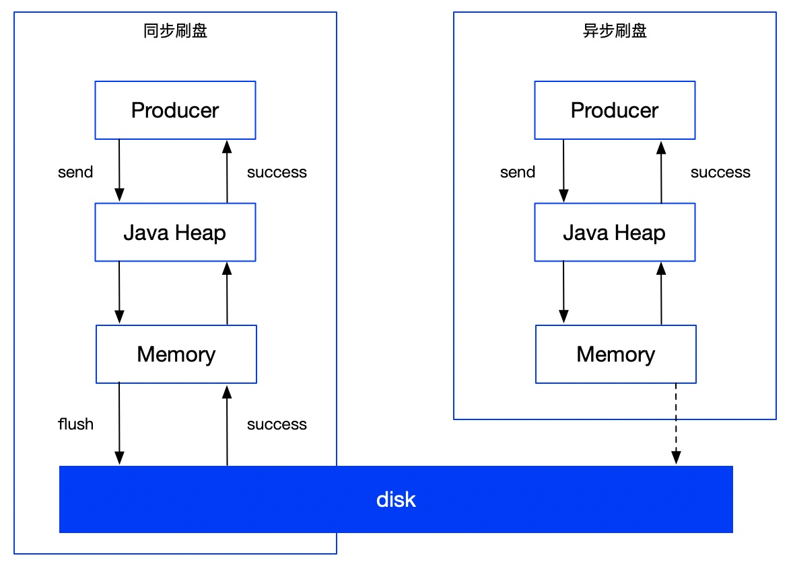

### 1、消息存储结构

RocketMQ消息的存储是由ConsumerQueue和CommitLog配合完成的，消息真正的物理存储文件是CommitLog，ConsumerQueue是消息的逻辑队列，类似数据库的索引文件，存储的是指向物理存储的地址。每个Topic下的每个MessageQueue都有一个对应的ConsumerQueue文件。

- **CommitLog**：存储消息的元数据，单个文件默认1G，文件写满后会建立一个新的文件，消息顺序写入文件

- **ConsumerQueue**：存储消息在CommitLog的索引，和MessageQueue一一对应，主要为了提高消息消费的性能。

- - 文件夹组织方式：topic/queue/file三层组织结构
  - consumequeue文件采取定长设计，每一个条目共20个字节，分别为8字节的commitlog物理偏移量、4字节的消息长度、8字节tag hashcode，单个文件由30W个条目组成，可以像数组一样随机访问每一个条目，每个ConsumeQueue文件大小约5.72M；

- **IndexFile**：为了消息查询提供了一种通过key或时间区间来查询消息的方法，这种通过IndexFile来查询消息的方法不影响发送与消费消息的主流程

- - Index文件的存储位置是：$HOME \store\index${fileName}，文件名fileName是以创建时的时间戳命名的
  - 固定的单个IndexFile文件大小约为400M，一个IndexFile可以保存 2000W个索引，IndexFile的底层存储设计为在文件系统中实现HashMap结构，故rocketmq的索引文件其底层实现为hash索引

### 2、刷盘机制

- **同步刷盘：**在返回写成功状态时，消息已经被写入磁盘。具体流程是，消息写入内存的PageCache后，立刻通知刷盘线程刷盘，然后等待刷盘完成，刷盘线程执行完成后唤醒等待的线程，返回消息写成功的状态。
- **异步刷盘：**在返回写成功状态时，消息可能只是被写入了内存的PageCache，写操作的返回快，吞吐量大；当内存里的消息积累到一定程度时，统一触发写磁盘动作，快速写入。
- **配置：**同步刷盘还是异步刷盘，都是通过Broker配置文件里的flushDiskType参数配置的，可配置成：SYNC_FLUSH、ASYNC_FLUSH

### 3、高可用机制

- **NameServer的高可用：**通过NameServer集群的方式保证高可用

- **Broker集群的高可用：**RocketMQ分布式集群是通过Master和Slave的配合达到高可用的。

- - Master和Slave的区别：在Broker的配置文件中，参数brokerId的值为0表明这个Broker是Master，大于0表明这个Broker是Slave，同时brokerRole参数也会说明这个Broker是Master还是Slave。
  - Master角色的Broker支持读和写，Slave角色的Broker仅支持读，也就是Producer只能和Master角色的Broker连接写入消息；Consumer可以连接Master角色的Broker，也可以连接Slave角色的Broker来读取消息。

- **消息消费高可用：**Consumer不需要设置连接哪个Broker，当Master不可用或者繁忙的时候，会自动切换到Slave读，这就达到了消费端的高可用。
- **消息发送高可用：**在创建Topic的时候，把Topic的多个MessageQueue创建在多个Broker组上（相同Broker名称，不同brokerId的机器组成一个Broker组），这样当一个Broker组的Master不可用后，其他组的Master仍然可用，Producer仍然可以发送消息。RockerMQ目前不支持把Slave自动转成Master，需要手动修改配置。

### 4、消息主从复制

- 同步复制：等Master和Slave都写成功后才给客户端返回成功

- - 优点：消息安全性高，Slave有全部数据，容易恢复
  - 缺点：数据写入延迟增高，系统吞吐量下降

- 异步复制：只要Master写入成功就返回成功

- - 优点：较低延迟，较高吞吐量
  - 缺点：有可能丢失消息

- 配置：通过brokerRole参数进行设置，可以设为ASYNC_MASTER（用于Master节点，异步复制Master）、SYNC_MASTER（用于Master节点，同步双写Master）、SLAVE（用于Slave节点）

### 5、消息重试

- 顺序消息的重试：对于顺序消息，当消费者消费消息失败后，会自动不断进行消息重试（每次间隔时间为1秒），这时，应用会出现消息消费被阻塞的情况。因此，在使用顺序消息时，务必保证应用能够及时监控并处理消费失败的情况，避免阻塞现象的发生。

- 无序消息的重试：对于无序消息（普通、定时、延时、事务消息），当消费者消费消息失败时，您可以通过设置返回状态达到消息重试的结果。无序消息的重试只针对集群消费方式生效；广播方式不提供失败重试特性，即消费失败后，失败消息不再重试，继续消费新的消息。

- - 默认允许重试16次

### 6、死信队列

消息经过最大重试次数还没被消费的消息会被放到一个特殊的队列中，这种正常无法被消费的消息被称为死信消息，存储死信消息的队列称为死信队列。

- 死信消息的特性：

- - 不会再被消费者正常消费
  - 有效期与正常消息相同，均为3天，3天后会被自动删除

- 死信队列的特性：

- - 一个死信队列对应一个Group ID，而不是对应单个消费者实例
  - 如果一个Group ID未产生死信消息，RocketMQ不会为其创建相应的死信队列
  - 一个死信队列包含了对应Group ID产生的所有死信消息，不论该消息属于哪个Topic