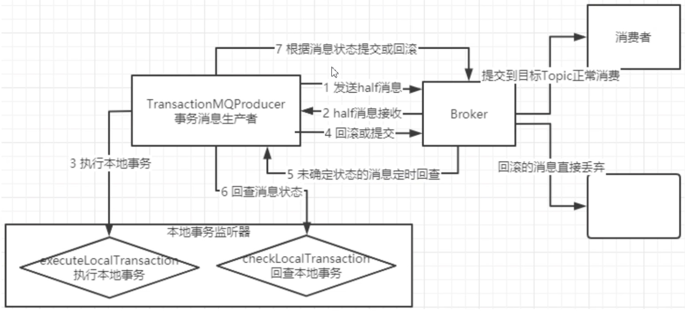

### 1、如何保证顺序消费

RocketMQ保证的也是局部有序，不是全局有序，如果要让消息有序，生产者需要指定MessageQueue，消费者要声明一个MessageListenerOrderly

### 2、集群模式和广播模式的区别

- 集群模式：每条消息只会被consumer集群内的一个consumer消费一次，默认是集群模式
- 广播模式：每条消息会被consumer集群内的所有consumer消费一次

### 3、延迟消息

生产者将消息发送到Broker集群后，延迟指定时间后将消息发送给消费者，RocketMQ开源版只支持指定18个延迟级别，如果需要更灵活的设置需要修改源码

### 4、消息过滤

- 通过Tag过滤
- 通过表达式过滤（SQL）

### 5、事务消息

事务消息是在分布式系统中保证最终一致性的两阶段提交的消息实现，可以保证本地事务执行与消息发送两个操作的原子性，也就是这两个消息一起成功或者一起失败。

