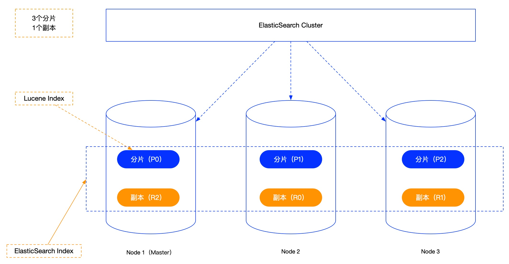

### 1、ES集群系统架构



- **单节点集群：**集群中只有一个节点，可以指定分片数和副本数，这些分片会存储在同一个节点上，但是副本不会被创建，因为副本必须和分片处在不同的节点上。

- **多节点集群：**集群中有多个节点，其中一个为master节点，负责整个集群的管理。

- - 节点角色：

  - - Coordinating Node（协调节点）：处理请求的节点，会将请求路由到正确的节点上，默认都是Coordinating Node
    - Master Node：处理创建、删除索引等请求，决定分片被分到哪个节点，负责索引的创建与删除，维护并且更新Cluster State
    - Master Eligible Node：可以参与选举Master，集群中第一个启动的Master Eligible会成为Master节点，通过node.master: true来指定
    - Data Node：可以保存数据的节点

  - 配置：

```
# 集群名称
cluster.name: cluster-es
# 节点名称，每个节点的名称不能重复
node.name: node-1
# IP地址，每个节点的地址不能重复
network.host: linux1
# 是不是有资格主节点
node.master: true
node.data: true
http.port: 9200
# es7.x 之后新增的配置，初始化一个新的集群时需要此配置来选举master
cluster.initial_master_node: ["node-1"]
# es7.x 之后新增的配置，节点发现
discovery.send_hosts: ["linux1:9300", "linux2:9300", "linux3:9300"]
```

- - 水平扩容：指定相同的cluster.name配置，新增节点即可

  - - 索引的分片数和副本数在新建索引时就指定了，意味着集群中节点数据的最大值也确定了，比如设置3个分片，1个副本，那么总共会有6的分片数据，集群中的节点最大就是6，如果想要超过6个节点，由于分片数不能修改，所以需要修改副本数来实现，比如把副本数改为2，那么总共就有9个分片数据，可以支持9个节点。

### 2、Master节点选举过程

- 何时发起：

- - 集群启动初始化
  - 集群的Master崩溃的时候
  - 任何一个节点发现当前集群中的Master节点没有得到n/2 + 1节点认可的时候，触发选举

- 选举谁：

- - 当clusterStateVersion越大，优先级越高。这是为了保证新Master拥有最新的clusterState(即集群的meta)，避免已经commit的meta变更丢失。因为Master当选后，就会以这个版本的clusterState为基础进行更新。(一个例外是集群全部重启，所有节点都没有meta，需要先选出一个master，然后master再通过持久化的数据进行meta恢复，再进行meta同步)。
  - 当clusterStateVersion相同时，节点的Id越小，优先级越高。即总是倾向于选择Id小的Node，这个Id是节点第一次启动时生成的一个随机字符串。之所以这么设计，应该是为了让选举结果尽可能稳定，不要出现都想当master而选不出来的情况。

- 脑裂问题：低版本需要自己设置，7.x版本不需要自己设置，不会再出现脑裂问题

### 3、数据写流程

- 客户端请求集群中任意一个节点（协调节点）

- 协调节点将请求转移到指定的节点

- 主分片保存数据

- 主分片将数据发送到副本分片

- 副本分片保存完数据后给主分片响应

- 主分片将结果返回给客户端

- 数据一致性保证：通过consistency参数指定

- - quorum：默认值，超过半数的副本写入成功就给客户端返回成功
  - one：主分片写入成功就返回
  - all：所有分片都写入成功后再返回

### 4、数据读流程

- 客户端发送查询请求到协调节点
- 协调节点计算数据所在分片以及全部的副本位置
- 为了能够负载均衡，可以轮询所有节点
- 将请求转发给具体节点
- 节点返回查询结果，将结果反馈给客户端

### 5、数据更新流程

- 局部更新：结合数据读流程和数据写流程
- 全部更新：先将旧的数据标记为删除，然后再添加新的数据