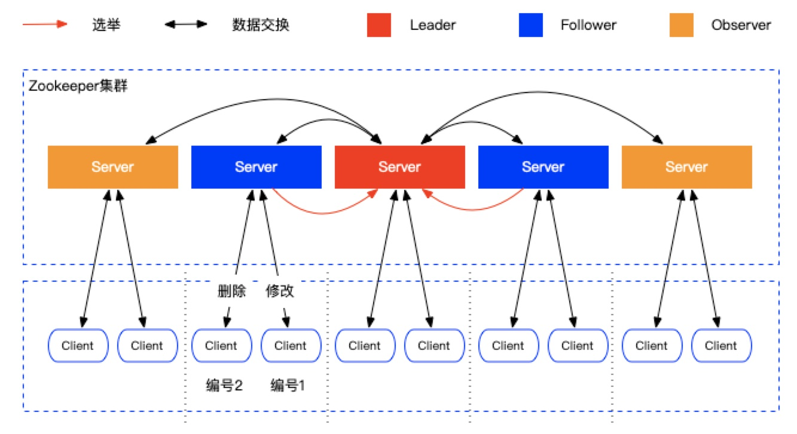

### 1、Zookeeper集群中的角色

- Leader 领导者：

- - 处理事务请求（增删改）
  - 集群内各服务器的调度者（同步数据）

- Follower 跟随者：

- - 处理客户端非事务请求（查），转发事务请求给Leader服务器
  - 参与Leader选举投票

- Observer 观察者：

- - 处理客户端非事务请求，转发事务请求给Leader服务器
  - 不参与Leader选举投票

### 2、Zookeeper的数据模型

- zk是一个树型目录服务，其数据模型和unix的文件系统目录树很类似，拥有一个层次结构。

- 每一个节点被称为ZNode，每个节点上都会保存自己的数据和节点信息。

- 节点可以拥有子节点，同时也允许少量（1MB）数据存储在该节点之下。

- 节点可以分为四大类：

- - persistent 持久化节点：客户端断开连接后节点还存在
  - ephemeral 临时节点（-e）：客户端关闭后节点就会删除，只在当前会话中有效
  - persistent_sequential 持久化顺序节点（-s）：和持久化节点类似，有一个编号来保持顺序
  - ephemeral_sequential 临时顺序节点（-es）：和临时节点类似，有一个编号来保持顺序

### 3、Watch事件监听

- zk允许用户在指定节点上注册一些watcher，并且在一些特定事件触发的时候，zookeeper服务端会将事件通知到感兴趣的客户端上去，该机制是zookeeper实现分布式协调服务的重要特性。
- zk中引入watcher机制来实现了发布、订阅功能，能够让多个订阅者同时监听某一个对象（节点），当一个对象自身状态变化时，会通知所有订阅者。
- zk原生支持通过注册watcher来进行事件监听，但是其使用并不是特别方便，需要开发人员自己反复注册watcher，比较繁琐。curator引入了cache来实现对zk服务端事件的监听。

- zk提供三种watcher：

- - NodeCache：只监听某一个特定的节点
  - PathChildrenCache：监听一个ZNode的子节点
  - ThreeCache：可以监听整个树上的所有节点，类似于PathChildrenCache和NodeCache的组合