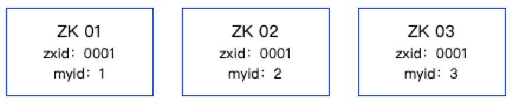
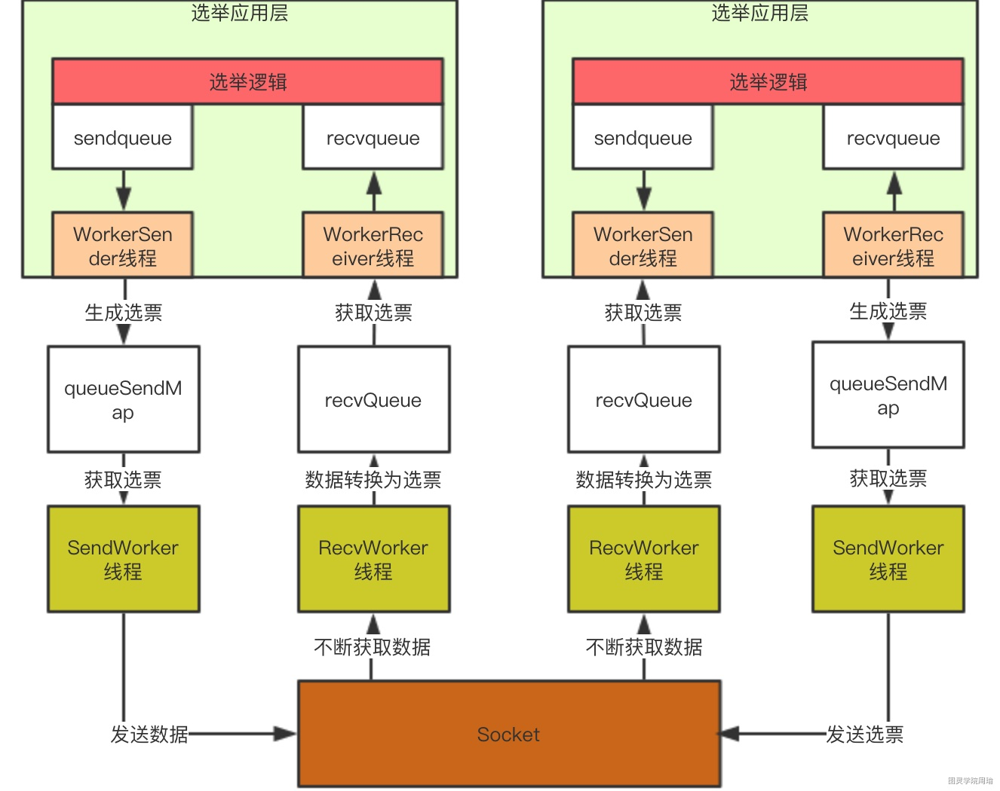

### 1、Leader选举

- 触发Leader选举的时机

- - 集群启动时
  - Leader节点宕机
  - 超过一半的follower节点挂了，会重新进行领导者选举，此时由于一半的节点都挂了，所以无法选出Leader节点，此时整个集群无法对外提供服务

- 依赖的机制

- - zxid：事务ID，用来唯一标识一次服务器状态变更，值越大说明数据越新，在选举时权重越大
  - myid：zk集群中服务器的唯一标识，值越大在选举时权重越大
  - 过半机制：票数超过一半时可以当选Leader

- zk节点的状态：

- - looking：Leader选举阶段，这个状态集群不能对外提供服务
  - leading：当前节点是Leader，负责协调事务
  - following：当前节点是Follower，和Leader保持数据同步
  - observing：当前节点是Observing，和Leader保持数据同步

- Leader选举的过程

- - 集群：有三台机器组成集群，依次启动

  - 第一步：ZK01启动，将选票投给自己，此时ZK01获得的选票是<[zxid:0001, myid:1]>，当前其他服务器还没启动，不会进行广播，自己只有一张选票，所以也无法当选Leader；

  - 第二步，ZK02启动，首先也将选票投给自己，此时ZK02获得的选票是<[zxid:0001, myid:2]>，然后将自己的选票广播给ZK01；

  - - ZK01拿到ZK02广播的选票[zxid:0001, myid:2]后进行判断，首先判断zxid哪个比较大，zxid比较大的胜选，如果相等，则判断myid哪个比较大，myid较大的获得胜选，ZK01将自己本地的选票改为新的选票后进行广播；
    - ZK02拿到ZK01广播的选票[zxid:0001, myid:2]后进行判断，同样先判断zxid，然后判断myid，此时，ZK02发现自己已经获得了两张选票，已经超过了半数，那么ZK02当选为Leader；

  - 第三步，ZK03启动，ZK03启动时发现ZK02已经是Leader了，那么自己会直接变为Follower

### 2、数据同步机制

- 依赖的机制

- - 2PC：两阶段提交，先预提交，等待ACK，发送Commit

- 数据同步的过程：

- - 第一步：客户端向Leader发送一个写请求，如果客户端连接的是Follower节点，Follower节点会将该写请求同步给Leader节点进行处理

  - 第二步：Leader在本机生成事务日志

  - 第三步：Leader节点向Follower节点发起预提交

  - 第四步：Follower在本地持久化日志

  - 第五步：Follower节点向Leader节点返回ACK响应

  - 第六步：Leader节点发现有一半的节点返回了ACK响应

  - 第七步：Leader节点向Follower节点发送commit请求

  - - commit请求是异步请求，所以zk其实也是最终一致性，而不是强一致性，因为这个过程如果有节点出现异常，那么不同节点查到的数据可能会不一致

  - 第八步：Leader自己进行提交，给客户端成功响应