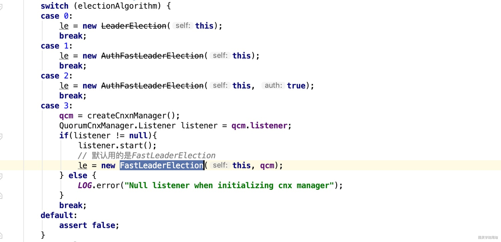
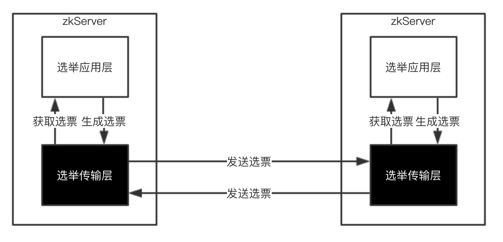
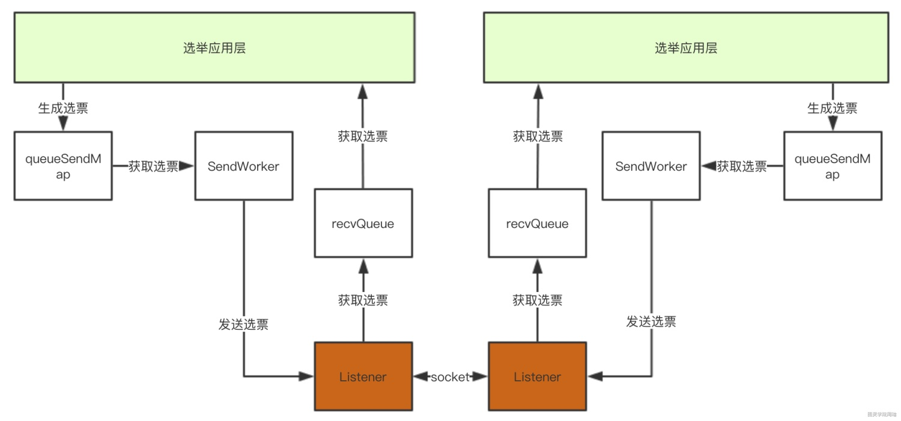
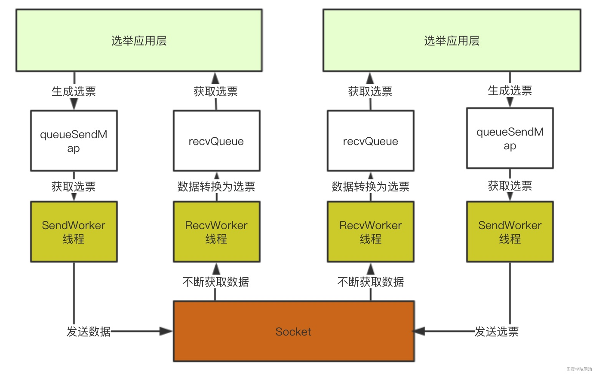
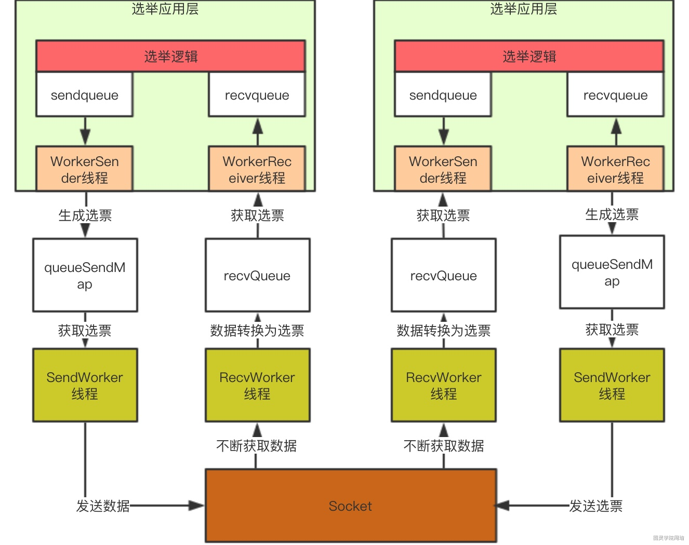

### 人类选举的基本原理

正常情况下，选举是一定要投票的。

我们应该都经历过投票，在投票时我们可能会将票投给和我们关系比较好的人，如果你和几个候选人都比较熟，这种情况下你会将选票投给你认为能力比较强的人，如果你和几个候选人都不熟，并且你自己也是候选人的话，这时你应该会认为你是这些候选人里面最厉害的那个人，大家都应该选你，这时你就会去和别人交流以获得别人的投票，但是很有可能在交流的过程中，你发现了比你更厉害的人，这时你如果脸皮不是那么厚的话，你应该会改变你的决定，去投你觉得更厉害的人，最终你将得到在你心中认为最厉害的人，且将票投给他，选票将会放在投票中，最后从投票箱中进行统计，获得票数最多的人当选。

在这样一个选举过程中我们提炼出四个基本概念：

1. 个人能力：投我认为能力最强的人，这是投票的基本规则
2. 改票：能力最强的人是逐渐和其他人沟通之后的结果，类似改票，先投给A，但是后来发现B更厉害，则改为投B
3. 投票箱：所有人公用一个投票箱
4. 领导者：获得投票数最多的人为领导者

### Zookeeper选举的基本原理

Zookeeper集群模式下才需要选举。

Zookeeper的选举和人类的选举逻辑类似，Zookeeper需要实现上面人类选举的四个基本概念；

1. 个人能力：Zookeeper是一个数据库，集群中节点的数据越新就代表此节点能力越强，而在Zookeeper中可以通事务id(zxid)来表示数据的新旧，一个节点最新的zxid越大则该节点的数据越新。所以Zookeeper选举时会根据zxid的大小来作为投票的基本规则。
2. 改票：Zookeeper集群中的某一个节点在开始进行选举时，首先认为自己的数据是最新的，会先投自己一票，并且把这张选票发送给其他服务器，这张选票里包含了两个重要信息：**zxid**和**sid**，sid表示这张选票投的服务器id，zxid表示这张选票投的服务器上最大的事务id，同时也会接收到其他服务器的选票，接收到其他服务器的选票后，可以根据选票信息中的zxid来与自己当前所投的服务器上的最大zxid来进行比较，如果其他服务器的选票中的zxid较大，则表示自己当前所投的机器数据没有接收到的选票所投的服务器上的数据新，所以本节点需要改票，改成投给和刚刚接收到的选票一样。
3. 投票箱：Zookeeper集群中会有很多节点，和人类选举不一样，Zookeeper集群并不会单独去维护一个投票箱应用，而是在每个节点内存里利用一个数组来作为投票箱。每个节点里都有一个投票箱，节点会将自己的选票以及从其他服务器接收到的选票放在这个投票箱中。因为集群节点是相互交互的，并且选票的PK规则是一致的，所以每个节点里的这个投票箱所存储的选票都会是一样的，这样也可以达到公用一个投票箱的目的。
4. 领导者：Zookeeper集群中的每个节点，开始进行领导选举后，会不断的接收其他节点的选票，然后进行选票PK，将自己的选票修改为投给数据最新的节点，这样就保证了，每个节点自己的选票代表的都是自己暂时所认为的数据最新的节点，再因为其他服务器的选票都会存储在投票箱内，所以可以根据投票箱里去统计是否有超过一半的选票和自己选择的是同一个节点，都认为这个节点的数据最新，一旦整个集群里超过一半的节点都认为某一个节点上的数据最新，则该节点就是领导者。

通过对四个概念的在Zookeeper中的解析，也同时介绍了一下Zookeeper领导者选举的基本原理，只是说选举过程中还有更多的细节需要我们了解，下面我结合源码来给大家详细的分析一下Zookeeper的快速领导者选举原理。

### 领导者选举入口

ZooKeeperServer表示单机模式中的一个zkServer。

QuoruPeer表示集群模式中的一个zkServer。

QuoruPeer类定义如下：

```
public class QuorumPeer extends ZooKeeperThread implements QuorumStats.Provider
```

定义表明QuorumPeer是一个ZooKeeperThread，表示是一个线程。

当集群中的某一个台zkServer启动时QuorumPeer类的start方法将被调用。

```
public synchronized void start() {
        loadDataBase(); // 1
        cnxnFactory.start(); // 2
        startLeaderElection(); // 3 
        super.start();  // 4
    }
```

1. zkServer中有一个内存数据库对象ZKDatabase， zkServer在启动时需要将已被持久化的数据加载进内存中，也就是加载至ZKDatabase。
2. 这一步会开启一个线程来接收客户端请求，但是需要注意，这一步执行完后虽然成功开启了一个线程，并且也可以接收客户端线程，但是因为现在zkServer还没有经过初始化，实际上把请求拒绝掉，知道zkServer初始化完成才能正常的接收请求。
3. 这个方法名很有误导性，这个方法并没有真正的开始领导选举，而是进行一些初始化
4. 继续启动，包括进行领导者选举、zkServer初始化。

### 领导者选举策略

上文QuorumPeer类的startLeaderElection会进行领导者选举初始化。

首先，领导者选举在Zookeeper中有3种实现：



其中LeaderElection、AuthFastLeaderElection已经被标为过期，不建议使用，所以现在用的都是**快速领导者选举****FastLeaderElection，**我们着重来介绍FastLeaderElection。

### 快速领导者选举

快速领导者选举实现架构如下图：



### 传输层初始化

从架构图我们可以发现，快速领导者选举实现架构分为两层：**应用层**和**传输层**。所以初始化核心就是初始化传输层。

初始化步骤：

1. 初始化QuorumCnxManager
2. 初始化QuorumCnxManager.Listener
3. 运行QuorumCnxManager.Listener
4. 运行QuorumCnxManager
5. 返回FastLeaderElection对象

#### QuorumCnxManager介绍

QuorumCnxManager就是传输层实现，QuorumCnxManager中几个重要的属性：

- ConcurrentHashMap<Long, ArrayBlockingQueue<ByteBuffer>> **queueSendMap**
- ConcurrentHashMap<Long, SendWorker> **senderWorkerMap**
- ArrayBlockingQueue<Message> **recvQueue**
- QuorumCnxManager.Listener

传输层的每个zkServer需要发送选票信息给其他服务器，这些选票信息来至应用层，在传输层中将会按服务器id分组保存在**queueSendMap**中。

传输层的每个zkServer需要发送选票信息给其他服务器，SendWorker就是封装了Socket的发送器，而**senderWorkerMap**就是用来记录其他服务器id以及对应的SendWorker的。

传输层的每个zkServer将接收其他服务器发送的选票信息，这些选票会保存在**recvQueue**中，以提供给应用层使用。

QuorumCnxManager.Listener负责开启socket监听。

细化后的架构图如下：




#### 服务器之间连接问题

在集群启动时，一台服务器需要去连另外一台服务器，从而建立Socket用来进行选票传输。那么如果现在A服务器去连B服务器，同时B服务器也去连A服务器，那么就会导致建立了两条Socket，我们知道Socket是双向的，Socket的双方是可以相互发送和接收数据的，那么现在A、B两台服务器建立两条Socket是没有意义的，所以ZooKeeper在实现时做了限制，只允许**服务器ID较大者去连服务器ID较小者，小ID服务器去连大ID服务器会被拒绝**，伪代码如下**：**

```
if (对方服务器id < 本服务器id) {
    closeSocket(sock); // 关闭这条socket
    connectOne(sid);   // 由本服务器去连对方服务器
} else {
    // 继续建立连接
}
```

#### SendWorker、RecvWorker介绍

上文介绍到了SendWorker，它是zkServer用来向其他服务器发送选票信息的。

类结构如下：

```
class SendWorker extends ZooKeeperThread {
    Long sid;
    Socket sock;
    RecvWorker recvWorker;
    volatile boolean running = true;
    DataOutputStream dout;
}
```

它封装了socket并且是一个线程，实际上SendWorker的底层实现是：SendWorker线程会不停的从**queueSendMap**中获取选票信息然后发送到Socket上。

基于同样的思路，我们还需要一个线程从Socket上获取数据然后添加到**recvQueue**中，这就是**RecvWorker**的功能。

所以架构可以演化为下图，通过这个架构，选举应用层直接从recvQueue中获取选票，或者选票添加到queueSendMap中既可以完成选票发送：



### 应用层初始化

#### FastLeaderElection类介绍

FastLeaderElection类是快速领导者选举实现的核心类，这个类有三个重要的属性：

- LinkedBlockingQueue<**ToSend**> **sendqueue**;
- LinkedBlockingQueue<**Notification**> **recvqueue**;
- Messenger **messenger**;

- - Messenger.WorkerSender
  - Messenger.WorkerReceiver

服务器在进行领导者选举时，在发送选票时也会同时接受其他服务器的选票，FastLeaderElection类也提供了和传输层类似的实现，将待发送的选票放在**sendqueue**中，由**Messenger.****WorkerSender**发送到传输层**queueSendMap**中。

同样，由**Messenger.****WorkerReceiver**负责从传输层获取数据并放入**recvqueue**中。

这样在应用层了，只需要将待发送的选票信息添加到**sendqueue**中即可完成选票信息发送，或者从**recvqueue**中获取元素即可得到选票信息。

在构造FastLeaderElection对象时，会对**sendqueue、****recvqueue**队列进行初始化，并且运行**Messenger.****WorkerSender**与**Messenger.****WorkerReceiver**线程。

此时架构图如下：




到这里，QuorumPeer类的startLeaderElection方法已经执行完成，完成了传输层和应用层的初始化。

### 快速领导者选举实现

QuorumPeer类的start方法前三步分析完，接下来我们来看看第四步：

```
super.start();
```

QuorumPeer类是一个ZooKeeperThread线程，上述代码实际就是运行一个线程，相当于运行QuorumPeer类中的run方法，这个方法也是集群模式下Zkserver启动最核心的方法。

总结一下QuorumPeer类的start方法：

1. 加载持久化数据到内存
2. 初始化领导者选举策略
3. 初始化快速领导者选举传输层
4. 初始化快速领导者选举应用层
5. 开启主线程

主线程开启之后，QuorumPeer类的start方法即执行完成，这时回到上层代码可以看到主线程会被join住：

```
quorumPeer.start(); // 开启线程
quorumPeer.join(); // join线程
```

接下来我们着重来分析一下主线程内的逻辑。

#### 主线程

在主线程里，会有一个主循环(Main loop)，主循环伪代码如下：

```
while (服务是否正在运行) {
    switch (当前服务器状态) {
        case LOOKING:
            // 领导者选举
            setCurrentVote(makeLEStrategy().lookForLeader());
            break;
        case OBSERVING:
            try {
                // 初始化为观察者
            } catch (Exception e) {
                LOG.warn("Unexpected exception",e );                        
            } finally {
                observer.shutdown();
                setPeerState(ServerState.LOOKING);
            }
            break;
        case FOLLOWING:
            try {
                // 初始化为跟随者
            } catch (Exception e) {
                LOG.warn("Unexpected exception",e);
            } finally {
                follower.shutdown();
                setPeerState(ServerState.LOOKING);
            }
            break;
        case LEADING:
            try {
                // 初始化为领导者
            } catch (Exception e) {
                LOG.warn("Unexpected exception",e);
            } finally {
                leader.shutdown("Forcing shutdown");
                setPeerState(ServerState.LOOKING);
            }
        break;
    }
}
```

这个伪代码实际上**非常非常重要****，大家细心的多看几遍。**

**
**

根据伪代码可以看到，当服务器状态为LOOKING时会进行领导者选举，所以我们着重来看领导者选举。

#### lookForLeader

当服务器状态为LOOKING时会调用FastLeaderElection类的lookForLeader方法，这就是领导者选举的应用层。

##### 1.初始化一个投票箱

```
HashMap<Long, Vote> recvset = new HashMap<Long, Vote>();
```

##### 2.更新选票，将票投给自己

```
updateProposal(getInitId(), getInitLastLoggedZxid(), getPeerEpoch());
```

##### 3.发送选票

```
sendNotifications();
```

##### 4.不断获取其他服务器的投票信息，直到选出Leader

```
while ((self.getPeerState() == ServerState.LOOKING) && (!stop)){
    // 从recvqueue中获取接收到的投票信息
    Notification n = recvqueue.poll(notTimeout, TimeUnit.MILLISECONDS);
    
    if (获得的投票为空) {
        // 连接其他服务器
    } else {
        // 处理投票
    }
}
```

##### 5.连接其他服务器

因为在这一步之前，都只进行了服务器的初始化，并没有真正的去与其他服务器建立连接，所以在这里建立连接。

##### 6.处理投票

判断接收到的投票所对应的服务器的状态，也就是投此票的服务器的状态：

```
switch (n.state) {
    case LOOKING:
        // PK选票、过半机制验证等
        break;
    case OBSERVING:
        // 观察者节点不应该发起投票，直接忽略
        break;
    case FOLLOWING:
    case LEADING:
        // 如果接收到跟随者或领导者节点的选票，则可以认为当前集群已经存在Leader了，直接return，退出lookForLeader方法。
}
```

##### 7. PK选票

```
if (接收到的投票的选举周期 > 本服务器当前的选举周期) {
    // 修改本服务器的选举周期为接收到的投票的选举周期
    // 清空本服务器的投票箱（表示选举周期落后，重新开始投票）
    // 比较接收到的选票所选择的服务器与本服务器的数据谁更新，本服务器将选票投给数据较新者
    // 发送选票
} else if(接收到的投票的选举周期 < 本服务器当前的选举周期){
    // 接收到的投票的选举周期落后了，本服务器直接忽略此投票
} else if(选举周期一致) {
    // 比较接收到的选票所选择的服务器与本服务器当前所选择的服务器的数据谁更新，本服务器将选票投给数据较新者
    // 发送选票
}
```

##### 8.过半机制验证

本服务器的选票经过不停的PK会将票投给数据更新的服务器，PK完后，将接收到的选票以及本服务器自己所投的选票放入投票箱中，然后从投票箱中统计出与本服务器当前所投服务器一致的选票数量，判断该选票数量是否超过集群中所有跟随者的一半（选票数量 > 跟随者数量/2），如果满足这个过半机制就选出了一个**准Leader。**

**
**

##### 9.最终确认

选出**准Leader**之后，再去获取其他服务器的选票，如果获取到的选票所代表的服务器的数据比准Leader更新，则准Leader卸职，继续选举。如果没有准Leader更新，则继续获取投票，直到没有获取到选票，则选出了最终的Leader。

Leader确定后，其他服务器的角色也确定好了。

### 领导选举完成后

上文**主线程小节**有一段非常重要的伪代码，这段伪代码达到了一个非常重要的功能，就是：

> ZooKeeper集群在进行领导者选举的过程中不能对外提供服务

根据伪代码我们可以发现，只有当集群中服务器的角色确定了之后，while才会进行下一次循环，当进入下一次循环后，就会根据服务器的角色进入到对应的初始化逻辑，初始化完成之后才能对外提供服务。


(文章转载自：https://www.yuque.com/renyong-jmovm/ds/fukd3b)