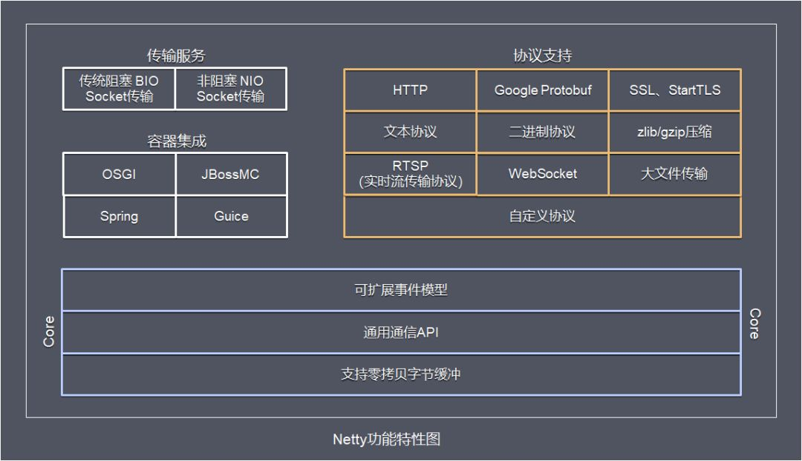
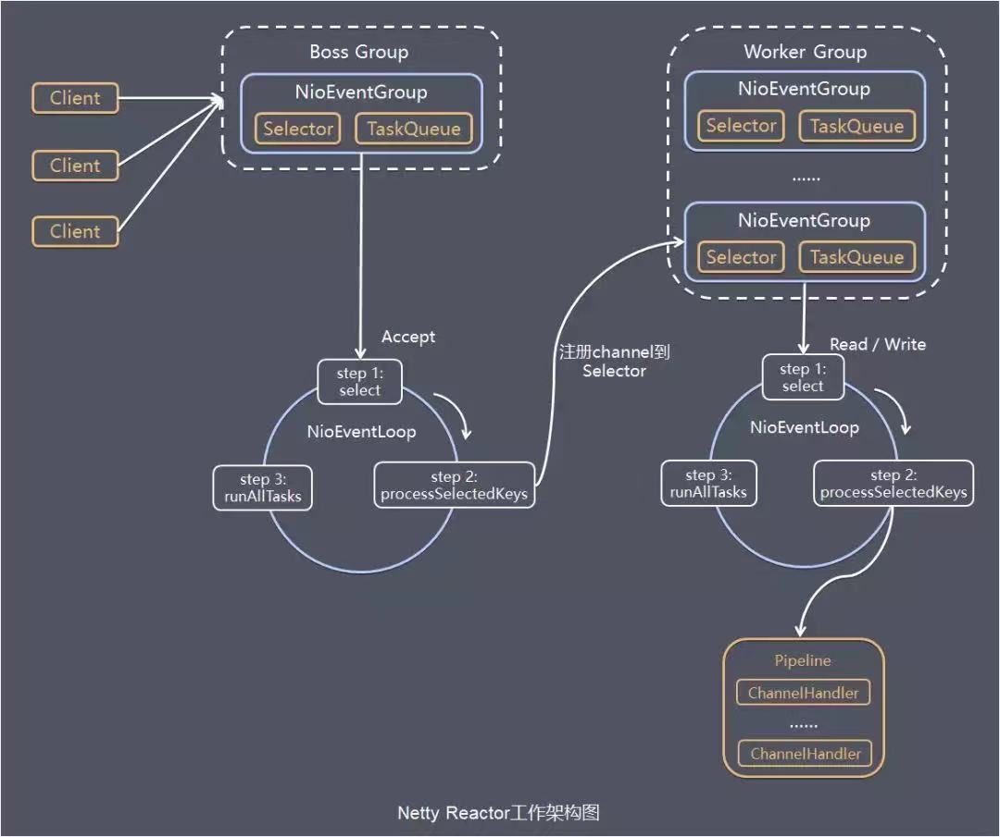

### 一、功能特性



- 传输服务：支持BIO、NIO
- 容器集成：支持OSGI、JBossMC、Spring、Guice
- 协议支持：HTTP、Protobuf、二进制、文本、WebSocket、自定义协议等
- Core核心：可扩展事件模型、通用通信API、支持零拷贝的Bytebuf缓冲对象

### 二、工作流程



- server端包含1个Boss NioEventLoopGroup和1个Worker NioEventLoopGroup，NioEventLoopGroup相当于1个事件循环组，这个组里包含多个事件循环NioEventLoop，每个NioEventLoop包含1个selector和1个事件循环线程。

- 每个Boss NioEventLoopGroup循环执行的任务包含3步：

- - 轮询accept事件
  - 处理accept I/O事件，与Client建立连接，生成NioSocketChannel，并将NioSocketChannel注册到某个Worker NioEventLoop的Selector上
  - 处理任务队列中的任务（runAllTasks），任务队列中的任务包括用户调用eventloop.execute或schedule执行的任务，或者其它线程提交到该eventloop的任务

- 每个Worker NioEventLoopGroup循环执行的任务包含3步：

- - 轮询read、write事件
  - 处理I/O事件，即read、write事件，在NioSocketChannel可读、可写事件发生时进行处理
  - 处理任务队列中的任务（runAllTasks）

- 任务队列中的task有三种典型使用场景：

- - 用户程序自定义的普通任务

```
ctx.channel().eventLoop().execute(new Runnable() {
   @Override
   public void run() {
       //...
   }
});
```

- - 用户自定义的定时任务

```
ctx.channel().eventLoop().schedule(new Runnable() {
   @Override
   public void run() {
   }
}, 60, TimeUnit.SECONDS);
```

- - 非当前reactor线程调用channel的各种方法

### 三、模块组件

- **Bootstrap、ServerBootstrap：**Bootstrap意思是引导、一个Netty应用通常由一个Bootstrap开始，主要作用是配置整个Netty程序，串联各个组件

- - Bootstrap类是客户端程序的启动引导类
  - ServerBootstrap类是服务端启动引导类

- **Future、ChannelFuture：**在Netty中所有的IO操作都是异步的，不能立刻得到消息是否被正确处理，但是可以过一会等它执行完成或者直接注册一个监听，具体的实现就是通过Future和ChannelFuture，他们可以注册一个监听，当操作执行成功或失败时监听会自动触发注册的监听事件

- **Channel：**Netty网络通信的组件，能够用于执行网络I/O操作。Channel为用户提供：

- - 当前网络连接的通道的状态（例如是否打开？是否已连接？）

  - 网络连接的配置参数（例如接收缓存区大小）

  - 提供一部的网络I/O操作（如建立连接、读写、绑定端口），异步调用意味着任何I/O调用都将立即返回，并且不保证在调用结束时所请求的I/O操作已完成。调用立即返回一个ChannelFuture实例，通过注册监听器到ChannelFuture上，可以I/O操作成功、失败或取消时回调通知调用方

  - 支持关联I/O操作与对应的处理程序

  - **常用Channel类型**（不同协议、不同的阻塞类型的连接都有不同的Channel类型与之对应，这些通过涵盖了UDP和TCP网络IO以及文件IO）：

  - - NioSocketChannel：异步的客户端TCP Socket连接
    - NioServerSocketChannel：异步的服务器端TCP Socket连接
    - NioDatagramChannel：异步的UDP连接
    - NioSctpChannel：异步的客户端Sctp连接
    - NioSctpServerChannel：异步的Sctp服务器端连接

- **Selector：**Netty基于Selector对象实现I/O多路复用，通过Selector一个线程可以监听多个连接的Channel事件，当向一个Selector中注册Channel后，Selector内部的机制就可以自动不断地查询（select）这些注册的Channel是否有已就绪的I/O事件（例如可读，可写，网络连接完成等），这样程序就可以很简单地使用一个线程高效地管理多个Channel

- **NioEventLoop：**NioEventLoop中维护了一个线程和任务队列，支持异步提交执行任务，线程启动时会调用NioEventLoop的run方法，执行I/O任务和非I/O任务：

- - I/O任务：即selectionKey中ready的事件，如：accept、connect、read、write等，由processSelectedKeys方法触发
  - 非I/O任务：添加到taskQueue中的任务，如register0、bind0等任务，由runAllTasks方法触发

- **NioEventLoopGroup：**主要管理eventLoop的生命周期，可以理解为一个线程池，内部维护了一组线程，每个线程（NioEventLoop）负责处理多个Channel上的事件，而一个Channel只对应于一个线程

- **ChannelHandler：**ChannelHandler是一个接口，处理I/O事件或拦截I/O操作，并将其转发到其ChannelPipeline（业务处理链）中的下一个处理程序，使用时可以继承它的子类或适配器：

- - 子类：

  - - ChannelInboundHandler：用于处理入站I/O事件
    - ChannelOutboundHandler：用于处理出站I/O事件

  - 适配器：

  - - ChannelInboundHandlerAdapter：用于处理入站I/O事件
    - ChannelOutboundHandlerAdapter：用于处理出站I/O事件
    - ChannelDuplexHandler：用于处理入站和出站事件

- **ChannelHandlerContext：**保存Channel相关的所有上下文信息，同时关联一个ChannelHandler对象

- **ChannelPipline：**保存ChannelHandler的List，用于处理或拦截Channel的入站事件和出站操作

### 四、代码实现

1、初始化并启动Netty服务端过程如下：

```
public static void main(String[] args) {
       // 创建mainReactor
       NioEventLoopGroup boosGroup = new NioEventLoopGroup();
       // 创建工作线程组
       NioEventLoopGroup workerGroup = new NioEventLoopGroup();
       final ServerBootstrap serverBootstrap = new ServerBootstrap();
       serverBootstrap
                // 组装NioEventLoopGroup
               .group(boosGroup, workerGroup)
                // 设置channel类型为NIO类型
               .channel(NioServerSocketChannel.class)
               // 设置连接配置参数
               .option(ChannelOption.SO_BACKLOG, 1024)
               .childOption(ChannelOption.SO_KEEPALIVE, true)
               .childOption(ChannelOption.TCP_NODELAY, true)
               // 配置入站、出站事件handler
               .childHandler(new ChannelInitializer<NioSocketChannel>() {
                   @Override
                   protected void initChannel(NioSocketChannel ch) {
                       // 配置入站、出站事件channel
                       ch.pipeline().addLast(...);
                       ch.pipeline().addLast(...);
                   }
               });
       // 绑定端口
       int port = 8080;
       serverBootstrap.bind(port).addListener(future -> {
           if (future.isSuccess()) {
               System.out.println(new Date() + ": 端口[" + port + "]绑定成功!");
           } else {
               System.err.println("端口[" + port + "]绑定失败!");
           }
       });
}
```

基本过程如下：

- 初始化创建2个NioEventLoopGroup

- - 其中boosGroup用于Accept建立连接事件，并分发请求
  - workerGroup用于处理I/O读写事件和业务逻辑

- 基于ServerBootstrap配置EventLoopGroup、Channel类型、连接参数、配置入站、出站事件Handler

- 绑定端口，开始工作

