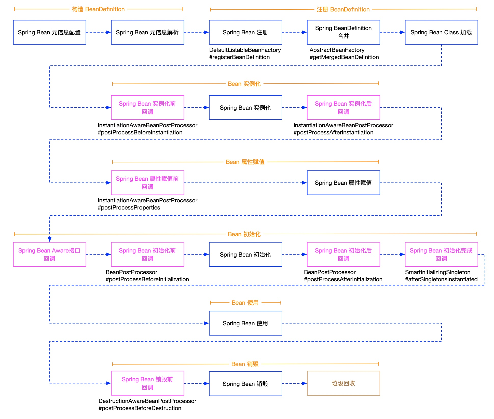
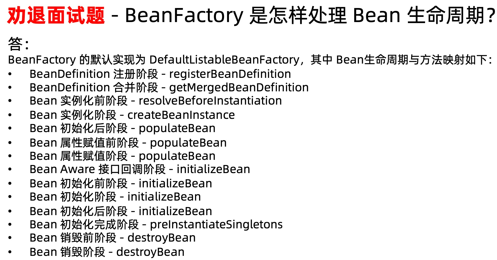
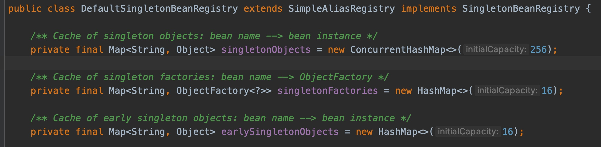
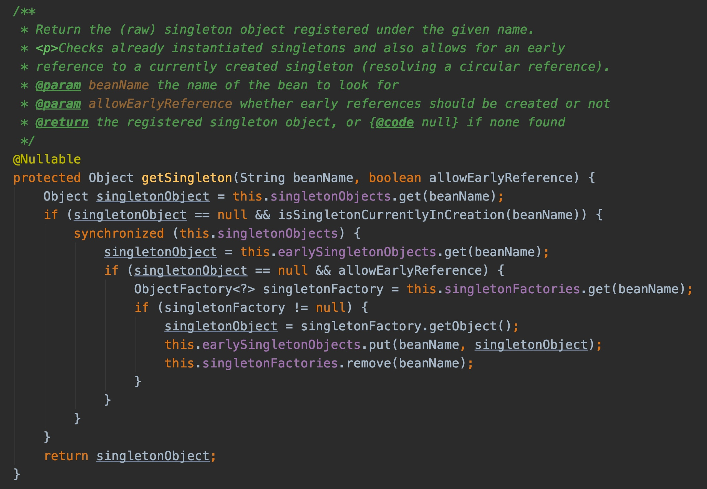
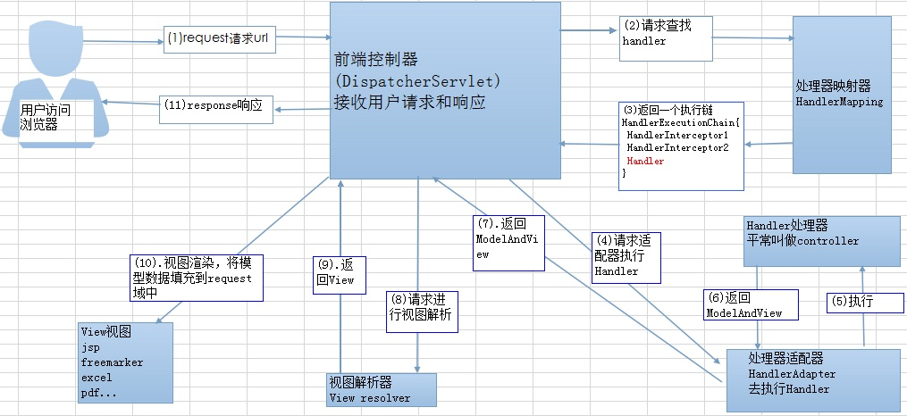

### 1、Spring Bean的生命周期

#### Spring Bean初始化阶段 

- Aware接口回调

- - BeanNameAware
  - BeanClassLoaderAware
  - BeanFactoryAware
  - EnvironmentAware
  - EmbeddedValueResolverAware
  - ResourceLoaderAware
  - ApplicationEventPublisherAware
  - MessageSourceAware
  - ApplicationContextAware

- 初始化前回调

- - BeanPostProcessor#postProcessBeforeInitialization

- 初始化

- - @PostConstruct 标注方法
  - 实现 InitializingBean 接口的 afterPropertiesSet() 方法
  - 自定义初始化方法

- 初始化后回调

- - BeanPostProcessor#postProcessAfterInitialization

- 初始化完成回调

- - Spring4.1+：SmartInitializingSingleton#afterSingletonsInstantiated

### 2、Spring如何解决循环依赖

循环依赖主要有两个情况，一种是通过属性注入形成循环依赖，另一种是通过构造器注入形成循环依赖，并且是在单例模式下，通过构造器形成的循环依赖Spring是无法自动解决的，必须自己排查代码设计是否有问题，可以通过延迟初始化（@Lazy）来解决。

对于“singleton”作用域的bean，可以通过AbstractAutowireCapableBeanFactory#setAllowCircularReferences(boolean)来控制是否支持循环依赖，默认是true，设为false则禁用循环依赖，当出现循环依赖时则抛出BeanCurrentlyInCreationException。

Spring IoC容器处理循环依赖主要依靠**3个Map**（或者说三级缓存），分别是：

- **singletonObjects（一级缓存）：**用于缓存所有**初始化完成**的单例Bean
- **earlySingletonObjects（二级缓存）：**用于保存从**三级Map**中获取到的正在初始化的Bean，保存的同时会移除**三级Map**中对应的ObjectFactory实现类，在完全初始化好某个Bean时，会移除**二级Map**中对应的早期对象
- **singletonFactories（三级缓存）：**用于保存正在初始化的Bean对应的ObjectFactory实现类，调用其getObject()方法返回正在初始化的Bean对象（仅实例化还没完全初始化），如果存在则将获取到的 Bean 对象保存至**二级 Map**，同时从当前 **三级 Map** 移除该 ObjectFactory 实现类。

**具体步骤：**

- 首先会实例化A，在实例化后，初始化前会生成一个ObjectFactory对象保存在singletonFactories中
- 在初始化A时发现需要注入B，然后对B进行依赖查找，发现B还不存在（从三级缓存中都找不到B）
- 然后实例化B，同样在实例化后，初始化前会生成一个B的ObjectFactory对象保存在singletonFactories中
- 然后初始化B时发现需要注入A，然后对A进行依赖查找，从singletonFactories中找到A，调用getObject()方法，获取到正在初始化中的A Bean，然后存储到earlySingletonObjects中，并从singletonFactories中删除A的ObjectFactory
- B注入A后完成了初始化，存储在singletonObjects中，并从earlySingletonObjects和singletonFactories中删除半成品的B Bean
- 此时A继续完成初始化，至此A和B都完成了初始化，这样就避免了循环依赖造成的问题

**常见问题：**

**问题一：为什么需要上面的 二级 Map ？** 

因为通过 三级 Map获取 Bean 会有相关 SmartInstantiationAwareBeanPostProcessor#getEarlyBeanReference(..) 的处理，避免重复处理，处理后返回的可能是一个代理对象

例如在循环依赖中一个 Bean 可能被多个 Bean 依赖， A -> B（也依赖 A） -> C -> A，当你获取 A 这个 Bean 时，后续 B 和 C 都要注入 A，没有上面的 二级 Map的话，三级 Map 保存的 ObjectFactory 实现类会被调用两次，会重复处理，可能出现问题，这样做在性能上也有所提升

**问题二：为什么不直接调用这个 ObjectFactory#getObject() 方法放入 二级Map 中，而需要上面的 三级 Map？** 

对于不涉及到 AOP 的 Bean 确实可以不需要 singletonFactories（三级 Map），但是 Spring AOP 就是 Spring 体系中的一员，如果没有singletonFactories（三级 Map），意味着 Bean 在实例化后就要完成 AOP 代理，这样违背了 Spring 的设计原则。Spring 是通过 AnnotationAwareAspectJAutoProxyCreator 这个后置处理器在完全创建好 Bean 后来完成 AOP 代理，而不是在实例化后就立马进行 AOP 代理。如果出现了循环依赖，那没有办法，只有给 Bean 先创建代理对象，但是在没有出现循环依赖的情况下，设计之初就是让 Bean 在完全创建好后才完成 AOP 代理。

### 3、Spring Bean的作用域

#### 3.1、Spring Bean的作用域（掌握singleton和prototype即可）

- **singleton**：单例作用域，Spring Bean默认的作用域，一个BeanFactory有且仅有一个实例，这里的单例不是指在整个应用中单例，而是在当前Spring IoC容器中是单例对象
- **prototype**：原型作用域，每次依赖查找和依赖注入生成新Bean对象
- request：将Spring Bean存储在ServletRequest上下文中，每次HTTP请求都会产生新的实例（只针对HTTP请求）
- session：将Spring Bean存储在HttpSession中，同一个session中产生一个实例（只针对HTTP请求）
- application：将Spring Bean存储在ServletContext中

#### 3.2、singleton和prototype的差异

- 依赖注入和依赖查找：

- - Singleton Bean 无论依赖查找还是依赖注入，均为同一个对象
  - Prototype Bean 无论依赖查找还是依赖注入，均为新生成的对象

- 依赖注入集合类型的对象：

- - Singleton Bean 和 Prototype Bean 均会存在一个
  - Prototype Bean 和其他地方依赖注入的 Prototype Bean不是同一个对象

- 回调方法：

- - 无论是Singleton Bean 还是 Prototype Bean均会执行初始化方法回调
  - Singleton Bean会执行销毁方法回调
  - Prototype Bean不会执行销毁方法回调，可以利用BeanPostProcessor进行清扫工作（有局限性）。

- 生命周期管理；

- - Spring容器会管理Singleton Bean完整的生命周期
  - Spring容器没有办法管理Prototype Bean的完整的生命周期，也没办法记录实例的存在

### **4、谈谈对IoC的理解**

IoC（Inverse of Control:控制反转）是一种设计思想，就是 **将原本在程序中手动创建对象的控制权，交由Spring框架来管理**。 IoC 在其他语言中也有应用，并非 Spring 特有。 IoC 容器是 Spring 用来实现 IoC 的载体， **IoC 容器实际上就是个Map（key，value）,Map 中存放的是各种对象**。

将对象之间的相互依赖关系交给 IoC 容器来管理，并由 IoC 容器完成对象的注入。这样可以很大程度上简化应用的开发，把应用从复杂的依赖关系中解放出来。 IoC 容器就像是一个工厂一样，当我们需要创建一个对象的时候，只需要配置好配置文件/注解即可，完全不用考虑对象是如何被创建出来的。 在实际项目中一个 Service 类可能有几百甚至上千个类作为它的底层，假如我们需要实例化这个 Service，你可能要每次都要搞清这个 Service 所有底层类的构造函数，这可能会把人逼疯。如果利用 IoC 的话，你只需要配置好，然后在需要的地方引用就行了，这大大增加了项目的可维护性且降低了开发难度。

**Spring IoC的初始化过程：**

### **5、谈谈对AOP的理解**

AOP(Aspect-Oriented Programming:面向切面编程)能够将那些与业务无关，却为业务模块所共同调用的逻辑或责任（例如事务处理、日志管理、权限控制等）封装起来，便于减少系统的重复代码，降低模块间的耦合度，并有利于未来的可拓展性和可维护性。

Spring AOP就是基于动态代理的，如果要代理的对象，实现了某个接口，那么Spring AOP会使用JDK Proxy，去创建代理对象，而对于没有实现接口的对象，就无法使用 JDK Proxy 去进行代理了，这时候Spring AOP会使用Cglib ，这时候Spring AOP会使用 Cglib 生成一个被代理对象的子类来作为代理，如下图所示：

当然你也可以使用 AspectJ ,Spring AOP 已经集成了AspectJ ，AspectJ 应该算的上是 Java 生态系统中最完整的 AOP 框架了。

使用 AOP 之后我们可以把一些通用功能抽象出来，在需要用到的地方直接使用即可，这样大大简化了代码量。我们需要增加新功能时也方便，这样也提高了系统扩展性。日志功能、事务管理等等场景都用到了 AOP 。

### **6、Spring中单例Bean的线程安全问题：**

多线程环境下操作同一个对象会有线程安全问题，常用的Controller、Service、Dao由于都是无状态的，所以一般不会出现问题。

解决这个问题主要有两种思路：

- 在类中定义一个ThreadLocal变量，将数据存储在ThreadLocal中（推荐）；
- 将Bean的作用域改为Prototype；

### **7、SpringMVC的工作原理：**

流程说明：

- 客户端（浏览器）发送请求，直接请求到DispatcherServlet；
- DispatcherServlet根据请求信息调用HandlerMapping，解析请求对应的handler；
- 解析到对应的handler后，然后由HandlerAdapter适配器处理；
- HandlerAdapter会根据Handler来调用真正的处理器来处理请求，并处理业务逻辑；
- 处理器处理完业务后，会返回一个ModelAndView对象，Model是返回的数据对象，View是一个逻辑的View对象；
- ViewResolver会根据逻辑View查找实际的View；
- DispatcherServlet把返回的Model传给View；
- 把View返回给请求者；

### **8、Spring事务隔离级别**

**TransactionDefinition 接口中定义了五个表示隔离级别的常量：**

- TransactionDefinition.ISOLATION_DEFAULT: 使用后端数据库默认的隔离级别，Mysql 默认采用的 REPEATABLE_READ隔离级别 Oracle 默认采用的 READ_COMMITTED隔离级别.
- TransactionDefinition.ISOLATION_READ_UNCOMMITTED: 最低的隔离级别，允许读取尚未提交的数据变更，可能会导致脏读、幻读或不可重复读
- TransactionDefinition.ISOLATION_READ_COMMITTED: 允许读取并发事务已经提交的数据，可以阻止脏读，但是幻读或不可重复读仍有可能发生
- TransactionDefinition.ISOLATION_REPEATABLE_READ: 对同一字段的多次读取结果都是一致的，除非数据是被本身事务自己所修改，可以阻止脏读和不可重复读，但幻读仍有可能发生。
- TransactionDefinition.ISOLATION_SERIALIZABLE: 最高的隔离级别，完全服从ACID的隔离级别。所有的事务依次逐个执行，这样事务之间就完全不可能产生干扰，也就是说，该级别可以防止脏读、不可重复读以及幻读。但是这将严重影响程序的性能。通常情况下也不会用到该级别。

### **9、Spring中事务传播行为**

支持当前事务的情况：

- TransactionDefinition.PROPAGATION_REQUIRED： 如果当前存在事务，则加入该事务；如果当前没有事务，则创建一个新的事务。
- TransactionDefinition.PROPAGATION_SUPPORTS： 如果当前存在事务，则加入该事务；如果当前没有事务，则以非事务的方式继续运行。
- TransactionDefinition.PROPAGATION_MANDATORY： 如果当前存在事务，则加入该事务；如果当前没有事务，则抛出异常。（mandatory：强制性）

不支持当前事务的情况：

- TransactionDefinition.PROPAGATION_REQUIRES_NEW： 创建一个新的事务，如果当前存在事务，则把当前事务挂起。
- TransactionDefinition.PROPAGATION_NOT_SUPPORTED： 以非事务方式运行，如果当前存在事务，则把当前事务挂起。
- TransactionDefinition.PROPAGATION_NEVER： 以非事务方式运行，如果当前存在事务，则抛出异常。

其他情况：

- TransactionDefinition.PROPAGATION_NESTED： 如果当前存在事务，则创建一个事务作为当前事务的嵌套事务来运行；如果当前没有事务，则该取值等价于TransactionDefinition.PROPAGATION_REQUIRED。