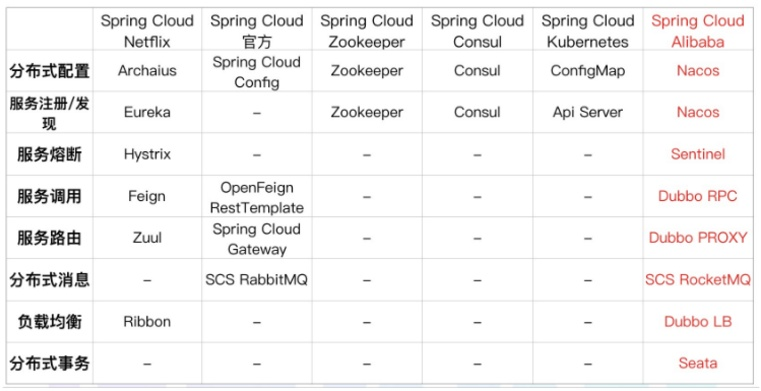
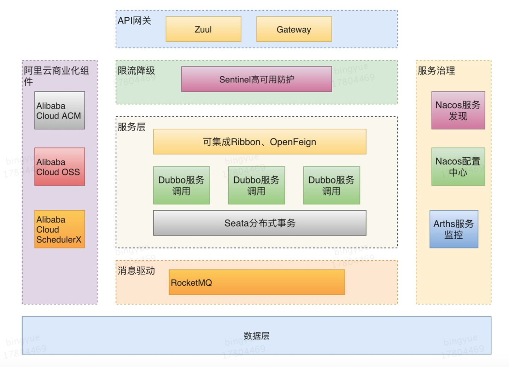

### 阿里开源组件

Nacos：一个更易于构建云原生应用的动态服务发现、配置管理和服务管理平台。

Sentinel：把流量作为切入点，从流量控制、熔断降级、系统负载保护等多个维度保护服务的稳定性。

RocketMQ：开源的分布式消息系统，基于高可用分布式集群技术，提供低延时的、高可靠的消息发布与订阅服务。

Dubbo：这个就不用多说了，在国内应用非常广泛的一款高性能 Java RPC 框架。

Seata：阿里巴巴开源产品，一个易于使用的高性能微服务分布式事务解决方案。

Arthas：开源的Java动态追踪工具，基于字节码增强技术，功能非常强大。