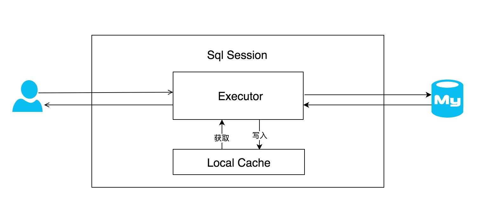
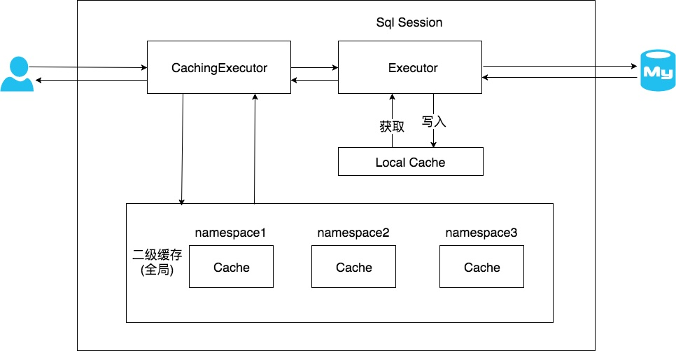
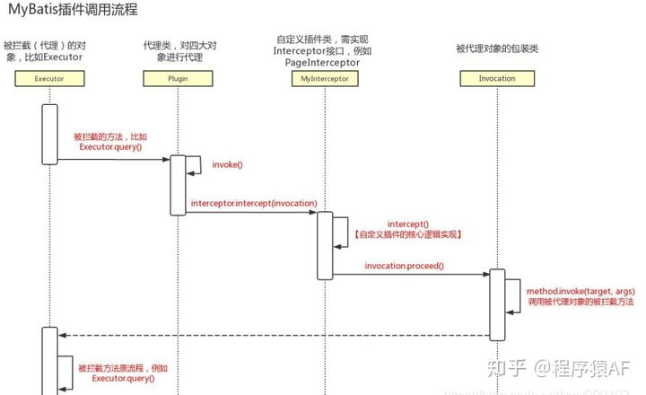

### **1、MyBatis加载mapper有几种方式：**

- 使用相对于类路径的资源引用（优先级第2）

```
<!-- 使用相对于类路径的资源引用 -->
<mappers>
  <mapper resource="org/mybatis/builder/AuthorMapper.xml"/>
  <mapper resource="org/mybatis/builder/BlogMapper.xml"/>
  <mapper resource="org/mybatis/builder/PostMapper.xml"/>
</mappers>
```

- 使用完全限定资源定位符（URL）（优先级第3）

```
<!-- 使用完全限定资源定位符（URL） -->
<mappers>
  <mapper url="file:///var/mappers/AuthorMapper.xml"/>
  <mapper url="file:///var/mappers/BlogMapper.xml"/>
  <mapper url="file:///var/mappers/PostMapper.xml"/>
</mappers>
```

- 使用映射器接口实现类的完全限定类名（优先级第4） 

```
<!-- 使用映射器接口实现类的完全限定类名 -->
<mappers>
  <mapper class="org.mybatis.builder.AuthorMapper"/>
  <mapper class="org.mybatis.builder.BlogMapper"/>
  <mapper class="org.mybatis.builder.PostMapper"/>
</mappers>
```

- 将包内的映射器接口实现全部注册为映射器（优先级第1）

```
<!-- 将包内的映射器接口实现全部注册为映射器 -->
<mappers>
  <package name="org.mybatis.builder"/>
</mappers>
```

### **2、MyBatis中有几种SQL执行器：**

- SimpleExecutor：默认执行器，每执行一次update或select，就开启一个Statement对象，用完立刻关闭Statement对象。
- BatchExecutor：批量执行器，执行update（没有select，JDBC批处理不支持select），将所有sql都添加到批处理中（addBatch()），等待统一执行（executeBatch()），它缓存了多个Statement对象，每个Statement对象都是addBatch()完毕后，等待逐一执行executeBatch()批处理。与JDBC批处理相同。
- ReuseExecutor：复用执行器，执行update或select，以sql作为key查找Statement对象，存在就使用，不存在就创建，用完后，不关闭Statement对象，而是放置于Map内，供下一次使用。简言之，就是重复使用Statement对象。


### **3、MyBatis的缓存机制：**

https://tech.meituan.com/2018/01/19/mybatis-cache.html

MyBatis实现了两级缓存机制用于提高相同SQL的查询效率，默认只开启了本地会话缓存，如果想要开启二级缓存需要自己手动配置。

**一级缓存** 

在应用运行过程中，我们有可能在一次数据库会话中，执行多次查询条件完全相同的SQL，MyBatis提供了一级缓存的方案优化这部分场景，如果是相同的SQL语句，会优先命中一级缓存，避免直接对数据库进行查询，提高性能。具体执行过程如下图所示：



每个SqlSession中持有了Executor，每个Executor中有一个LocalCache。当用户发起查询时，MyBatis根据当前执行的语句生成MappedStatement，在Local Cache进行查询，如果缓存命中的话，直接返回结果给用户，如果缓存没有命中的话，查询数据库，结果写入Local Cache，最后返回结果给用户。具体实现类的类关系图如下图所示：


一级缓存配置：

我们来看看如何使用MyBatis一级缓存。开发者只需在MyBatis的配置文件中，添加如下语句，就可以使用一级缓存。共有两个选项，SESSION或者STATEMENT，默认是SESSION级别，即在一个MyBatis会话中执行的所有语句，都会共享这一个缓存。一种是STATEMENT级别，可以理解为缓存只对当前执行的这一个Statement有效。

```
<setting name="localCacheScope" value="SESSION"/>
```

一级缓存工作流程：


一级缓存总结：

1. MyBatis一级缓存的生命周期和SqlSession一致。
2. MyBatis一级缓存内部设计简单，只是一个没有容量限定的HashMap，在缓存的功能性上有所欠缺。
3. MyBatis的一级缓存最大范围是SqlSession内部，有多个SqlSession或者分布式的环境下，数据库写操作会引起脏数据，建议设定缓存级别为Statement。

**二级缓存：** 

在上文中提到的一级缓存中，其最大的共享范围就是一个SqlSession内部，如果多个SqlSession之间需要共享缓存，则需要使用到二级缓存。开启二级缓存后，会使用CachingExecutor装饰Executor，进入一级缓存的查询流程前，先在CachingExecutor进行二级缓存的查询，具体的工作流程如下所示：



二级缓存开启后，同一个namespace下的所有操作语句，都影响着同一个Cache，即二级缓存被多个SqlSession共享，是一个全局的变量。

当开启缓存后，数据的查询执行的流程就是 二级缓存 -> 一级缓存 -> 数据库。

二级缓存配置：

要正确的使用二级缓存，需完成如下配置的。

- 在MyBatis的配置文件中开启二级缓存：

```
<setting name="cacheEnabled" value="true"/>
```

- 在MyBatis的映射XML中配置cache或者 cache-ref 。

```
<!-- cache标签用于声明这个namespace使用二级缓存，并且可以自定义配置。 -->
<cache/>
<!--
属性：
type：cache使用的类型，默认是PerpetualCache，这在一级缓存中提到过。
eviction： 定义回收的策略，常见的有FIFO，LRU。
flushInterval： 配置一定时间自动刷新缓存，单位是毫秒。
size： 最多缓存对象的个数。
readOnly： 是否只读，若配置可读写，则需要对应的实体类能够序列化。
blocking： 若缓存中找不到对应的key，是否会一直blocking，直到有对应的数据进入缓存。
-->
<!-- cache-ref代表引用别的命名空间的Cache配置，两个命名空间的操作使用的是同一个Cache。 -->
<cache-ref namespace="mapper.StudentMapper"/>
```

二级缓存总结：

1. MyBatis的二级缓存相对于一级缓存来说，实现了SqlSession之间缓存数据的共享，同时粒度更加的细，能够到namespace级别，通过Cache接口实现类不同的组合，对Cache的可控性也更强。
2. MyBatis在多表查询时，极大可能会出现脏数据，有设计上的缺陷，安全使用二级缓存的条件比较苛刻。
3. 在分布式环境下，由于默认的MyBatis Cache实现都是基于本地的，分布式环境下必然会出现读取到脏数据，需要使用集中式缓存将MyBatis的Cache接口实现，有一定的开发成本，直接使用Redis、Memcached等分布式缓存可能成本更低，安全性也更高。

### **4、MyBatis的执行流程：**

各组件介绍：


执行流程：


### **5、MyBatis分页有几种方式：**

a、通过SQL语句的limit进行分页

```
<select id="findByPager" resultType="com.xxx.mybatis.domain.User">
    select * from xx_user limit #{page},#{size}
</select>
<select id="count" resultType="long">
    select count(1) from xx_user
</select>
```

b、通过拦截器进行分页

需要定义一个类实现interceptor接口：

```
//省略包
@Intercepts({@Signature(type=StatementHandler.class,method="prepare",args={Connection.class,Integer.class})})
public class MyPageInterceptor implements Interceptor {
    
    private int page;
    private int size;
    @SuppressWarnings("unused")
    private String dbType;
 
    @SuppressWarnings("unchecked")
    @Override
    public Object intercept(Invocation invocation) throws Throwable {
        System.out.println("plugin is running...");
        StatementHandler statementHandler = (StatementHandler)invocation.getTarget();
        MetaObject metaObject = SystemMetaObject.forObject(statementHandler);
        while(metaObject.hasGetter("h")){
            Object object = metaObject.getValue("h");
            metaObject = SystemMetaObject.forObject(object);
        }
        while(metaObject.hasGetter("target")){
            Object object = metaObject.getValue("target");
            metaObject = SystemMetaObject.forObject(object);
        }
        MappedStatement mappedStatement = (MappedStatement)metaObject.getValue("delegate.mappedStatement");
        String mapId = mappedStatement.getId();
        if(mapId.matches(".+ByPager$")){
            ParameterHandler parameterHandler = (ParameterHandler)metaObject.getValue("delegate.parameterHandler");
            Map<String, Object> params = (Map<String, Object>)parameterHandler.getParameterObject();
            page = (int)params.get("page");
            size = (int)params.get("size");
            String sql = (String) metaObject.getValue("delegate.boundSql.sql");
            sql += " limit "+(page-1)*size +","+size;
            metaObject.setValue("delegate.boundSql.sql", sql);
        }
        return invocation.proceed();
    }
 
    @Override
    public Object plugin(Object target) {
        return Plugin.wrap(target, this);
    }
 
    @Override
    public void setProperties(Properties properties) {
        String limit = properties.getProperty("limit","10");
        this.page = Integer.parseInt(limit);
        this.dbType = properties.getProperty("dbType", "mysql");
    }
}
```

spring配置中，增加plugin设置：


c、通过PageHelper进行分页

这种方式底层原理也是通过拦截器方式，只不过是第三个封装的一个包。

引入maven依赖： 

```
<dependency>
    <groupId>com.github.pagehelper</groupId>
    <artifactId>pagehelper</artifactId>
    <version>4.2.1</version>
 </dependency>
```

修改spring配置：

```
<bean id="pageInterceptor" class="com.github.pagehelper.PageHelper">
    <property name="properties">
        <props>
            <prop key="helperDialect">mysql</prop>
            <prop key="reasonable">true</prop>
            <prop key="supportMethodsArguments">true</prop>
            <prop key="params">count=countSql</prop>
        </props>
    </property>
 </bean>
 
<bean id="sqlSessionFactory" class="org.mybatis.spring.SqlSessionFactoryBean">
    <property name="dataSource" ref="dataSource" />
    <property name="mapperLocations"  value="classpath:com/xxx/mybatis/dao/*Mapper.xml"/>
    <property name="plugins" ref="pageInterceptor"></property>
</bean>
```

代码中使用： 

```
public Pager<User> findByPager(int page,int size){
    Pager<User> pager = new Pager<User>();
    Page<User> res = PageHelper.startPage(page,size);
    userDao.findAll();
    pager.setRows(res.getResult());
    pager.setTotal(res.getTotal());
    return pager;
}
```

### **6、MyBatis插件运行原理：**

MyBatis中的插件是通过拦截器来实现的，底层采用JDK动态代理+责任链模式来实现的。


有4个对象可以被拦截：


插件被定义后，在解析配置文件时会将定义的插件存储到InterceptorChain的interceptors属性中：


插件在使用时会给拦截的对象生成一个代理类。执行流程如下：

