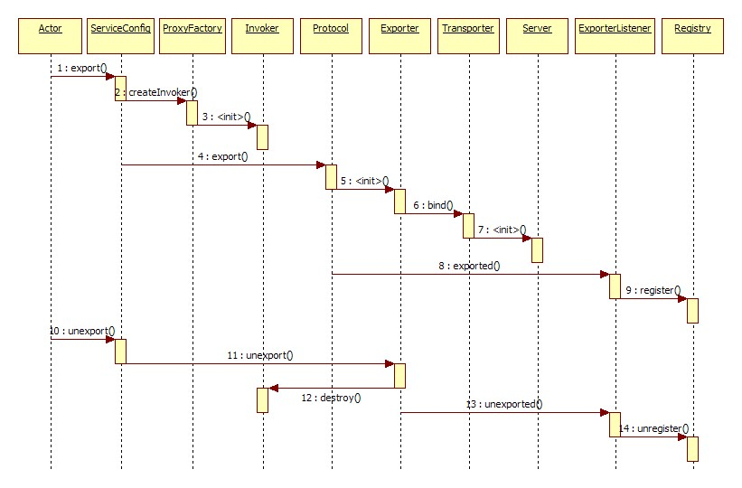
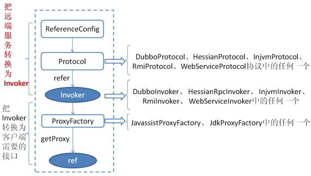

### **1、服务提供者暴露一个服务的详细过程：**

首先ServiceConfig类拿到对外提供服务的实际类ref（如：HelloWorldImpl），然后通过ProxyFactory类的getInvoker方法使用ref生成一个AbstractProxyInvoker实例，到这一步就完成具体服务到Invoker的转化，然后会完成从Invoker到Exporter的转化，这个步骤也是Dubbo暴露服务的关键。采用不同的协议，Invoker转换成Exporter的方式也不同，以Dubbo协议为例，Dubbo协议的Invoker转化为Exporter发生在DubboProtocol类的export方法，它主要是打开socket侦听服务，并接收客户端发来的请求。底层的通信细节采用Netty来完成。

### **2、服务消费者消费一个服务的详细过程：**

首先ReferenceConfig类的init方法调用Protocol的refer方法生成Invoker实例（如上图中红色部分），这是服务消费的关键。接下来把Invoker转换为客户端需要的接口（如：HelloWorld）

### **3、Dubbo集群容错是怎么做的：**

在集群调用失败时，Dubbo提供了多种容错方案，缺省为failover重试。

- Failover：失败自动切换，当出现失败，重试其他服务器，一般用于读操作；
- Failfast：快速失败，只发起一次调用，失败立即报错。通常用于非幂等性的写操作；
- Failsafe：失败安全，出现异常时，直接忽略。通常用于写入审计日志；
- Failback：失败自动恢复，后台记录失败请求，定时重发。通常用于消息通知操作；
- Forking：并行调用多个服务器，只要一个成功即返回。通常用于实时性要求较高的读操作；
- Broadcase：广播调用所有提供者，逐个调用，任意一台报错则报错。通常用于通知所有提供者更新缓存或日志等本地资源操作；

### **4、Dubbo的负载均衡策略：**

- Random：**随机，按权责设置随机概率。**在一个截面上碰撞的概率高，但调用量越大分布越均匀，而且按概率使用权重后也比较均匀，有利于动态调整提供者权重。
- RoundRobin：**轮询，按公约后的权重设置轮询比率。**存在慢的提供者累积请求的问题，比如：第二台机器很慢，但没挂，当请求调到第二台时就卡在那，久而久之，所有请求都卡在调到第二台上。

- LeastActive：**最少活跃调用数，相同活跃数的随机，活跃数指调用前后计数差。**使慢的提供者收到更少请求，因为越慢的提供者的调用前后计数差会越大。
- ConsistentHash：**一致性Hash，相同参数的请求总是发到同一提供者。**当某一台提供者挂时，原本发往该提供者的请求，基于虚拟节点，平摊到其它提供者，不会引起剧烈变动。