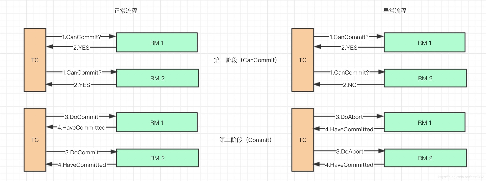
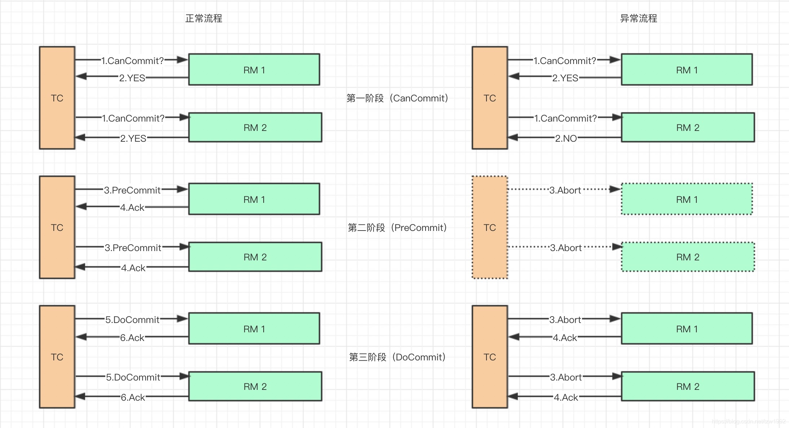
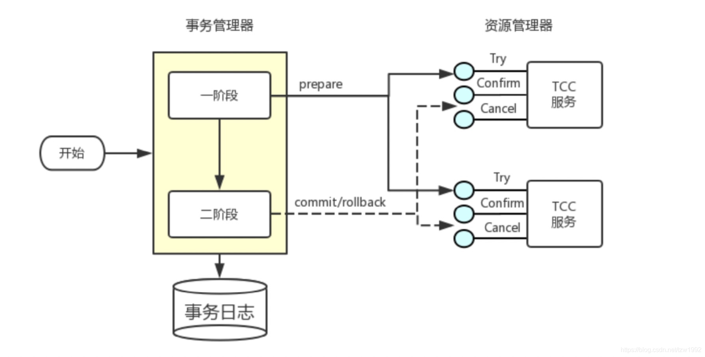
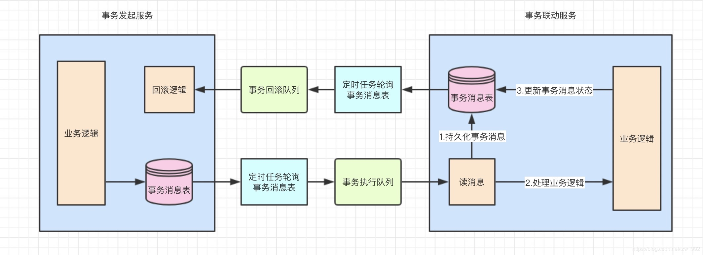
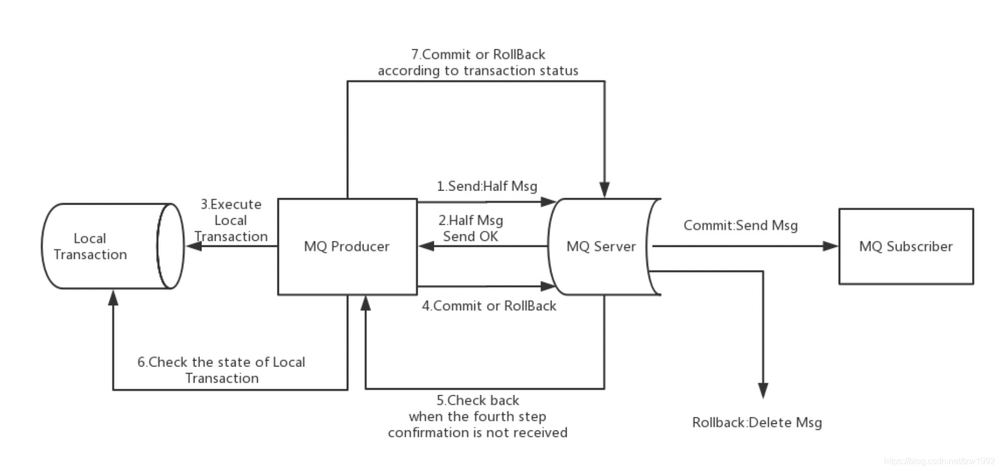
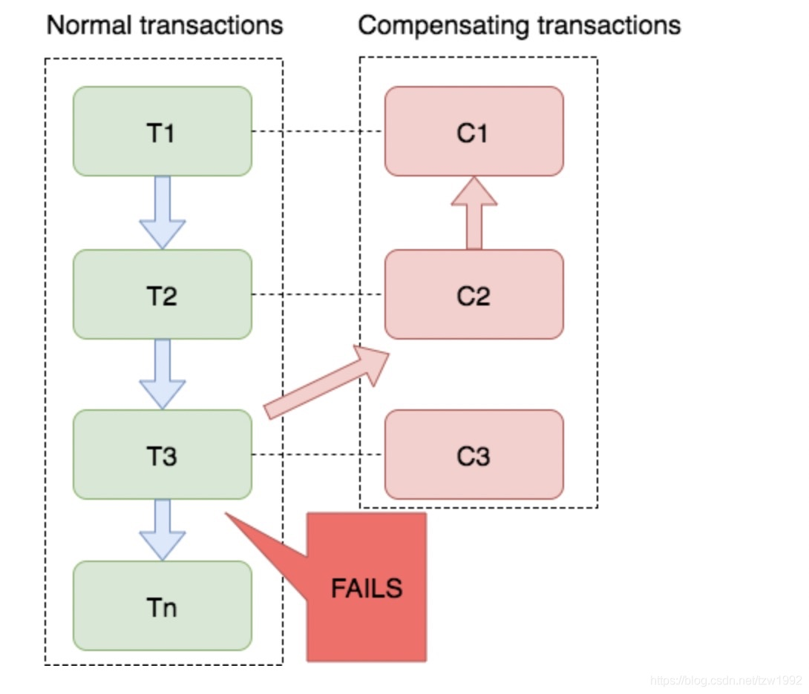

### 1、分布式事务常见解决方案

#### 2PC

2PC是两阶段提交协议（two phase commitment protocol）的缩写。存储引擎的事务特性可以保证在存储引擎级别实现ACID。而要将这种能力扩展到数据库之间则可以基于XA协议的二阶段提交协议方法来实现。XA协议是由Tuxeto首先提出的，并交给了X/Open组织。XA是一个分布式事务协议，规定了事务管理器和资源管理器的接口。目前主流的商业数据库都实现了XA接口，MySQL在5.0版本开始也支持了XA事务。XA事务中需要一个事务管理器作为协调者，负责各个本地资源的提交和回滚；而资源管理器（一般指数据库）只是分布式事务的参与者。

两阶段提交协议的执行过程分为投票（voting）和提交（commit）两个阶段。投票阶段，协调者会向事务的参与者发起执行操作的CanCommit请求，并等待参与者的响应。参与者接收到请求后，会执行请求中的事务操作，记录日志信息但不提交，待参与者执行成功，则向协调者发送"YES"消息，表示同意操作；若不成功，则发送"NO"消息，表示终止操作。当所有参与者都返回操作结果后，系统进入提交阶段。在提交阶段协调者会根据所有参与者返回的信息（YES或NO）向参与者发送DoCommit或DoAbort指令。如果全部是YES则向参与者发送DoCommit，参与者会完成剩余的操作并释放资源，然后向协调者返回HaveCommitted消息。如果参与者返回的信息中包含NO，则向所有参与者发送DoAbort，参与者会进行回滚操作，并返回HaveCommitted。协调者收到HaveCommitted消息后意味着整个事务完成。

不足：

- 同步阻塞问题：两阶段提交算法在执行过程中，所有参与节点都是事务阻塞类型的。
- 单点故障问题：一旦事务管理器发送故障，整个系统都会处于停滞状态。
- 数据不一致问题：在提交阶段，当协调者向参与者发送DoCommit请求后，如果发生了局部网络异常，则会导致只有一部分参与者接收到提交请求并执行提交操作，则在整个分布式系统中可能出现数据不一致问题。

#### 3PC

3PC是对2PC的改进，为了解决两阶段提交的同步阻塞和数据不一致问题，三阶段提交引入了超时机制和准备阶段。同时在协调者后参与者中引入超时机制。如果协调者和参与者在规定的时间内没有接收到其他节点的响应，就会根据当前的状态选择提交或终止事务。在第一阶段和第二阶段中间引入了一个准备阶段，也就是在提交阶段之前加入了一个预提交阶段。在预提交阶段排除一些不一致的情况，保证在最后提交前各参与节点的状态是一致的。三阶段提交协议就分为CanCommit、PreCommit、DoCommit三个阶段。

#### TCC

TCC是Try Confirm Cancel的缩写，其核心思想是将事务流程分为三个步骤来执行：初步操作（Try）、确认操作（Confirm）、取消操作（Cancel）。

初步操作：初步操作可以理解为是一个预处理过程，这个阶段按照正常的业务流程进行执行，为业务预留相应的资源，但是不能直接将资源使用掉。举个例子，比如库存扣减操作，在这个过程可以先将库存进行冻结，等执行到confirm操作是在进行真实的扣减，执行cancel时则只需将冻结的库存释放即可。

确认操作：当try阶段所有操作都执行成功后则可以执行确认操作，这个阶段不处理任何业务检查，只是使用try阶段预留的资源。确认操作如果失败了会进行重试，所以接口需要保证幂等性。

取消操作：当try处理阶段出现异常则会执行取消操作，取消操作会释放try阶段预留的资源。同样需要保证接口幂等性。

TCC相较于XA协议解决了已下几个问题：

- 解决了协调者单点问题。
- 解决了同步阻塞问题。
- 通过重试机制保证数据一致性，能解决大部分问题，但是没办法百分百保证。

#### 本地消息表

本地消息表的方案最初是由 eBay 提出，核心思路是将分布式事务拆分成本地事务进行处理。

方案通过在事务主动发起方额外新建事务消息表，事务发起方处理业务和记录事务消息在本地事务中完成，轮询事务消息表的数据发送事务消息，事务被动方基于消息中间件消费事务消息表中的事务。

本地消息表是基于BASE理论的最终一致性模型，适合对一致性要求不高的场景。

#### MQ事务消息

有些消息队列支持事务消息，比如RocketMQ，其本质是对本地消息表方案的一个封装，将本地消息表移动到MQ的内部。

大致过程分为：

- 第一阶段Prepared消息，并拿到消息的地址。
- 第二阶段执行本地事务。
- 第三阶段通过第一阶段拿到的地址去访问消息，并修改状态。

也就是说在业务方法内要向消息队列提交两次请求，一次发送消息和一次确认消息。如果确认消息发送失败了RocketMQ会定期扫描消息集群中的事务消息，这时候发现了Prepared消息，它会向消息发送者确认，所以生产方需要实现一个check接口，RocketMQ会根据发送端设置的策略来决定是回滚还是继续发送确认消息。这样就保证了消息发送与本地事务同时成功或同时失败。

#### Saga

Saga是30年前一篇数据库伦理提到的一个概念。其核心思想是将长事务拆分为多个本地短事务，由Saga事务协调器协调，如果正常结束那就正常完成，如果某个步骤失败，则根据相反顺序一次调用补偿操作。

Saga的组成：

每个Saga由一系列sub-transaction Ti 组成

每个Ti 都有对应的补偿动作Ci，补偿动作用于撤销Ti造成的结果,这里的每个T，都是一个本地事务。

可以看到，和TCC相比，Saga没有“预留 try”动作，它的Ti就是直接提交到库。

Saga的执行顺序有两种：

T1, T2, T3, …, Tn

T1, T2, …, Tj, Cj,…, C2, C1，其中0 < j < n

Saga定义了两种恢复策略：

- 向后恢复，即上面提到的第二种执行顺序，其中j是发生错误的sub-transaction，这种做法的效果是撤销掉之前所有成功的sub-transaction，使得整个Saga的执行结果撤销。
- 向前恢复，适用于必须要成功的场景，执行顺序是类似于这样的：T1, T2, …, Tj(失败), Tj(重试),…, Tn，其中j是发生错误的sub-transaction。该情况下不需要Ci。

这里要注意的是，在saga模式中不能保证隔离性，因为没有锁住资源，其他事务依然可以覆盖或者影响当前事务。

#### 总结

|            | 2PC  | 3PC  | TCC  | 本地消息表 | MQ事务消息 | Saga |
| ---------- | ---- | ---- | ---- | ---------- | ---------- | ---- |
| 数据一致性 | 强   | 强   | 弱   | 弱         | 弱         | 弱   |
| 容错性     | 低   | 低   | 高   | 高         | 高         | 高   |
| 复杂性     | 中   | 高   | 高   | 低         | 低         | 中   |
| 性能       | 低   | 低   | 中   | 中         | 高         | 中   |
| 维护成本   | 低   | 中   | 高   | 中         | 中         | 高   |

- 2PC/3PC：依赖于数据库，能够很好的提供强一致性和强事务性，但相对来说延迟比较高，比较适合传统的单体应用，在同一个方法中存在跨库操作的情况，不适合高并发和高性能要求的场景。
- TCC：适用于执行时间确定且较短，实时性要求高，对数据一致性要求高。
- 本地消息表/MQ 事务：都适用于事务中参与方支持操作幂等，对一致性要求不高，业务上能容忍数据不一致到一个人工检查周期，事务涉及的参与方、参与环节较少，业务上有校验系统兜底。
- Saga 事务：由于 Saga 事务不能保证隔离性，需要在业务层控制并发，适合于业务场景事务并发操作同一资源较少的情况。 Saga 相比缺少预提交动作，导致补偿动作的实现比较麻烦。Saga 事务较适用于补偿动作容易处理的场景。