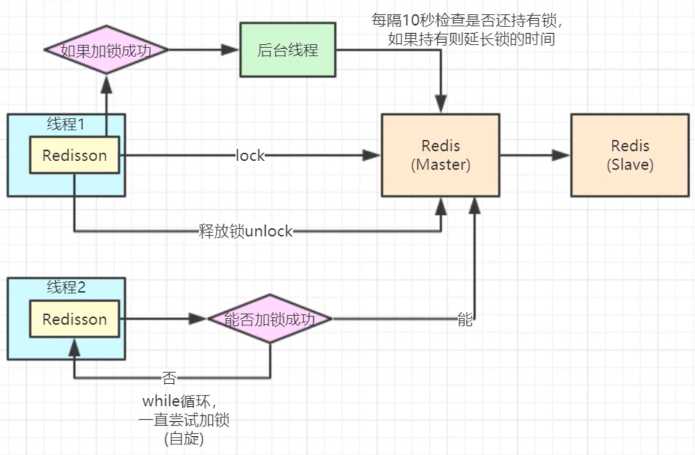
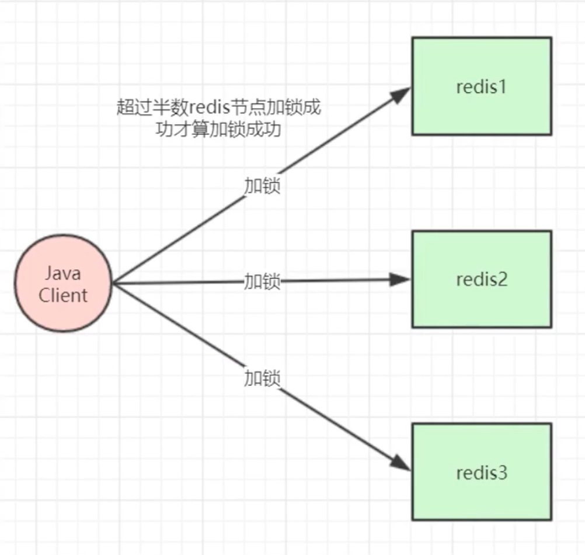

### 1、通过setnx命令实现分布式锁

setnx是set if not exists的缩写，指定的key不存在时，为key设置指定的值。

```
# 命令：
SET key value [EX seconds | PX milliseconds] [NX]
# 加锁, unique_value作为客户端唯一性的标识
SET lock_key unique_value NX PX 10000
# 释放锁 比较unique_value是否相等，避免误释放
if redis.call("get",KEYS[1]) == ARGV[1] 
then 
    return redis.call("del",KEYS[1])
else 
    return 0
end
```

```
@RestController
public class RedisLockController {
    @Resource
    private RedisTemplate redisTemplate;
    @GetMapping("/redis/lock/simple")
    public String redisLockSimple(@RequestParam Long goodsId) {
        String lockKey = "redis-lock-key-" + goodsId;
        String clientId = UUID.randomUUID().toString();
        try {
            //获取锁
            boolean lock = redisTemplate.opsForValue().setIfAbsent(lockKey, clientId, 10, TimeUnit.SECONDS);
            if(!lock) {
                //未获取到锁，不允许执行
                return "fail";
            }
            //todo 业务逻辑
        } finally {
            //释放锁
            if(clientId.equals(redisTemplate.opsForValue().get(lockKey))) {
                redisTemplate.delete(lockKey);
            }
        }
        return "success";
    }
}
```

缺点：锁的过期时间不好确定。

### 2、Redisson分布式锁实现

实现原理：底层采用lua脚本保证加锁的原子性，后台有一个线程专门检测获取到锁的线程是否已经执行完成，如果没有执行完成会自动延长锁过期的时间，其他竞争锁的线程在请求锁时如果没有获取到锁，会自旋尝试获取锁。



```
@Configuration
public class RedissonConfig {
    @Bean
    public Redisson redisson() {
        Config config = new Config();
        config.useSingleServer()
                .setAddress("redis://127.0.0.1:6379")
                .setDatabase(0);
        return (Redisson) Redisson.create(config);
    }
}
@RestController
public class RedisLockController {
    @Resource
    private Redisson redisson;
    @GetMapping("/redis/lock/redisson")
    public String redisLockRedisson(@RequestParam Long goodsId) {
        String lockKey = "redis-lock-key-" + goodsId;
        RLock redissonLock = redisson.getLock(lockKey);
        try {
            //获取锁
            redissonLock.lock();
            //todo 业务逻辑
        } finally {
            //释放锁
            redissonLock.unlock();
        }
        return "success";
    }
}
```

```
// 加锁底层源码实现
<T> RFuture<T> tryLockInnerAsync(long waitTime, long leaseTime, TimeUnit unit, long threadId, RedisStrictCommand<T> command) {
    return evalWriteAsync(getRawName(), LongCodec.INSTANCE, command,
                          "if (redis.call('exists', KEYS[1]) == 0) then " +
                          "redis.call('hincrby', KEYS[1], ARGV[2], 1); " +
                          "redis.call('pexpire', KEYS[1], ARGV[1]); " +
                          "return nil; " +
                          "end; " +
                          "if (redis.call('hexists', KEYS[1], ARGV[2]) == 1) then " +
                          "redis.call('hincrby', KEYS[1], ARGV[2], 1); " +
                          "redis.call('pexpire', KEYS[1], ARGV[1]); " +
                          "return nil; " +
                          "end; " +
                          "return redis.call('pttl', KEYS[1]);",
                          Collections.singletonList(getRawName()), unit.toMillis(leaseTime), getLockName(threadId));
}
```

### 3、RedLock分布式锁实现

实现原理：超过半数redis节点加锁成功才算加锁成功。（一般不建议使用，过于麻烦，性能不高）



```
@RestController
public class RedisLockController {
    @Resource
    private Redisson redisson;
    @GetMapping("/redis/lock/redlock")
    public String redisLockRedLock(@RequestParam Long goodsId) {
        String lockKey = "redis-lock-key-" + goodsId;
        //这里需要自己实例化多个redis实例的redisson客户端链接，这里只是伪代码用一个redisson客户端模拟
        RLock redissonLock1 = redisson.getLock(lockKey);
        RLock redissonLock2 = redisson.getLock(lockKey);
        RLock redissonLock3 = redisson.getLock(lockKey);
        //根据多个RLock对象构建RedissonRedLock（主要区别）
        RedissonRedLock redissonRedLock = new RedissonRedLock(redissonLock1, redissonLock2, redissonLock3);
        try {
            //获取锁
            //waitTime：获取锁的等待时间，超过这个时间认为获取锁失败
            //leaseTime：锁的持有时间，超过这个时间会自动失效
            boolean lock = redissonRedLock.tryLock(10 ,10, TimeUnit.SECONDS);
            if(lock) {
                //todo 业务逻辑
            }
        } catch (InterruptedException e) {
            e.printStackTrace();
        } finally {
            //释放锁
            redissonRedLock.unlock();
        }
        return "success";
    }
}
```

### 4、通过zookeeper实现分布式锁

核心思想：当客户端要获取锁，则创建节点，使用完锁，则删除该节点。

- 请求锁时，在锁节点下创建临时顺序节点；
- 获取锁节点下所有的子节点，判断自己创建的节点是不是序号最小的，如果是则代表获取到锁，如果不是则对比自己大的上一个节点添加删除事件监听器；
- 释放锁时删除自己创建的节点，然后监听该节点的客户端会收到通知，然后再次判断自己创建的节点是不是最小的，如果是代表获取到锁，如果不是重复上面的操作；

可以使用Curator框架封装的代码：


Curator封装了5种锁方案：

- InterProcessSemaphoreMutex：分布式排他锁（非可重入锁）
- InterProcessMutex：分布式可重入排它锁
- InterProcessReadWriteLock：分布式读写锁
- InterProcessMultiLock：将多个锁作为单个实体管理的容器
- InterProcessSemaphoreV2：共享信号量