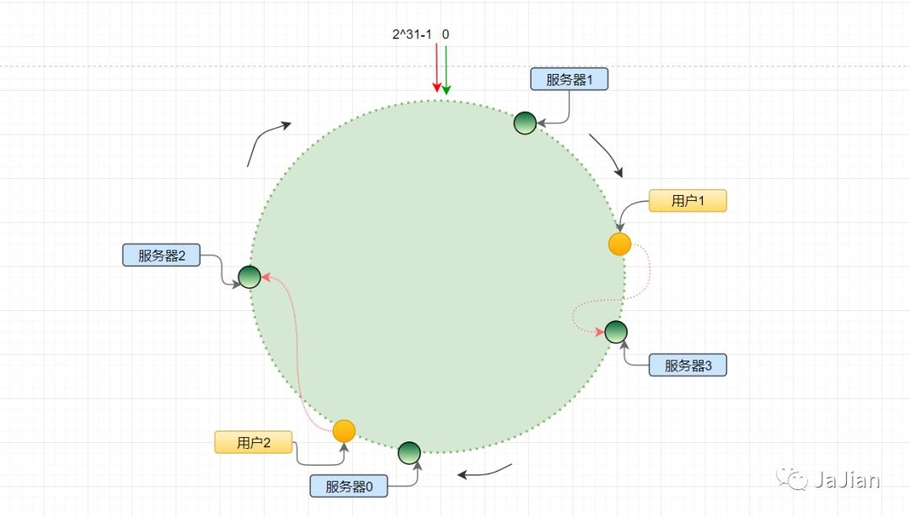

### 1、解决什么问题

在分布式系统中，如果采用Hash算法将数据路由存储在集群中的某个节点上，假如集群中新增或者删除节点，那么全部数据都需要进行hash迁移，工作量非常大。

采用一致性Hash算法后则只需要对1/N的数据进行迁移，大大减少了工作量。而且通过引入虚拟节点，可以使数据分布更加均衡。

### 2、应用场景

- 分布式缓存
- 分库分表
- 负载均衡

### 3、实现原理

第一步：构造虚拟Hash环。一致性Hash算法将整个哈希值空间组织成一个虚拟的圆环，假设某哈希函数H的值空间为0~2^32 - 1（即哈希值是一个32位无符号整形，如果哈希环的节点数想自定义，只需改造Hash函数，比如想分为1024个节点，那么将原Hash值对1024取模即可），整个哈希环如下：


第二步：将服务器映射到Hash环上。一般使用服务器的IP地址，或者服务器唯一名称进行Hash后对2^32取模，得到的值就是该服务器在Hash环上的位置：

```
hash(服务器的IP地址) % 2^32
```


第三步：将数据映射到Hash环上。在负载均衡中一般使用用户的IP进行Hash，在分布式数据存储中一般选择一个分区键进行Hash，计算出来的值就是该数据在Hash环上的位置。

```
hash(用户的IP地址) % 2^32
```



第四步：为数据找到对应的处理服务器。将数据节点所在的位置开始，按照顺时针的方向开始找到下一个服务器节点，该服务器节点即处理该数据的节点。

### 4、常见问题

- 新增/删除节点 数据如何迁移

- - 新增节点时，只需将新节点所在位置，到前一个服务器节点所在位置之间的数据迁移到新节点上即可，其他位置的数据都不需要处理（将N~N-1之间的数据重新映射到N）


- - 删除节点时，只需将删除节点所在位置，到前一个服务器节点所在位置之间的数据迁移到删除节点下一个服务器节点上即可，其他位置的数据不需要处理（将N~N-1之间的数据映射到N+1）


- 如何处理数据倾斜问题

- - 通过新增虚拟节点可以使整个数据分布更加均衡，虚拟节点和真实节点之间会维护一个映射关系，这样就可以解决服务器较少时数据倾斜问题。

