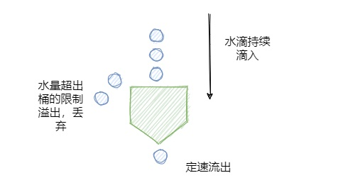

### 1、限流

限制并发的请求访问量，超过阈值则拒绝访问。限流不可避免的会造成用户的请求变慢或者被拒的情况，从而会影响用户体验。因此限流是需要在用户体验和系统稳定性之间做平衡。

### 2、熔断

服务熔断也称为服务隔离或过载保护。在微服务应用中，服务存在一定的依赖关系，形成一定的依赖链，如果某个目标服务调用慢或者有大量超时，造成服务不可用，间接导致其他的依赖服务不可用，最严重的可能会阻塞整条依赖链，最终导致业务系统崩溃（又称雪崩效应）。当下游的服务因为某种原因突然变得不可用或响应过慢，上游服务为了保证自己整体服务的可用性，不再继续调用目标服务，直接返回，快速释放资源，如果目标服务情况好转则恢复调用。**（切断对下游服务的调用，等服务正常后，再恢复调用）**

应对服务雪崩的一种自我保护机制，可看作是降级的特殊情况。


### 3、降级

当服务器压力剧增，为了保证核心功能的可用性，而选择性的降低一些功能的可用性，或者直接关闭该功能。

比如：贴吧类型的网站，当服务器吃不消的时候，可以选择把发帖功能关闭，注册功能关闭，改密码，改头像这些都关了，为了确保登录和浏览帖子这种核心的功能。

**实现方式：**

- 独立的降级系统：可以灵活且批量的配置服务器的降级功能，可以用来实现主动降级功能（可以指定对某些接口进行降级，被降级的接口会触发自定义的降级行为（如返回指定内容）而不会执行原有的逻辑）
- 通过代码自动降级：实现方式和熔断类似

### 4、常见限流算法

#### 计数器算法

**原理：**在系统中保存一个计数器，接收到一个请求，计数器加1，一个请求处理完毕后计数器减1，每次请求来的时候判断计数器的值，如果超过阈值，那么就拒绝访问。

```
boolean tryAcquire() {
    if(counter < threshold) {
        counter ++;
        return true;
    }
    return false;
}
boolean tryRelease() {
    if(counter > 0) {
        counter --;
        return true;
    }
    return false;
}
```

**优点：**简单，单机在Java中可用Atomic等原子类，分布式环境用Redis incr

**缺点：**

- 流量不平滑，假设我们允许的阈值是1万，此时计数器的值为0， 当1万个请求在前1秒内一股脑儿的都涌进来，这突发的流量可是顶不住的。缓缓的增加处理和一下子涌入对于程序来说是不一样的。
- 没有指定时间间隔，一般的限流都是为了限制在指定时间间隔内的访问量

#### 固定窗口算法

**原理：**它相比于计数限流主要是多了个时间窗口的概念。计数器每过一个时间窗口就重置。比如限制1s处理100个请求，第一个请求进来开始计时，在接下来的1s内，每来一个请求，就把计数器加1，如果达到阈值，就拒绝访问，等1s结束后，重置计数器

```
boolean tryAcquire() {
    long now = currentTimeMillis(); //获取当前时间
    if(now - lastAcquireTime > timeWindow) { //判断是否过了时间窗口
        counter = 0;  //计数器重置
        lastAcquireTime = now;
    }
    if(counter < threshold) {  //小于阈值
        counter ++;
        return true;
    }
    return false;
}
```

**优点：**相比计数器法增加了时间窗口概念

**缺点：**有临界问题，假设系统每秒允许 100 个请求，假设第一个时间窗口是 0-1s，在第 0.55s 处一下次涌入 100 个请求，过了 1 秒的时间窗口后计数清零，此时在 1.05 s 的时候又一下次涌入100个请求。虽然窗口内的计数没超过阈值，但是全局来看在 0.55s-1.05s 这 0.1 秒内涌入了 200 个请求，这其实对于阈值是 100/s 的系统来说是无法接受的。


#### 滑动窗口算法

**原理：**滑动窗口限流解决固定窗口临界值的问题，可以保证在任意时间窗口内都不会超过阈值。相对于固定窗口，滑动窗口除了需要引入计数器之外还需要记录时间窗口内每个请求到达的时间点，因此对内存的占用会比较多。规则如下，假设时间窗口为 1 秒：

- 记录每次请求的时间
- 统计每次请求的时间 至 往前推1秒这个时间窗口内请求数，并且 1 秒前的数据可以删除。
- 统计的请求数小于阈值就记录这个请求的时间，并允许通过，反之拒绝。


```
boolean tryAcquire() {
    long now = currentTimeMillis();  //获取当前时间
    long counter = getCounterInTimeWindow(now);  //根据当前时间获取时间窗口内的计数
    if(counter < threshold) {  //小于阈值
        addToTimeWindow(now());  //记录当前时间
        return true;
    }
    return false;
}
```

**优点：**解决了固定窗口的临界值问题

**缺点：**无法解决短时间内集中流量的突击，也就是流量不平滑

#### 漏桶算法

**原理：**水滴持续滴入漏桶中，底部定速流出，如果水滴滴入的速率大于流出的速率，当存水超过桶的大小的时候就会溢出。漏桶一般通过**队列**来实现，处理不过来的请求放到队列中排队，如果队列满了就拒绝请求。规则如下：

- 请求来了放入桶中
- 桶内请求量满了拒绝请求
- 服务定速从桶内拿请求处理



```
boolean tryAcquire() {
    long now = currentTimeMillis();  //获取当前时间
    long consumeWater = (now - lastInjectTime) * rate; //当前时间减去上次注水的时间 * 流出速率 = 流出的水量
    long leftWater = max(0, leftWater - consumeWater); // 之前桶内的水量 - 这段时间流出的水量
    if(leftWater + 1 <= capacity) { // 水桶内的水量 + 此次注入的一滴水 是否不大于 桶的大小
        lastInjectTime = now; //重置注水时间
        leftWater++; //水桶水量+1
        return true;
    } else {
        return false;
    }
}
```

**优点：**流量平滑，不管发送请求的速率是多少，都按照相同的速率进行处理

**缺点：**优点也是缺点，请求过于平滑，不够灵活

#### 令牌桶算法

**原理：**令牌桶其实和漏桶的原理类似，只不过漏桶是定速地流出，而令牌桶是定速地往桶里塞入令牌，然后请求只有拿到了令牌才能通过，之后再被服务器处理。当然令牌桶的大小也是有限制的，假设桶里的令牌满了之后，定速生成的令牌会丢弃。规则如下：

- 定速的往桶内放入令牌
- 令牌数量超过桶的限制，丢弃
- 请求来了先向桶内索要令牌，索要成功则通过被处理，反之拒绝

令牌桶算法和**Semaphore信号量**类似，信号量可控制某个资源被同时访问的个数，其实和咱们拿令牌思想一样，一个是拿信号量，一个是拿令牌。只不过信号量用完了返还，而咱们令牌用了不归还，因为令牌会定时再填充。


```
boolean tryAcquire(String key) {
    long now = currentTimeMillis();  //获取当前时间
    long generatedToken = (now - lastAcquireTime) * rate; //当前时间减去上次取令牌的时间 * 放入令牌的速率
    long leftToken = min(capacity, leftToken + generatedToken); // 之前桶内的令牌数 + 这段时间放入的令牌数
    if(leftToken >= 1) { // 水桶内的水量 + 此次注入的一滴水 是否不大于 桶的大小
        lastAcquireTime = now; //重置取令牌时间
        leftToken--; //令牌数-1
        return true;
    } else {
        return false;
    }
}
```

**优点：**应对突发流量时表现更佳

**缺点：**需要提前预热，不然开始的时候可能直接拒绝请求

参考：https://segmentfault.com/a/1190000023552181 、 https://www.infoq.cn/article/ipxnuqwu3lgwxc8j7tzw

#### 5、限流组件

- Google Guava包中的**RateLimiter**：单机限流可用，基于令牌桶实现的，并且扩展了算法，支持预热功能。
- 阿里开源的**Sentinel**：匀速排队限流策略，就采用了漏桶算法
- Nginx中的限流模块**limit_req_zone**：采用了漏桶算法，还有 OpenResty 中的 resty.limit.req库等等

#### 6、Sentinel、Hystrix、Resilience4j对比

