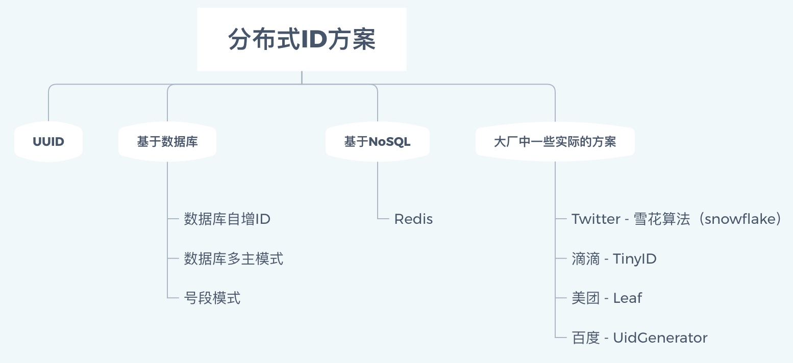
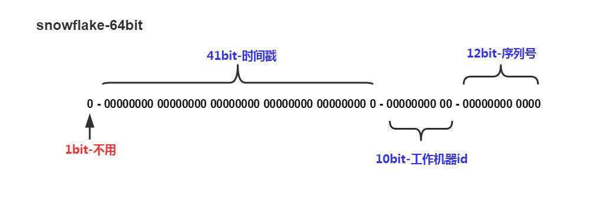

### 1、UUID

UUID指Universally Unique Identifier，即通用唯一标识符，UUID的目的是让分布式系统中的所有元素都有唯一的识别信息。UUID重复的概率非常低。

UUID理论上的总数为16^32 = 2^128 ~= 3.4*10^123，也就是说每纳秒产生1百万个UUID，要花100亿年才会将所有UUID用完。

**格式：**UUID使用16进制表示，共36个字符（32个字母数字+4个连接符"-"），8-4-4-4-12（如：6d25a684-9558-11e9-aa94-efccd7a0659b）

- xxxxxxxx-xxxx-Mxxx-Nxxx-xxxxxxxxxxxx
- 数字 M 的四位表示 UUID 版本，当前规范有5个版本，M可选值为1, 2, 3, 4, 5 ；
- 数字 N 的一至四个最高有效位表示 UUID 变体( variant )，有固定的两位10xx因此只可能取值8, 9, a, b

**问题：**大多数公司都使用MySQL，并且使用InnoDB引擎，UUID太长且无序，不适合在InnoDB中作为主键，会造成索引的频繁分裂。

### 2、基于数据库

- **数据库自增**

- - **原理：**新建一张单独的表，每次往表中插入数据获取自增的ID

  - **优点：**简单

  - **缺点：**

  - - 性能较低，每次需要获取ID都要请求数据库
    - 可靠性低，如果数据库出现故障，那么就无法获取ID，从而影响整个系统

- **数据库多主模式**

- - **原理：**还是使用数据库自增，但是采用多个数据库实例来提高整个系统的可靠性

  - - 每个实例都需要设置自增的起始值和步长，如：

    - - 第一个实例：设置起始值为1，步长为2（set @auto_increment_offset = 1; set @auto_increment_increment = 2;）

      - - 生成的序列：1,3,5,7,9,...

      - 第二个实例：设置起始值为2，步长为2（set @auto_increment_offset = 2; set @auto_increment_increment = 2;）

      - - 生成的序列：2,4,6,8,10,...

  - **优点：**可靠性比单数据库实例要高

  - **缺点：**扩展性不太好，比如要增加数据库实例就会比较麻烦

- **号段模式**

- - **原理：**号段可以理解成批量获取，从数据库获取ID时，如果能批量获取多个ID并缓存在本地的话，那样将大大提供业务应用获取ID的效率。每次从数据库获取ID时，就获取一个号段，比如(1,1000]，这个范围表示了1000个ID，业务应用在请求ID时，只需要在本地从1开始自增并返回即可，而不需要每次都请求数据库，一直到本地自增到1000时，也就是当前号段已经被用完时，才去数据库重新获取下一号段。

```
CREATE TABLE id_generator (
  id int(10) NOT NULL,
  current_max_id bigint(20) NOT NULL COMMENT '当前最大id',
  increment_step int(10) NOT NULL COMMENT '号段的长度',
  PRIMARY KEY (`id`)
) ENGINE=InnoDB DEFAULT CHARSET=utf8;
```

这个数据库表用来记录自增步长以及当前自增ID的最大值（也就是当前已经被申请的号段的最后一个值），因为自增逻辑被移到代码中去了，所以数据库不需要这部分逻辑了。

这种方案不再强依赖数据库，就算数据库不可用，那么应用也能继续支撑一段时间。但是如果应用重启，会丢失一段ID，导致ID空洞。

- - **优点：**效率更高
  - **缺点：**需要依赖数据库

### 3、基于NoSQL

- **Redis**

- - 原理：和利用数据库自增类似，可以利用Redis的incr命令来实现原子性的自增与返回
  - 优点：效率比较高
  - 缺点：要考虑数据持久化问题，Redis数据容易丢失，如果数据丢失会造成ID重复

### 4、Twitter - 雪花算法

分布式ID固定是一个long型的数字，一个long型占8个字节，也就是64个bit，原始snowflake算法中对于bit的分配如下图：



- 第一个bit位是标识部分，在java中由于long的最高位是符号位，正数是0，负数是1，一般生成的ID为正数，所以固定为0。
- 时间戳部分占41bit，这个是毫秒级的时间，一般实现上不会存储当前的时间戳，而是时间戳的差值（当前时间-固定的开始时间），这样可以使产生的ID从更小值开始；41位的时间戳可以使用69年，(1L << 41) / (1000L * 60 * 60 * 24 * 365) = 69年
- 工作机器id占10bit，这里比较灵活，比如，可以使用前5位作为数据中心机房标识，后5位作为单机房机器标识，可以部署1024个节点。
- 序列号部分占12bit，支持同一毫秒内同一个节点可以生成4096个ID

根据这个算法的逻辑，只需要将这个算法用Java语言实现出来，封装为一个工具方法，那么各个业务应用可以直接使用该工具方法来获取分布式ID，只需保证每个业务应用有自己的工作机器id即可，而不需要单独去搭建一个获取分布式ID的应用。

snowflake算法实现起来并不难，提供一个github上用java实现的：https://github.com/beyondfengyu/SnowFlake

在大厂里，其实并没有直接使用snowflake，而是进行了改造，因为snowflake算法中最难实践的就是工作机器id，原始的snowflake算法需要人工去为每台机器去指定一个机器id，并配置在某个地方从而让snowflake从此处获取机器id。但是在大厂里，机器是很多的，人力成本太大且容易出错，所以大厂对snowflake进行了改造。

### 5、大厂中一些实际方案

- **滴滴 - TinyID**

- - tinyid是基于数据库发号算法实现的，简单来说是数据库中保存了可用的id号段，tinyid会将可用号段加载到内存中，之后生成id会直接内存中产生。
  - 可用号段在第一次获取id时加载，如当前号段使用达到一定量时，会异步加载下一可用号段，保证内存中始终有可用号段。
  - (如可用号段1~1000被加载到内存，则获取id时，会从1开始递增获取，当使用到一定百分比时，如20%(默认)，即200时，会异步加载下一可用号段到内存，假设新加载的号段是1001~2000,则此时内存中可用号段为200~1000,1001~2000)，当id递增到1000时，当前号段使用完毕，下一号段会替换为当前号段。依次类推。
  - GitHub：https://github.com/didi/tinyid

- **美团 - Leaf**

- - 美团的Leaf也是一个分布式ID生成框架。它非常全面，即支持号段模式，也支持snowflake模式。号段模式这里就不介绍了，和上面的分析类似。
  - Leaf中的snowflake模式和原始snowflake算法的不同点，也主要在workId的生成，Leaf中workId是基于ZooKeeper的顺序Id来生成的，每个应用在使用Leaf-snowflake时，在启动时都会都在Zookeeper中生成一个顺序Id，相当于一台机器对应一个顺序节点，也就是一个workId。
  - GitHub：https://github.com/Meituan-Dianping/Leaf

- **百度 - uid-generator**

- - 使用的就是雪花算法，只是在生产机器ID时有所区别，在uid-generator中叫workId。uid-generator中的workId是由uid-generator自动生成的，并且考虑到了应用部署在docker上的情况，在uid-generator中用户可以自己去定义workId的生成策略。

  - - 默认策略：应用启动时由数据库分配。说的简单一点就是：应用在启动时会往数据库表(uid-generator需要新增一个WORKER_NODE表)中去插入一条数据，数据插入成功后返回的该数据对应的自增唯一id就是该机器的workId，而数据由host，port组成。

  - 对于uid-generator中的workId，占用了22个bit位，时间占用了28个bit位，序列化占用了13个bit位，需要注意的是，和原始的snowflake不太一样，时间的单位是秒，而不是毫秒，workId也不一样，同一个应用每重启一次就会消费一个workId。

  - GitHub：https://github.com/baidu/uid-generator

参考：https://www.yuque.com/renyong-jmovm/kb/lgz2xv