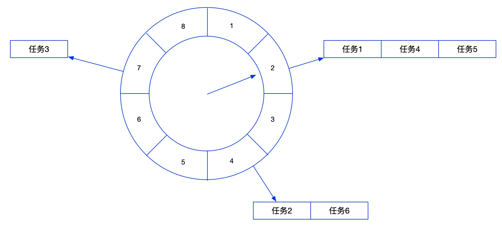
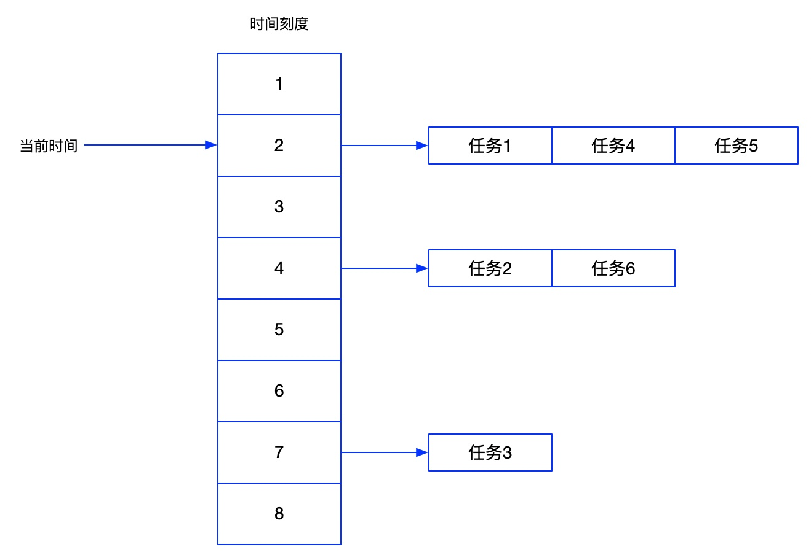
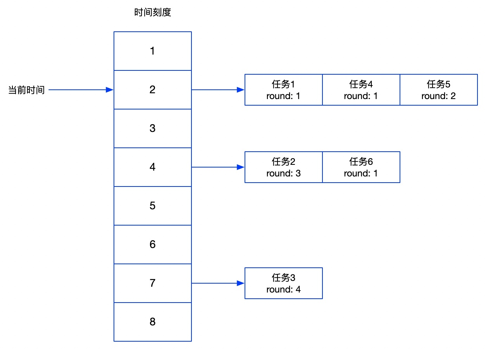
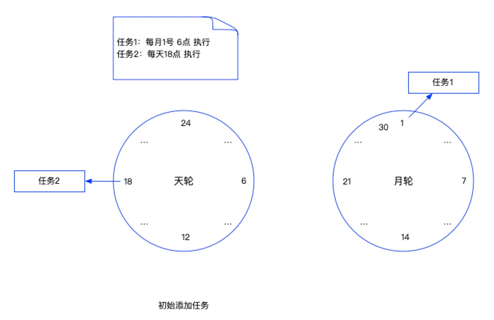
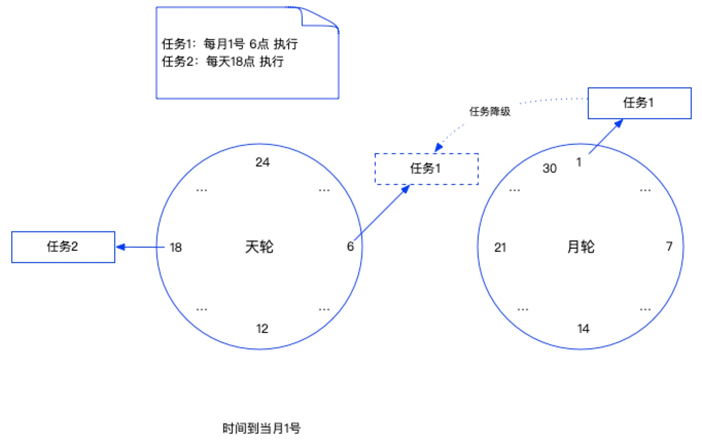
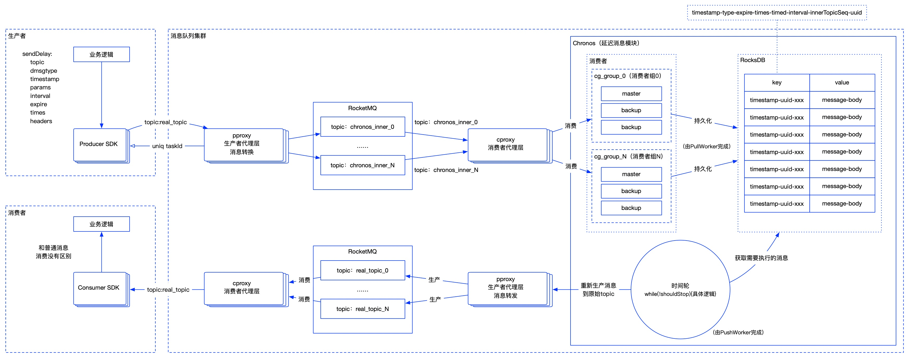

### 1、时间轮算法介绍

#### 原理

时间轮算法大量运用在各种定时任务调度中，结构如下图所示，可以想象成一个时钟，每个刻度就是一个调度周期（可以自己定义每个刻度代表的时长，比如每个刻度代表1秒或者1分钟等），每个刻度上可以挂载多个任务，然后有一个指针按照固定的时间移动，当指针移动到某个刻度上时那么就执行该刻度上挂载的任务。如果任务是需要循环执行的，那么在这次调度完后重新计算下一次执行的时间，重新挂载到下一次执行的刻度上即可，如果只需要执行一次那么调度完后直接销毁即可。



#### 实现

可以采用类似哈希表的方式来实现，使用数组+链表

- 时间刻度：可以使用一个数组来表示
- 任务列表：使用链表来实现
- 时间指针：使用while(true)加上sleep实现



**如果时间刻度不够用怎么办？**

有两种解决办法，第一种是增加刻度，但是增加刻度会带来新的问题，刻度太多会需要大量的存储空间，如果任务数较少，会造成空间利用率较低，而且大量指针移动都是无效的。第二种方法是采用带有round的时间轮，或者分层时间轮。

#### 轮次时间轮

不用增加时间轮的刻度，只需在任务上加一个round标识即可，round表示指针需要走完多少轮才执行任务。

- 计算任务挂载的刻度时，同时需要计算任务需要的round数
- 指针移动到某个刻度时，将该刻度上的任务的round值减1，然后取出所有round值等于0的任务执行

**总结：**带round的时间轮虽然可以节省空间，但是时间消耗还是比较大，如果刻度较小，任务列表又很多时，需要进行大量的遍历操作。



#### 分层时间轮

采用多个时间轮来配合完成任务，每个时间轮代表一个时间粒度，比如秒时间轮、分钟时间轮、小时时间轮、天时间轮、星期时间轮、月时间轮、年时间轮等。通过多个时间轮的配合可以做到既节省空间，又节省时间。

假设有两个任务，任务1（每月1号早上6点 执行）、任务2（每天18点 执行），定义两个时间轮，一个天轮，刻度为0~24点，一个月轮，刻度为1~30号，将任务添加到时间轮中



对于任务2来说每天都是18点执行，所以可以一直挂载在天轮的18刻度处，对于任务1来说，初始的时候会挂载在月轮的1刻度处，当指针指向刻度1时，会判断任务1是否需要降级，发现任务1要在6点执行，所以任务1需要降级到天轮，放到刻度6的位置，如下：



当任务1执行完后会重新再挂载到月轮的刻度1处。

### 2、Kafka中时间轮算法的应用

kafka中使用时间轮算法实现延时任务功能，比如：

- 延时生产
- 延时拉取
- 延时数据删除
- 心跳请求

Kafka 时间轮为 TimingWheel 类，位于 kafka.utils.timer 包中，采用的是分层时间轮实现，内部包含以下字段：

| 名称        | 类别                      | 说明                                                         |
| ----------- | ------------------------- | ------------------------------------------------------------ |
| tickMs      | Long                      | 时间轮由多个时间格组成，每个时间格就是tickMs，它代表当前时间轮的基本时间跨度 |
| wheelSize   | Integer                   | 代表每一层时间轮的格数，也就是桶的数量                       |
| interval    | Long                      | 当前时间轮的总体时间跨度，interval=tickMs * wheelSize        |
| startMs     | Long                      | 构造当层时间轮的时间，第一层的时间轮的startMs是TimeUnit.NANOSECONDS.toMillis(nanoseconds())，上层时间轮的startMs为下层时间轮的currentTime |
| currentTime | Long                      | 表示时间轮当前所处的时间                                     |
| taskCounter | AtomicInteger             | 任务数量，即所有桶的节点数量之和                             |
| queue       | DelayQueue[TimerTaskList] | 标准库的延时队列                                             |

### 3、Netty中时间轮算法的应用

Netty中使用时间轮算法来处理延迟任务，其实现类是HashedWheelTimer，和Kafka不同，Netty底层采用轮次时间轮算法实现，而不是复杂的分层时间轮。每次新增任务时是先放到MPSC队列（MPSC是 JCTools 中的并发队列，用在多个生产者可同时访问队列，但只有一个消费者会访问队列的情况）中，然后一个worker线程消费MPSC队列（不用考虑并发问题），时间每到一个槽位，遍历槽位的延迟队列，轮次小于等于0就代表本次要执行了。

netty时间轮设计还是比较简单的，因为新增任务使用了MPSC队列，时间复杂度算是O（1），单执行任务时只有一个work线程，任务多时执行较慢，而且会受之前的任务执行时间影响。

```java
public static void main(String args[]) {
    //1：时间轮走一个花费的时间 TimeUnit.SECONDS：时间单位 100：一轮总共多少格
    HashedWheelTimer timer = new HashedWheelTimer(1, TimeUnit.SECONDS, 100);
    timer.start();
    //实例化任务
    TimerTask task = new TimerTask() {
        @Override
        public void run(Timeout timeout) throws Exception {
            System.out.println("任务执行");
        }
    };
    //3秒后执行
    timer.newTimeout(task, 3, TimeUnit.SECONDS);
    //4秒后执行
    timer.newTimeout(task, 4, TimeUnit.SECONDS);
}
```

### 4、DDMQ中时间轮算法的应用



在DDMQ的延时消息模块使用到时间轮算法进行调度，**实现原理如下：**

- 首先业务层的生产者会利用ProducerSDK的sendDelay接口发送一个延时消息

- 然后消息会请求到生产者的代理上，生产者代理识别到这个消息是个延迟消息，那么会对消息进行转换，然后将消息发送到内部的一个topic上

- 延迟消息模块启动后，会启动一个PullWorker的服务，这个服务会去消费内部topic上的消息，然后将消息写到RocksDB上进行持久化

- 延迟消息模块启动后，还会启动另外一个叫PushWorker的服务，这个服务本质上就是一个时间轮服务，通过while(){}语句不停的执行

- - 时间轮服务首先会从本地磁盘取出当前应该调度的时间戳
  - 根据时间戳从RocksDB里面取出需要执行的消息
  - 然后将消息发送到真实的topic上，业务层的消费者就可以像消费普通消息一样去消费延迟消息
  - 如果是循环消息的话，会将该消息重新生成key写入到RocksDB里面，备下次调度使用
  - 如果消息过期了，那么就直接从RocksDB里面删除销毁即可
  - 执行完上面这些逻辑后，将调度时间戳加1秒，然后重新写入到磁盘上，下次再重新循环执行

**几个概念：**

- 延时消息：业务方把消息发送到DDMQ，但并不期望这条消息立马投递，而是推迟到当前时间点之后的某一个时间才可以进行消费，该消息即延时消息

- 指数间隔循环消息：业务方把消息发送到DDMQ，该消息会按照业务设定底数来算出间隔，间隔根据投递次数指数变大

- 固定间隔循环消息：业务方把消息发送到DDMQ，该消息会按照业务设定的投递间隔和投递次数不停地投递给业务消费

- 事务消息：DDMQ提供类似X/Open XA的分布式事务功能，通过DDMQ事务消息能够达到分布式事务的最终一致性

- - 事务消息的实现也是基于延时消息模块来实现的

### 5、Java中其他任务调度的方案

## Timer

Timer是java.util包下的一个定时器，和TimerTask配合使用

```java
public static void main(String[] args) {
    Timer timer = new Timer();
    // 1秒钟后执行，每隔2秒执行一次
    timer.schedule(new TimerTask() {
        @Override
        public void run() {
            System.out.println("Hello World!!!");
        }
    }, 1000, 2000);
}
//Timer有多个重载的schedule方法：
public void schedule(TimerTask task, long delay); //延迟多少毫秒后执行
public void schedule(TimerTask task, long delay, long period); //延迟多长时间后执行，并且每隔period毫秒执行一次
public void schedule(TimerTask task, Date time); //指定执行的时间
public void schedule(TimerTask task, Date firstTime, long period); //指定第一次执行的时间，并且每隔period毫秒执行一次
```

**Timer的问题：**多线程并行处理定时任务时，Timer运行多个TimeTask时，只要其中之一没有捕获抛出的异常，其它任务便会自动终止运行，使用ScheduledExecutorService则没有这个问题。并且Timer只会创建一个线程。

#### ScheduledThreadPoolExecutor

ScheduledThreadPoolExecutor本质上也是一个线程池，只不过跟普通的线程池相比必备任务调度的能力

```java
public static void main(String[] args) {
    ScheduledExecutorService scheduledExecutorService = new ScheduledThreadPoolExecutor(3);
    // 1秒钟后执行，每隔2秒执行一次
    scheduledExecutorService.scheduleAtFixedRate(new Runnable() {
        @Override
        public void run() {
            System.out.println("Hello World!!!");
        }
    }, 1000, 2000, TimeUnit.MILLISECONDS);
}
public ScheduledFuture<?> schedule(Runnable command, long delay, TimeUnit unit); // 延迟多长时间后执行任务
public <V> ScheduledFuture<V> schedule(Callable<V> callable, long delay, TimeUnit unit); // 延迟多长时间后执行任务
public ScheduledFuture<?> scheduleAtFixedRate(Runnable command, long initialDelay, long period, TimeUnit unit); // 延迟多长时间后执行任务，，并且每隔period指定的时间执行一次（以上一次任务开始的时间作为基础执行下一次任务）
public ScheduledFuture<?> scheduleWithFixedDelay(Runnable command, long initialDelay, long delay, TimeUnit unit); // 延迟多长时间后执行任务，，并且每隔period指定的时间执行一次（以上一次任务完成的时间作为基础执行下一次任务）
```

#### DelayQueue

DelayQueue是一个没有边界的BlockingQueue实现，加入其中的元素必须实现Delayed接口。

当生产者线程调用put之类的方法加入元素时，会触发Delayed接口中的compareTo方法进行排序，也就是说队列中的元素的顺序是按到期时间排序的，而非它们进入队列的顺序。排序在队列头部的元素是最早到期的，越往后到期时间越晚。

消费者线程查看队列头部的元素，注意是查看不是取出。然后调用元素的getDelay方法，如果此方法返回值小于0或者等于0，则消费者线程会从队列中取出此元素，并进行处理。如果getDelay方法返回的值大于0，则消费者线程wait返回的时间值后，再从队列头部取出元素，此时元素应该已经到期。

```java
public class DelayQueueDemo {
    public static void main(String[] args) {
        DelayQueue<DelayTask> delayQueue = new DelayQueue();
        delayQueue.put(new DelayTask("任务1",5000L));
        delayQueue.put(new DelayTask("任务2",3000L));
        delayQueue.put(new DelayTask("任务3",10000L));
        try {
            DelayTask task1 = delayQueue.take();
            System.out.println(task1.getTaskName() + " 执行了");
            DelayTask task2 = delayQueue.take();
            System.out.println(task2.getTaskName() + " 执行了");
            DelayTask task3 = delayQueue.take();
            System.out.println(task3.getTaskName() + " 执行了");
        } catch (InterruptedException e) {
            e.printStackTrace();
        }
    }
    @Data
    static class DelayTask implements Delayed {
        /**
         * 任务名称
         */
        private String taskName;
        /**
         * 调度时间
         */
        private Long scheduleTime;
        public DelayTask(String taskName, Long delayTime) {
            this.taskName = taskName;
            this.scheduleTime = delayTime + System.currentTimeMillis();
        }
        @Override
        public long getDelay(TimeUnit unit) {
            long diff = scheduleTime - System.currentTimeMillis();
            return unit.convert(diff, TimeUnit.MILLISECONDS);
        }
        @Override
        public int compareTo(Delayed o) {
            return (int) (this.scheduleTime - ((DelayTask) o).getScheduleTime());
        }
    }
}
//输出：
任务2 执行了
任务1 执行了
任务3 执行了
```