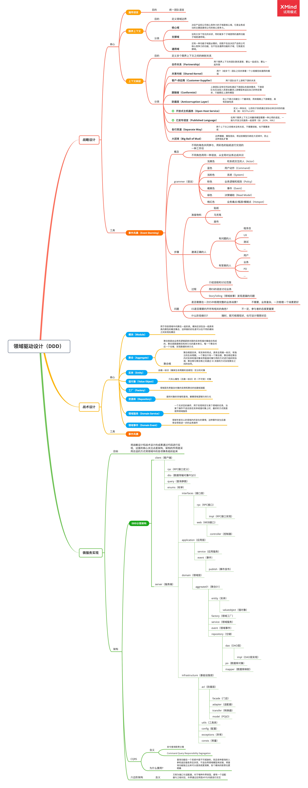
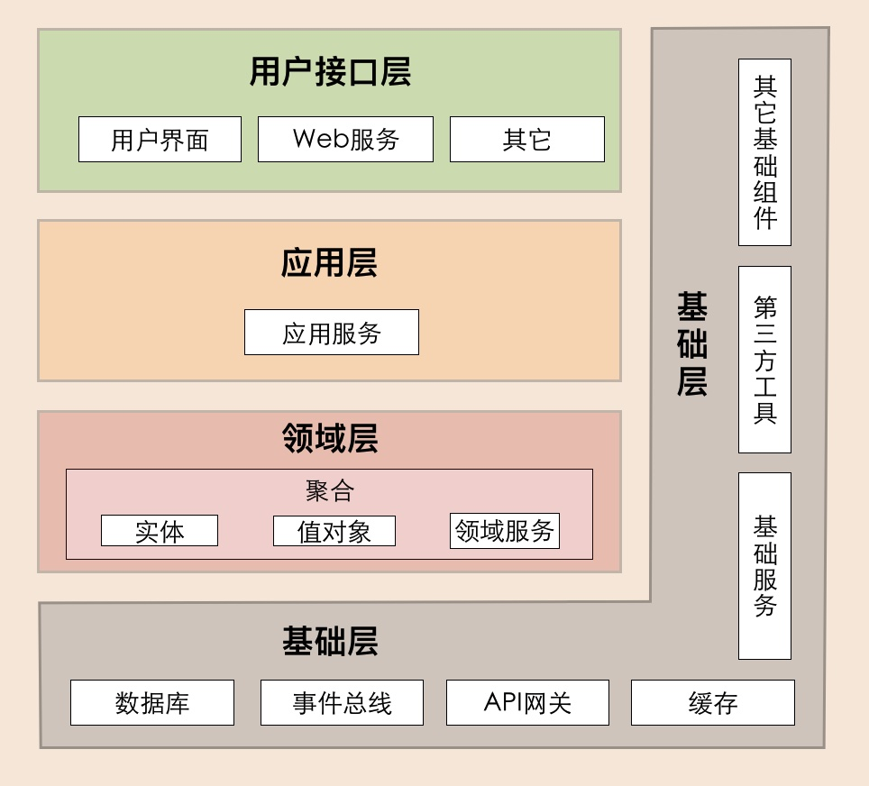
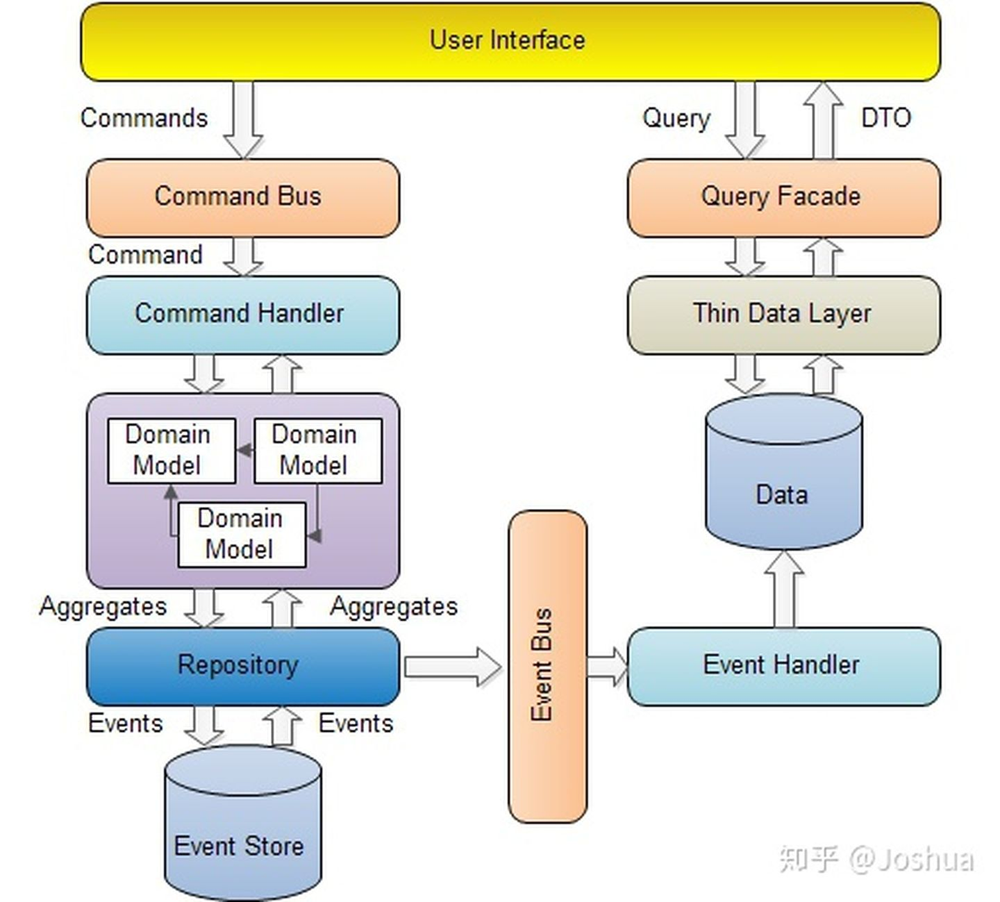
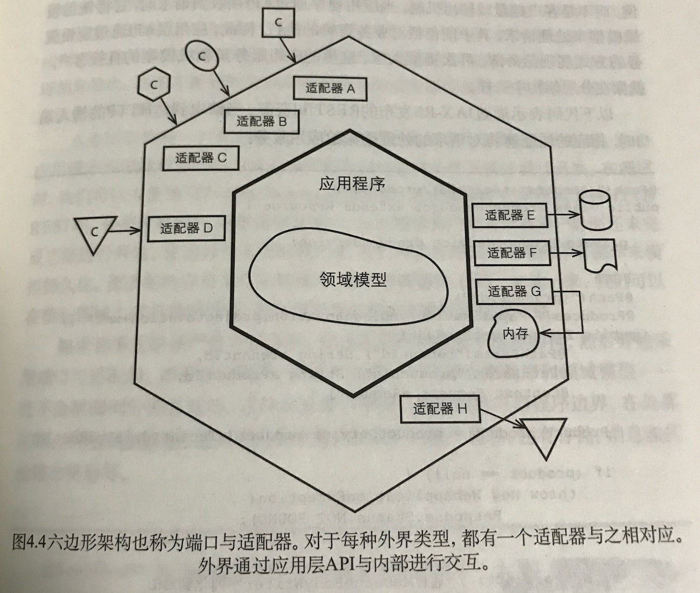

### 1、对领域驱动设计的理解

DDD是解决复杂系统设计的一种方法论，或者说一种思想。平常我们做系统设计用的比较多的是基于数据库的设计，我们首先会考虑表结构应该怎么设计，表里冗余那几个字段到时候查询时性能会比较高，领域驱动设计的话我们的关注点会放到领域模型上，和表结构相比，领域模型会跟接近于我们真实的业务，用DDD来做系统设计会让我们的系统更加清晰，跟真实的业务会更加吻合。一般DDD和微服务结合使用比较好，它可以解决我们微服务的边界问题。

### 2、DDD分层架构

### 3、CQRS

### 4、六边形架构

