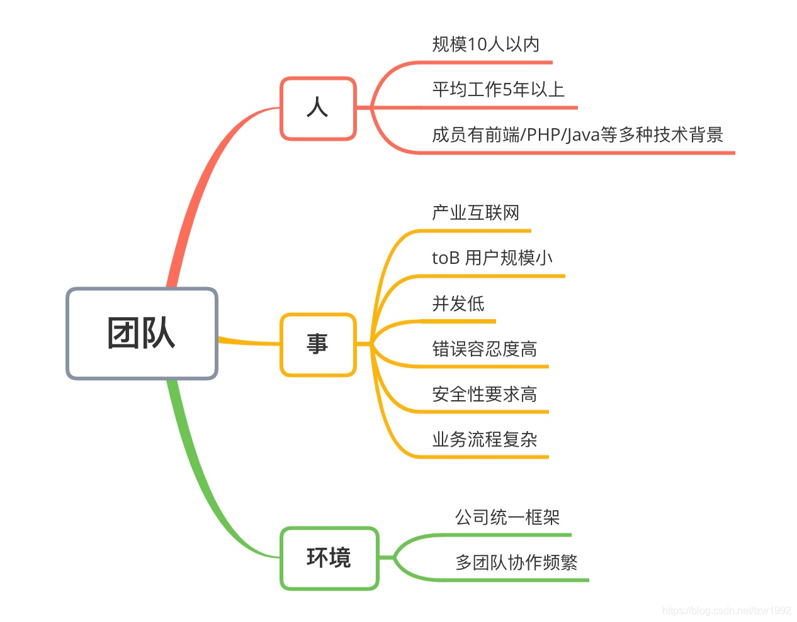
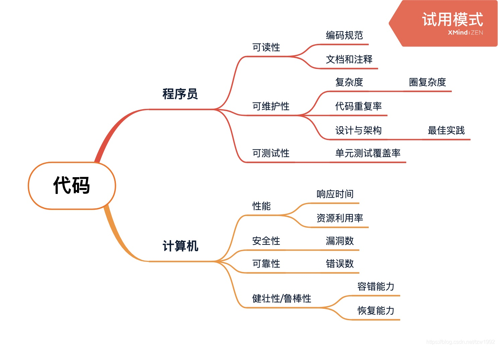
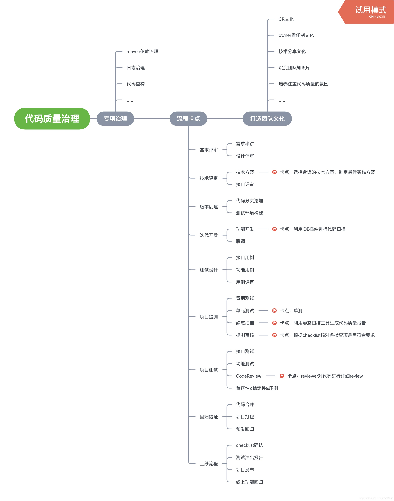
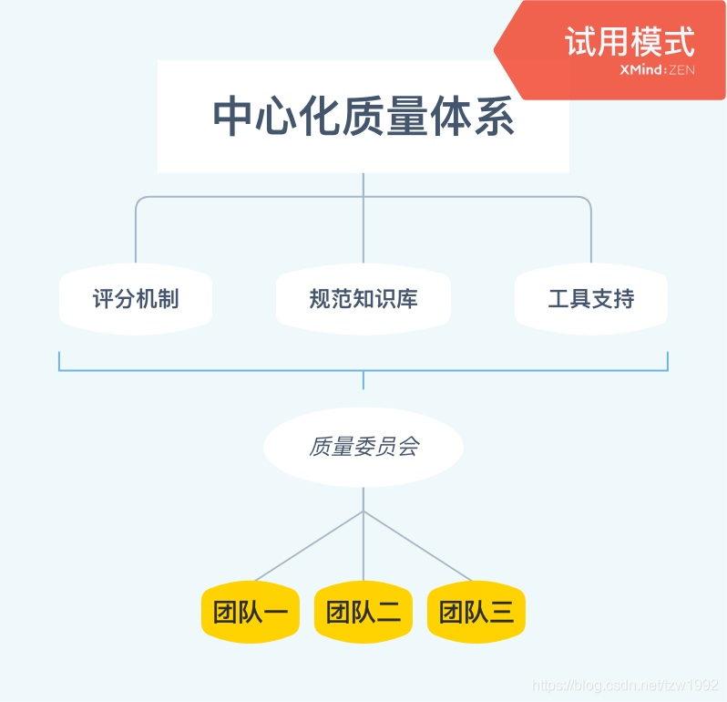

### 一、什么是代码质量

#### 1.1 定义

作为程序员相信大家或多或少都提过代码质量这个词，那到底什么是代码质量呢？或者说什么是好的代码呢？我相信每个人都会有自己的理解，一千个观众就有一千个哈姆雷特。就好比我们评价一个产品是不是好产品一样，有的人会从实用性的角度来评价，实用那就是好产品；有的人会从外观设计上来评价，好看那就是好产品。由于每个人评价的维度不同，评价的标准也不同，造成这种所谓的“好”和“坏”具有很强的主观性。对代码质量的评价也面临同样的问题，当我们无法得出一个放之四海而皆准的标准时，相信权威或许是一个好办法。下面我摘录《代码整洁之道》中关于整洁代码的讨论：

```
我喜欢优雅和高效的代码，代码逻辑应该直截了当，叫缺陷难以掩藏；尽量减少依赖关系，使之便于维护；依据某种分层战略完善错误处理代码；性能调至最优，省的别人做没规矩的优化，搞出一堆混乱来。整洁的代码只做好一件事。
– Bjarne Stroustrup，C++语言之父 《C++程序设计语言》作者
```

```
整洁的代码简单直接。整洁的代码如同优美的散文。整洁的代码从来不隐藏设计者的意图，充满了干净利落的抽象和直截了当的控制语句。
– Grady Booch，《面向对象分析与设计》作者
```

通过两位大神的描述，我们大致可以总结出高质量的代码首先应该便于阅读和理解，方便维护和扩展，逻辑清晰且直接，设计优良，性能优异且没有隐藏的bug等。

#### 1.2 标准

从上面的定义我们知道，对代码质量的评价是非常主观的，我们很难客观地通过一套量化指标来评定一段代码是好是坏。并且每种标准适用的范围和场景并不相同。所以要做代码质量治理第一件事就是要基于团队共识形成一套适用于团队内部的标准，这既可以降低个人的主观性，也避免了将各种指标生搬硬套做出很多无效的产出。

在制定团队标准前我们首先应该了解自己所在的团队，一般可以从人、事、环境三个维度来分析，下面以我所在的团队为例，进行团队画像：



从团队画像我们可以看出团队成员有多种技术背景，不同的技术栈代码风格会有很多差异，大家很容易将另一种语言的风格带入到Java开发中，这就造成代码风格不统一，因此整理统一的编码规范非常关键。我们做的是toB业务用户规模较小，但是业务流程复杂，因此我们在做质量治理时应该多关注程序的健壮性而非并发用户数这种指标。至此我们产出了第一版适用于自己团队的衡量代码质量的模型，然后我们可以基于这些指标对我们的代码进行针对性的治理，并且可以从实践过程发现问题，然后再完善这套模型。



有了模型，我们下一步要做的就是制定具体的指标：

| 指标       | 期望 |
| ---------- | ---- |
| 编码规范   |      |
| 圈复杂度   |      |
| 重复率     |      |
| 最佳实践   |      |
| 覆盖率     |      |
| 响应时间   |      |
| 资源利用率 |      |
| 漏洞数     |      |
| 错误数     |      |

### 二、为什么要做代码质量治理

#### 2.1 原因

讲了这么多我相信大家心里肯定会有一个疑问，那就是我们为什么要做代码质量治理？做代码质量治理到底会有什么产出？要回答这个问题我们不妨从反面来思考，假如不注重代码质量会产生什么后果。我相信大家都会有这样的经历，当我们回头看自己半年前或一年前写的代码时心里肯定会有一个大大的疑问，这特么写的啥，为什么会有这么奇葩的写法。当一个项目经过多个版本迭代后，里面夹杂着各种废弃的和正在使用的代码，各种逻辑相互交织，修改起来牵一发而动全身，这时维护起来将变得非常困难，面对这么一坨烂代码，到底是缝缝补补又三年还是推倒重来，这也是一个值得思考的问题。总结起来不注重代码质量会造成以下几点后果：

- 代码阅读困难，维护成本大
- 研发效率降低
- 容易出现bug，隐藏安全漏洞
- 代码性能下降
- 大规模重构费时费力

#### 2.2 难点

虽然不做代码治理会产生很多问题，但是真要实践起来，还是会有很多难点。下面是我总结的几点常见难点：

- 质量意识难拉齐：团队成员对代码质量的意识很难拉齐，每个人都有自己的个性，人都喜欢用自己觉得舒服的方式工作，这就造成规范比较难推动。
- 开发时间紧张：互联网公司都推崇敏捷开发，往往每次迭代周期都比较短，领导大多关注你是否能在较短的时间内完成任务，对代码质量的要求往往没那么高，在较紧张的工期压力下，往往就很难保证代码的质量。
- 成果难量化：代码质量的高低，在短时间内往往没有太明显的观感差异，只有达到一个临界点后才会大量爆露各种问题，这就造成做这项工作无法快速获得立竿见影的正向反馈，从而慢慢就会淡化做这项工作的动力。

### 三、如何落地

#### 3.1 解法



上面我们讲了很多方法论的东西，下面我们一起来探讨下如何进行落地。对代码进行质量治理我们可以从这3个方面进行入手，首先针对代码中的顽疾进行专项治理，然后在研发流程中设置卡点来保证每次迭代代码的质量，最后是打造团队注重代码质量的文化，只有意识提高了，才能真正产出高质量的代码。

##### 3.1.1 专项治理

进行专项治理首先需要识别出当前代码中有哪些痛点，而要识别代码中的痛点可以使用一个非常经典的指标：WTF/min。专项治理因为目标都很明确，只要选择好方案去执行就可以了。

##### 3.1.2 流程卡点

在研发流程中设置各种卡点，是我们进行质量治理最重要的手段。我们需要使用一系列的工具作为抓手，层层递进来保障代码的质量。

代码管控大致会经历4个阶段：

- 规范化： 制定代码规范
- 自动化： 借助工具保证规范落地
- 流程化： 在流程中设置质量检查卡点，避免漏网之鱼
- 中心化： 以团队整体为视角，集中管理代码规范，并实现质量状况透明

###### 规范化：

保证代码质量的第一步是建立团队代码规范，让大家能够形成共识，才能知道怎么做。建立规范这个过程其实是比较难的，要想建立一套好的规范要求你经验非常丰富，只有踩过无数的坑，才能发现为什么这样做会更好。在落实规范这件事上我们选择站在巨人的肩膀上然后再加入团队特有的一些共识制定一套适用自己的规范准则。

- 风格规范：选择《Google Style Guides》 (https://github.com/google/styleguide)
- 编码规范：选择《阿里巴巴Java开发手册》 (https://github.com/alibaba/p3c)
- 通过CodeReview机制沉淀团队内部规范

###### 自动化：

工欲善其事必先利其器，代码规范制定好后怎样能保证每个人都能按照规范编写代码，如果只靠个人自觉性那是不靠谱的，必须要有工具来做支撑，没有通过工具检测的代码就不能被提交到仓库。

- 代码自动格式化工具：SavaActions (https://plugins.jetbrains.com/plugin/7642-save-actions/versions)
- 编码规范检测工具：P3C (https://github.com/alibaba/p3c)
- 代码质量检测工具：SonarLint (https://plugins.jetbrains.com/plugin/7973-sonarlint)
- 单元测试覆盖率工具：JaCoCo (https://www.jacoco.org/jacoco/)


###### 流程化：

有了工具可以帮助我们高效的实现代码规范的落地，但是没有制度和流程的约束，随着时间的推移代码质量意识在团队中慢慢就会被淡化，最终又会回到初始的混沌状态，所以我们必须在制度和流程上强制采取质量保证措施。


###### 中心化：

当公司规模较大时，往往会划分为很多个小团队，每个小团队很可能各自为政，这时就很难从细节上去保证规范的落实，并且每个小团队适用的规范也不尽相同，不能用一套标准去要求所有人，到这个阶段更多的关注点应该放在方法论的输出上，而非具体的执行细节，具体的执行细节可以让各个团队自己去实施，但是需要有一套统一的评分标准来评估每个团队的实施状况。



##### 3.1.3 打造团队文化

所有的工具和流程制度都属于代码质量治理的外部力量，只有培养团队的质量文化才能最大限度的统一团队意志，自驱性的保证代码质量，这才是最高效率的方式。关于怎样才能打造好自己团队的文化，我觉得是值得每个人去思考的话题。关于代码质量这个方向我觉得可以关注以下几个方面：

- CodeReview文化：CR是一种很好的学习和总结方式，也是团队交流技术的一个很好的渠道。
- Owner责任制文化：owner意识可以让团队成员摆脱事不关己高高挂起的状态，通过将每个工程设定owner，可以让每个人主动去推动自己所负责的项目的质量，这可以更好的培养大家的质量意识。
- 技术分享文化：通过“学习吸收率金字塔”可知，教授他人是吸收率最高的一种方式，通过技术分享可以培养团队的技术氛围，一个技术氛围好的团队，才会有更多的技术交流，也才会更加注重代码质量。
- 沉淀团队知识库：团队要将一些好的案例和最佳实践以文本的形式沉淀下来，这样能方便后来者快速了解相关知识，避免走弯路，同时推动团队成员都以最佳实践来写代码，也是保证代码质量强有力的保证

#### 3.2 思考

说起代码质量每个人都会觉得很重要，但真正在实际工作中却往往会忽视掉，不管是工程师还是管理者都应该去反思其中的原因。做代码质量治理应该找到适合自己团队的方式，先从简单的开始循序渐进的进行，慢慢的培养大家的质量意识，多找到团队当前遇到的问题和痛点，先把重要的解决掉，然后再去解决不那么重要的问题，如果一开始就把高度拔的非常高往往就很难进行落地。代码质量治理就像一场马拉松，需要慢慢进行积累，很难立马就看到效果，只要长期坚持下去就一定能收获相应的成果。

### 四、参考资料

- 《代码整洁之道》

- 博客《代码质量管控的四个阶段》https://www.cnblogs.com/duanxz/p/4957991.html

- 博客《代码质量与技术债》https://cloud.tencent.com/developer/article/1151495