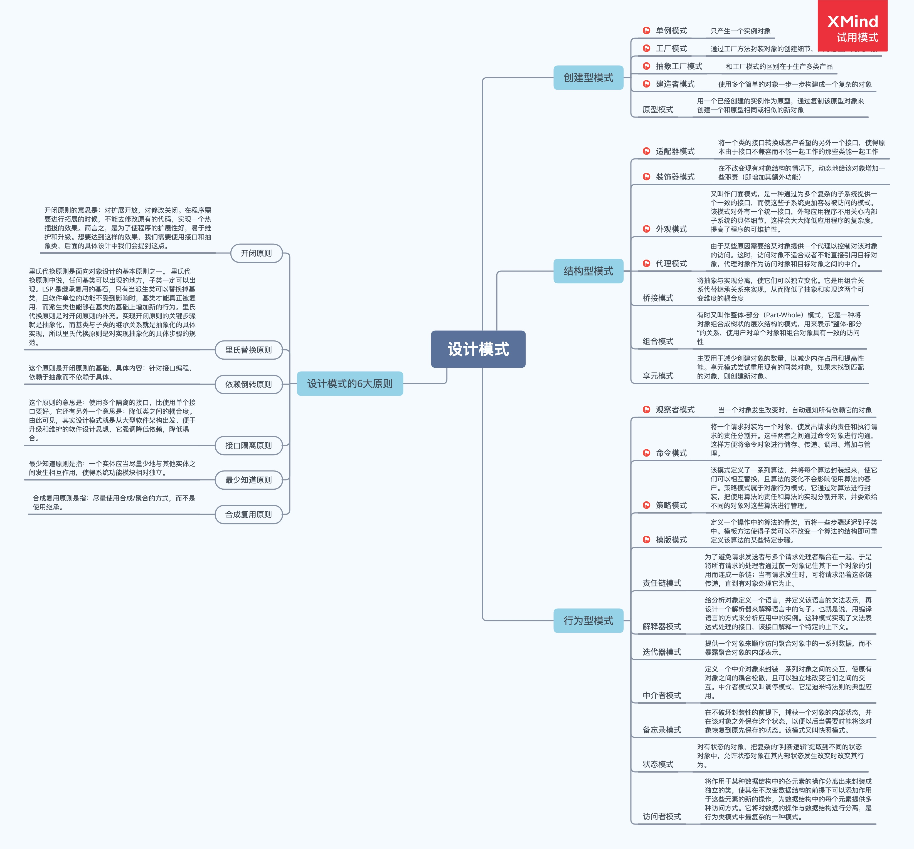

### 1、代理模式和装饰器模式的区别？

1、**装饰器模式**强调的是增强自身，在被装饰之后你能够在被增强的类上使用增强后的功能。增强后你还是你，只不过能力更强了而已；代理模式强调要让别人帮你去做一些本身与你业务没有太多关系的职责（记录日志、设置缓存）。**代理模式**是为了实现对象的控制，因为被代理的对象往往难以直接获得或者是其内部不想暴露出来。

2、**装饰器模式**是以对客户端透明的方式扩展对象的功能，是继承方案的一个替代方案；**代理模式**则是给一个对象提供一个代理对象，并由代理对象来控制对原有对象的引用；

3、**装饰器模式**是为装饰的对象增强功能；**代理模式**对代理的对象施加控制，但不对对象本身的功能进行增强；