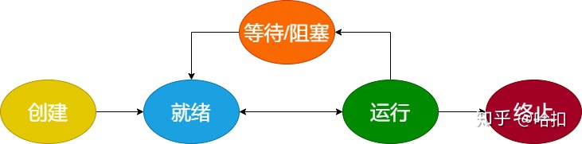
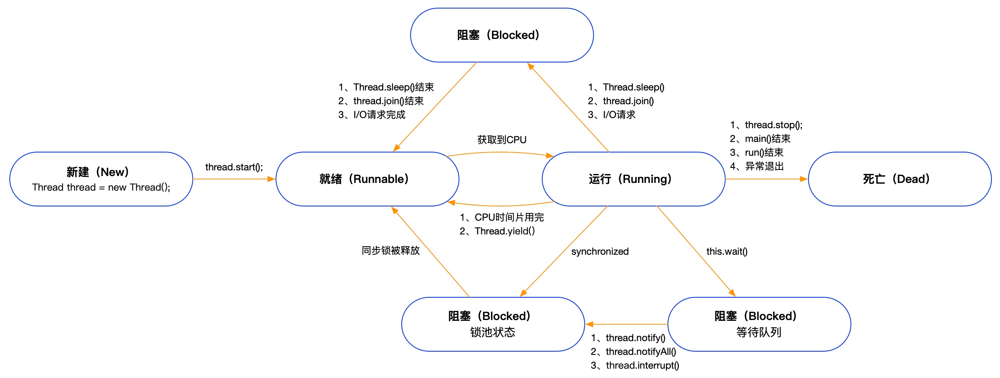

### 1、进程和线程的区别

进程：指在系统中正在运行的一个应用程序；程序一旦运行就是进程；进程是资源分配的最小单位。

线程：系统分配处理器时间资源的基本单元，或者说进程之内独立执行的一个单元执行流。线程是程序执行的最小单位。

### 2、进程的生命周期

- 创建：进程创建成功。
- 就绪：进程获得了可以运行所需要的各种资源，只要 CPU 就绪就可以运行。
- 运行：进程运行指令。
- 等待/阻塞：进程需要等待某些资源，所以被操作系统移出 CPU 进入等待或者阻塞的状态。
- 终止：进程正常退出或者异常退出。

### 3、线程的生命周期（Java）

- 新建状态（New）：当线程对象对创建后，即进入了新建状态，如：Thread t = new MyThread();

- 就绪状态（Runnable）：当调用线程对象的start()方法（t.start();），线程即进入就绪状态。处于就绪状态的线程，只是说明此线程已经做好了准备，随时等待CPU调度执行，并不是说执行了t.start()此线程立即就会执行；

- 运行状态（Running）：当CPU开始调度处于就绪状态的线程时，此时线程才得以真正执行，即进入到运行状态。注：就   绪状态是进入到运行状态的唯一入口，也就是说，线程要想进入运行状态执行，首先必须处于就绪状态中；

- 阻塞状态（Blocked）：处于运行状态中的线程由于某种原因，暂时放弃对CPU的使用权，停止执行，此时进入阻塞状态，直到其进入到就绪状态，才 有机会再次被CPU调用以进入到运行状态。根据阻塞产生的原因不同，阻塞状态又可以分为三种：

- - 等待阻塞：运行状态中的线程执行wait()方法，使本线程进入到等待阻塞状态；
  - 同步阻塞 -- 线程在获取synchronized同步锁失败(因为锁被其它线程所占用)，它会进入同步阻塞状态；
  - 其他阻塞 -- 通过调用线程的sleep()或join()或发出了I/O请求时，线程会进入到阻塞状态。当sleep()状态超时、join()等待线程终止或者超时、或者I/O处理完毕时，线程重新转入就绪状态。

- 死亡状态（Dead）：线程执行完了或者因异常退出了run()方法，该线程结束生命周期。