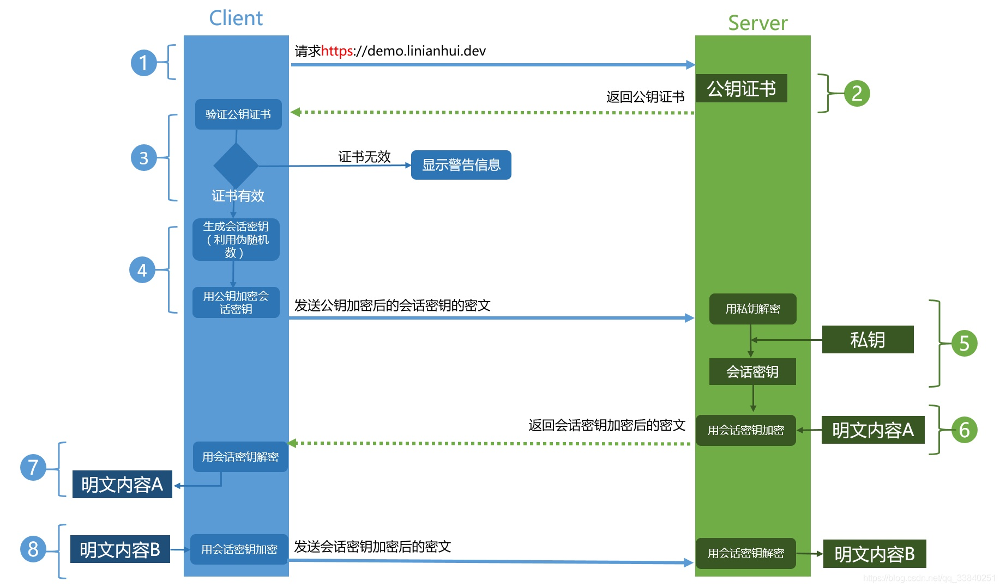

### 1、HTTPS工作流程

- **证书验证阶段**

- - 客户端（浏览器）向服务端发起HTTPS请求

  - 服务端把事先配置好的公钥证书（public key certificate）返回给客户端。SSL证书中包含：

  - - 证书颁发机构CA、证书有效期、公钥、证书所有者、签名等信息

  - 客户端验证SSL证书是否有效

  - - 首先浏览器读取证书中的证书所有者、有效期等进行校验
    - 然后浏览器查找操作系统中内置的受信任的证书颁发机构CA，验证是否为合法机构颁发的证书，如果不是则会报错提示警告信息
    - 验证证书是合法机构颁发后，浏览器从系统中取出颁发机构CA的公钥，然后对服务器发来的证书里面的签名进行解密
    - 浏览器使用相同的hash算法计算证书的hash值，然后和证书的签名进行比对，判断证书是否被篡改过

  - 客户端利用伪随机数生成器生成会话密钥（对称密钥）。然后利用证书中的公钥加密这个会话密钥，传送给服务端

  - 服务端使用自己的私钥解密客户端传过来的会话密钥，至此，客户端和服务端都拿到了会话密钥，后续的数据传输就采用对称加密的方式进行传递

- **数据传输阶段**

- - 服务使用对称密钥加密 明文内容 发送给客户端
  - 客户端使用对称密钥解密响应内容，得到明文内容
  - 客户端再次发起HTTPS请求，使用对称密钥加密请求的 明文内容，然后服务端使用对称密钥解密密文，得到 明文内容

- **总结**

- - HTTPS结合了非对称加密和对称加密的优点，通过非对称加密的方式传递对称密钥，然后通过对称加密来加密真实数据，然后再通过散列算法校验数据是否被篡改
  - 非对称加密的问题：效率低
  - 对称加密的问题：不安全，密钥容易被窃取
  - 散列算法的问题：不可逆

参考：[深入理解HTTPS工作原理](https://segmentfault.com/a/1190000018992153)