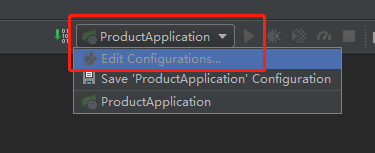
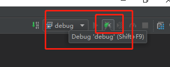

在工作中我们经常会遇到这样的场景，业务方吭哧吭哧跑过来跟你讲线上有个bug赶紧看一下，这个时候你肯定会说：莫慌，我看一眼日志。但是很多时候只会在一些关键节点记录日志，并不是每一个步骤都能跟踪到日志，假如通过现有日志中无法发现问题，你可能会在可能出现问题的地方加上日志，然后重新发布一遍，这虽然能够解决问题，但是却不够高效，而且上线是一个有风险的操作，很可能会带来新的问题。那有没有更好的方式呢？答案是肯定的，那就是我们今天要介绍的远程debug。Java本身支持调试模式，并且提供了一个简单的调试工具JDB，它可以用来debug一个Java程序，但是是基于命令行进行交互，和我们平常在IDE中使用图形界面进行debug有所差异。
在实际项目中我们一般会分为：开发环境、测试环境、预发环境和线上环境。开发环境一般是在自己本地，需要调试的话很方便，这里我们不讨论。测试、预发和线上环境一般都部署在远程服务器上，预发和线上环境使用的配置、数据库等资源一般都是一致的，这样可以最大化的还原线上场景。为了方便我们在遇到问题时可以快速进行调试并且定位到问题，建议在测试和预发环境都开启Java调试模式，但是线上环境一定要关闭调试模式，因为调试模式会带来额外的性能开销，并且也是不安全的。
### 名词解释
1. JPDA：即Java调试体系，是Java platform debug architecture的缩写，它是虚拟机的一整套用于调试的工具和接口。[资料](https://www.ibm.com/developerworks/cn/java/j-lo-jpda1/index.html?ca=drs-)

2. JDB：是The Java Debugger的缩写，JPDA是理论基础，而JDB则是它的一种具体实现。

### 实例演示
1. 在Java启动命令中加入如下参数：
```
java -jar -Xdebug -Xrunjdwp:transport=dt_socket,server=n,address=8081 test.jar
```
2. IDEA配置
- 先打开运行时Configurations界面：

- 新建一个Remote配置：

- 输入要调试的远程服务器的IP和端口：

- 启动debug调试：

至此就可以使用IDEA远程调试Java代码了。