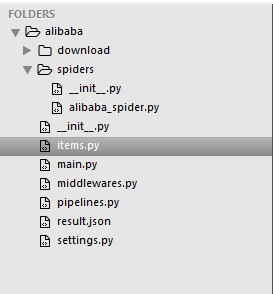

最近在学习上产品需要频繁到各大电商平台获取图片素材，有时一个产品主图+详情图有几十张，整个过程非常耗费时间，作为一个有追求的程序员，能偷懒的那就一定要偷懒，一张一张下载效率太低，保存网页又会下载很多无用的图片，所以想到了用爬虫去定向抓取，有了需求和想法那就撸起袖子开干。本文将会以抓取1688详情页的主图+详情图为例进行讲解，其他平台的操作类似。
### 安装必要依赖
1. 安装python：网上教程很多，这里不细讲，整个程序都是基于python开发的，所以必须要先安装好python。
2. 安装scrapy：scrapy是一个python开发的网络爬虫框架，可使用下面的命令安装：
```
pip install scrapy
```
3. 安装selenium：selenium是一个web自动化测试工具，它可以模拟浏览器中的一些操作，对于一些懒加载的页面，一般是用户滑动到某个位置时才会加载相应的数据，所以可以使用selenium来模拟用户的滑动，从而实现将完整的网页内容加载出来，可以使用下面的命令安装python的selenium库：
```
pip install selenium
```
4. 下载chromedriver驱动：需要和你的chrome浏览器版本保持一致。
[下载地址](https://chromedriver.storage.googleapis.com/index.html)
5. 其他组件可根据需要下载。

### 创建scrapy项目
输入以下命令创建一个scrapy项目：
```
scrapy startproject alibaba
```
项目创建好后结构如下：

### 编写业务代码
1. 编写items.py文件
```python
# -*- coding: utf-8 -*-

# Define here the models for your scraped items
#
# See documentation in:
# https://docs.scrapy.org/en/latest/topics/items.html

import scrapy

class AlibabaItem(scrapy.Item):
    # define the fields for your item here like:
    # name = scrapy.Field()
    # 产品名称
    product_title = scrapy.Field()
    # 主图
    main_pics = scrapy.Field()
    # 详情图
    desc_pics = scrapy.Field()
```

2. 在spiders目录新建一个alibaba_spider.py文件，这个就是我们具体的爬虫逻辑：
```python
# -*- coding: utf-8 -*-
import scrapy
from scrapy import Request
import json
from alibaba.items import AlibabaItem
from selenium import webdriver

class AlibabaSpider(scrapy.Spider):
    # 爬虫名
    name = 'alibaba_spider'
    # 允许的域名
    allowed_domains = ['detail.1688.com']
    # 入口URL，这里填写需要爬取的详情页地址
    start_urls = ['']

    def __init__(self):
        self.browser = webdriver.Chrome("D:/workspace/spider/chromedriver_win32/chromedriver.exe")
        self.browser.set_page_load_timeout(300)

    def closed(self,spider):
        print("spider closed")
        self.browser.close()

    def start_requests(self):
        for url in self.start_urls:
            yield Request(url=url, callback=self.parse)

    def parse(self, response):
        alibaba_item = AlibabaItem()

        # 产品名称
        product_title = response.xpath("//h1[@class='d-title']/text()").extract_first()
        alibaba_item["product_title"] = product_title

        # 主图
        main_pics = response.xpath("//ul[@class='nav nav-tabs fd-clr']/li[@data-imgs]/@data-imgs").extract()
        main_pic_list = []
        for main_pic_str in main_pics:
            main_pic = json.loads(main_pic_str)
            main_pic_list.append(main_pic['original'])
        alibaba_item["main_pics"] = main_pic_list

        # 详情图
        desc_pics = response.xpath("//div[@class='mod-detail-description mod-info mod']//img/@src").extract()
        desc_pic_list = []
        for desc_pic in desc_pics:
            desc_pic_list.append(desc_pic)
        alibaba_item["desc_pics"] = desc_pic_list

        yield alibaba_item
```
浏览器可以安装一个xpath healper插件，可以帮助我们快速的定位选取的html节点是否正确。

3. 在middlewares.py文件中编写selenium中间件，用来模拟浏览器的滚动：
```python
# -*- coding: utf-8 -*-

# Define here the models for your spider middleware
#
# See documentation in:
# https://docs.scrapy.org/en/latest/topics/spider-middleware.html

from scrapy.http import HtmlResponse
from selenium.common.exceptions import TimeoutException
import time

class SeleniumMiddleware(object):
    def process_request(self, request, spider):
        if spider.name == 'alibaba_spider':
            try:
                spider.browser.get(request.url)
                spider.browser.execute_script('window.scrollTo(0, document.body.scrollHeight)')
            except TimeoutException as e:
                print('超时')
                spider.browser.execute_script('window.stop()')
            time.sleep(2)
            return HtmlResponse(url=spider.browser.current_url, body=spider.browser.page_source, encoding="utf-8", request=request)
```
在settings.py文件中启用该middleware：
```python
# Enable or disable downloader middlewares
# See https://docs.scrapy.org/en/latest/topics/downloader-middleware.html
DOWNLOADER_MIDDLEWARES = {
    'alibaba.middlewares.SeleniumMiddleware': 543,
}
```
4. 编写pipelines.py处理图片下载逻辑：
```python
# -*- coding: utf-8 -*-

# Define your item pipelines here
#
# Don't forget to add your pipeline to the ITEM_PIPELINES setting
# See: https://docs.scrapy.org/en/latest/topics/item-pipeline.html

import os
import time
import requests

class AlibabaPipeline(object):
    def process_item(self, item, spider):
        # 保存图片
        dt = time.strftime("%Y%m%d%H%M%S", time.localtime())
        path = "./download/" + item["product_title"] + "/" + dt
        main_path = path + "/main/"
        desc_path = path + "/desc/"
        if not os.path.exists(main_path):
            # 创建目录
            print("创建主图目录：" + main_path)
            os.makedirs(main_path)

        if not os.path.exists(desc_path):
            # 创建目录
            print("创建详情图目录：" + desc_path)
            os.makedirs(desc_path)

        main_index = 1
        for main_pic in item["main_pics"]:
            file_name = "zt-" + str(main_index) + ".jpg"
            file_path = main_path + file_name
            if not os.path.exists(file_path):
                r = requests.get(main_pic)
                r.raise_for_status()
                with open(file_path, "wb") as f:
                    f.write(r.content)
                print("文件下载成功：" + file_path)
            else:
                print("文件已存在：" + file_path)
            main_index += 1

        desc_index = 1
        for desc_pic in item["desc_pics"]:
            file_name = "xq-" + str(desc_index) + ".jpg"
            file_path = desc_path + file_name
            if not os.path.exists(file_path):
                r = requests.get(desc_pic)
                r.raise_for_status()
                with open(file_path, "wb") as f:
                    f.write(r.content)
                print("文件下载成功：" + file_path)
            else:
                print("文件已存在：" + file_path)
            desc_index += 1

        return item
```
在settings.py文件中启用该pipeline：
```python
# Configure item pipelines
# See https://docs.scrapy.org/en/latest/topics/item-pipeline.html
ITEM_PIPELINES = {
    'alibaba.pipelines.AlibabaPipeline': 300,
}
```

### 启动爬虫
```
scrapy crawl alibaba_spider
```
程序运行结束后图片将会下载到download目录中，程序运行过程中出现错误逐个进行解决即可，本文主要提供一种思路，代码有些细节的地方可以进行优化，提高其稳定性。
